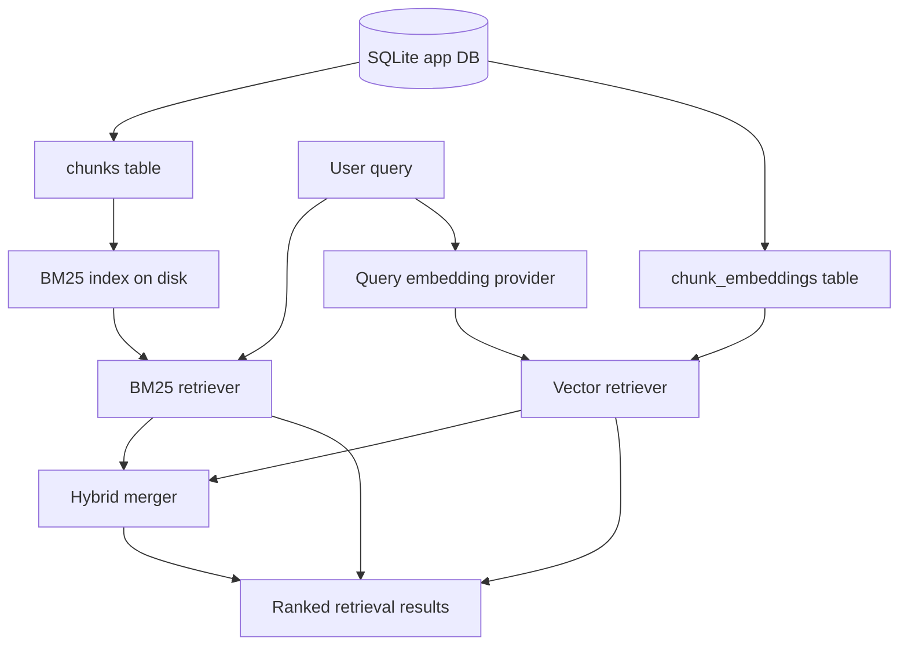

# End-to-End Search Retrieval Implementation Guide

## Executive summary

The RAG Evaluation System can now ingest documents, chunk them, compute embeddings for selected chunks, inspect corpus state, and compare stored chunk embeddings. The next milestone is not benchmark design. The next milestone is **retrieval that works end to end on real corpus questions**.

This guide defines the implementation path for the base retrieval stack:

1. **BM25 lexical search** over persisted chunks.
2. **Query-vector search** over stored chunk embeddings.
3. **Hybrid search** that merges BM25 and vector candidates.
4. **Retrieval smoke tests** that verify obvious behavior before building formal benchmarks.

The guiding principle is: **combine small working pieces only after each piece has a standalone smoke test**.

We should avoid building a large evaluation framework before search returns plausible results for real questions such as:

- `crape myrtle varieties`
- `how to plant arborvitae`
- `emerald green arborvitae spacing`
- `hydrangea pruning`
- `fast growing shade trees`
- `zone 5 flowering trees`

If these queries cannot retrieve relevant chunks, benchmark metrics will only measure a broken retrieval path. This ticket therefore focuses on making the retrieval substrate observable, bounded, reproducible, and testable.

## Intended reader

This guide is for a new intern implementing search in the repository. You should be able to understand:

- what already exists;
- why BM25 comes before benchmarks;
- how chunks, embeddings, and search indexes relate;
- which files to read first;
- which new service, CLI, API, and tests to add;
- how to run real queries safely;
- how to know when the system is ready for benchmark design.

The document is intentionally technical. It includes prose, bullets, diagrams, API references, file references, and pseudocode.

## Current system state

The current backend already has the ingestion and representation layers that search needs.

### Implemented pipeline pieces

```text
source -> document -> chunk -> embedding -> similarity/corpus inspection
```

Important code files:

| File | Role |
|---|---|
| `internal/db/db.go` | SQLite schema: sources, documents, chunks, embeddings, search index metadata, eval tables. |
| `internal/db/queries.go` | Typed query layer for sources, documents, chunks, embeddings, and coverage. |
| `internal/chunking/chunker.go` | Fixed-size chunker with overlap guard. |
| `internal/services/chunking/service.go` | Applies chunking strategies and persists chunks. |
| `internal/services/embedding/service.go` | Computes chunk embeddings using a Geppetto provider and stores BLOB vectors. |
| `internal/services/embedding/similarity.go` | Stored chunk-to-chunk cosine similarity. |
| `internal/services/embedding/vector.go` | Little-endian float32 vector encoding/decoding. |
| `internal/services/corpus/service.go` | Read-only corpus summaries/details for inspection. |
| `internal/api/handlers.go` | HTTP route registration and handlers. |
| `cmd/rag-eval/cmds/*` | Glazed/Cobra CLI command groups. |

### Current useful CLI commands

```bash
rag-eval source create
rag-eval source list
rag-eval source scan
rag-eval document list
rag-eval document get
rag-eval document chunks
rag-eval chunk apply
rag-eval chunk strategies
rag-eval embedding compute
rag-eval embedding coverage
rag-eval embedding similarity
rag-eval serve
```

### Current useful HTTP endpoints

```http
GET  /api/v1/health
GET  /api/v1/sources
POST /api/v1/sources
POST /api/v1/sources/{id}/scan
GET  /api/v1/documents
GET  /api/v1/documents/{id}
GET  /api/v1/documents/{id}/chunks
POST /api/v1/documents/{id}/chunk
GET  /api/v1/chunking-strategies
POST /api/v1/embeddings/compute
POST /api/v1/embeddings/coverage
POST /api/v1/embeddings/similarity
GET  /api/v1/corpus/sources
GET  /api/v1/corpus/documents
GET  /api/v1/corpus/documents/{id}
```

There is no search service yet. The `search_indexes` table exists, but it is metadata only.

## Problem statement

The system has chunks, but users cannot yet ask real questions and get ranked chunks back through a retrieval path. Without that path, it is premature to design benchmarks.

A benchmark depends on a retriever. The retriever depends on smaller parts:

- chunks must contain useful text;
- source filters must select the intended corpus subset;
- lexical indexing must read the same chunks users inspect;
- vector search must embed the query using the same provider/model identity as stored chunk embeddings;
- ranking output must include enough context to debug results;
- every operation must be bounded by default.

The next work should make these parts independently testable.

## Design principle: retrieval before evaluation

Do not start by designing large benchmark tables or metrics dashboards. Start by proving this statement:

> Given a real query, the system can return relevant chunks with document/source context and a score.

Then prove:

> The system can explain which retriever returned each chunk and why it is plausible.

Only after that should we design formal benchmark sets.

## Retrieval architecture

Target architecture:



The first implementation should allow each retriever to run alone:

```text
BM25 only
Vector only
Hybrid BM25 + vector
```

This makes debugging straightforward. If hybrid search is bad, inspect BM25 and vector separately before changing the merger.

## Stage 1: BM25 lexical search

BM25 should be implemented first because it is cheap, deterministic, explainable, and does not require live provider calls.

### Recommended index technology

Use **Bleve** for the first lexical index unless a project constraint changes.

Why Bleve:

- pure Go;
- good default BM25 behavior;
- stores a disposable on-disk index;
- fits the existing `search_indexes.index_path` table shape;
- avoids relying on SQLite FTS5 build tags;
- can be rebuilt from canonical SQLite chunks.

The invariant should remain:

> SQLite is canonical. Search indexes are disposable derived artifacts.

### New package

Create:

```text
internal/services/search/service.go
internal/services/search/bm25.go
internal/services/search/vector.go
internal/services/search/hybrid.go
internal/services/search/service_test.go
```

The first commit can include only `service.go`, `bm25.go`, and tests. Add vector/hybrid later.

### Index directory

Use a deterministic directory under project data:

```text
data/indexes/bm25/{index_id}/
```

Suggested index ID:

```text
bm25-fixed-1200-150-ttc-dump-guides-ttc-dump-articles
```

For arbitrary source lists, make the ID stable by hashing the normalized index config.

### Search document shape

Index one document per chunk.

```go
type IndexedChunk struct {
    ChunkID    string `json:"chunk_id"`
    DocumentID string `json:"document_id"`
    SourceID   string `json:"source_id"`
    Title      string `json:"title"`
    URL        string `json:"url"`
    StrategyID string `json:"strategy_id"`
    ChunkIndex int    `json:"chunk_index"`
    Text       string `json:"text"`
}
```

Fields to search:

- `title`, boosted moderately;
- `text`, primary content;
- later: metadata text or taxonomy text for products.

Fields to return:

- `chunk_id`;
- `document_id`;
- `source_id`;
- `title`;
- `url`;
- `chunk_index`;
- `score`;
- `preview`.

### Build request and result

```go
type BuildIndexRequest struct {
    IndexID    string
    StrategyID string
    SourceIDs  []string
    IndexPath  string
    Force      bool
    Limit      int
}

type BuildIndexResult struct {
    IndexID       string `json:"index_id"`
    StrategyID    string `json:"strategy_id"`
    SourceIDs     []string `json:"source_ids,omitempty"`
    IndexPath     string `json:"index_path"`
    ChunkCount    int    `json:"chunk_count"`
    DocumentCount int    `json:"document_count"`
    Rebuilt       bool   `json:"rebuilt"`
}
```

### Query request and result

```go
type QueryRequest struct {
    IndexID      string
    Query        string
    StrategyID   string
    SourceIDs    []string
    Limit        int
    PreviewRunes int
}

type RetrievalResult struct {
    Rank       int     `json:"rank"`
    ChunkID    string  `json:"chunk_id"`
    DocumentID string  `json:"document_id"`
    SourceID   string  `json:"source_id"`
    Title      string  `json:"title"`
    URL        string  `json:"url,omitempty"`
    ChunkIndex int     `json:"chunk_index"`
    Score      float64 `json:"score"`
    Retriever  string  `json:"retriever"`
    Preview    string  `json:"preview"`
}

type QueryResult struct {
    Query     string            `json:"query"`
    IndexID   string            `json:"index_id"`
    Retriever string            `json:"retriever"`
    Items     []RetrievalResult `json:"items"`
}
```

### BM25 build pseudocode

```go
func (s *Service) BuildBM25(ctx context.Context, req BuildIndexRequest) (*BuildIndexResult, error) {
    validate strategy_id
    normalize source_ids
    choose index_id and index_path

    if index exists and !force {
        return error explaining to use --force or pick a new index_id
    }

    remove temporary index directory
    create bleve mapping
    open new index in temporary directory

    chunks := queries.ListChunksWithDocumentContext(req.StrategyID, req.SourceIDs, req.Limit)

    batch := index.NewBatch()
    for each chunk:
        select ctx.Done
        doc := IndexedChunk{...}
        batch.Index(chunk.ID, doc)
        flush every 500 chunks
    flush final batch
    close index

    atomically move temporary index to final path
    upsert search_indexes metadata row

    return BuildIndexResult
}
```

### BM25 query pseudocode

```go
func (s *Service) QueryBM25(ctx context.Context, req QueryRequest) (*QueryResult, error) {
    validate query not empty
    default limit to 10; cap at 100
    open index by index_id or derived index path

    q := bleve.NewMatchQuery(req.Query)
    q.SetField("text")

    titleQ := bleve.NewMatchQuery(req.Query)
    titleQ.SetField("title")
    titleQ.SetBoost(2.0)

    disjunction := bleve.NewDisjunctionQuery(q, titleQ)
    search := bleve.NewSearchRequestOptions(disjunction, req.Limit, 0, false)
    search.Fields = []string{"chunk_id", "document_id", "source_id", "title", "url", "chunk_index", "text"}

    hits := index.Search(search)

    for each hit:
        make preview from text
        return rank, IDs, title, score, preview
}
```

The exact Bleve query can evolve. Start simple. Do not optimize ranking before running real queries.

## Stage 2: query-vector search

The system already stores chunk embeddings and can compute stored chunk-to-chunk similarity. Vector query search adds a missing operation:

```text
user query -> embedding vector -> compare to stored chunk vectors -> ranked chunks
```

This is not a new index at first. Use SQLite stored embeddings and bounded candidate scans. That is sufficient for the current partial corpus and avoids native vector dependencies.

### New vector request

```go
type VectorQueryRequest struct {
    Query        string
    StrategyID   string
    SourceIDs    []string
    Provider     embeddings.Provider
    ProviderType string
    Model        string
    Dimensions   int
    Limit        int
    CandidateLimit int
    PreviewRunes int
}
```

### Vector query pseudocode

```go
func (s *Service) QueryVector(ctx context.Context, req VectorQueryRequest) (*QueryResult, error) {
    validate query, strategy_id, provider
    model := req.Provider.GetModel()
    queryVector := req.Provider.GenerateEmbedding(ctx, req.Query)
    validate dimensions

    candidates := queries.ListChunkEmbeddingsForStrategySources(
        req.StrategyID,
        req.SourceIDs,
        req.ProviderType,
        model.Name,
        model.Dimensions,
        req.CandidateLimit,
    )

    scored := []RetrievalResult{}
    for each candidate:
        vector := DecodeFloat32Vector(candidate.Embedding)
        score := CosineSimilarity(queryVector, vector)
        append result with retriever="vector"

    sort descending by score
    trim to limit
    attach previews
    return QueryResult
}
```

### Why candidate limits matter

A full corpus scan is acceptable for a small smoke test but not for full production scale. Keep `candidate_limit` explicit so users understand the search scope.

Default:

```text
limit: 10
candidate_limit: 500
preview_runes: 240
```

If `candidate_limit` is zero, choose a safe default. Do not silently scan millions of rows later.

## Stage 3: hybrid search

Hybrid search should be implemented only after BM25 and vector search pass independent smoke tests.

The first hybrid method can be simple reciprocal-rank fusion.

### Reciprocal Rank Fusion

For each result from each retriever:

```text
rrf_score = 1 / (k + rank)
```

Use `k = 60` by default.

Merged score:

```text
hybrid_score = bm25_rrf + vector_rrf
```

If a chunk appears in both lists, merge evidence:

```json
{
  "chunk_id": "chk-...",
  "score": 0.0317,
  "retriever": "hybrid",
  "components": {
    "bm25": { "rank": 2, "score": 8.42 },
    "vector": { "rank": 7, "score": 0.78 }
  }
}
```

### Hybrid pseudocode

```go
func (s *Service) QueryHybrid(ctx context.Context, req HybridQueryRequest) (*QueryResult, error) {
    bm25 := s.QueryBM25(ctx, req.BM25)
    vector := s.QueryVector(ctx, req.Vector)

    byChunk := map[string]*HybridCandidate{}

    for rank, item := range bm25.Items {
        candidate := getOrCreate(item.ChunkID)
        candidate.BM25Rank = rank + 1
        candidate.BM25Score = item.Score
        candidate.Score += 1.0 / float64(60 + rank + 1)
    }

    for rank, item := range vector.Items {
        candidate := getOrCreate(item.ChunkID)
        candidate.VectorRank = rank + 1
        candidate.VectorScore = item.Score
        candidate.Score += 1.0 / float64(60 + rank + 1)
    }

    sort candidates by Score desc
    return top N with component metadata
}
```

This is explainable enough for early validation.

## CLI design

Add a new command group:

```text
cmd/rag-eval/cmds/search/root.go
cmd/rag-eval/cmds/search/index.go
cmd/rag-eval/cmds/search/query.go
cmd/rag-eval/cmds/search/vector.go
cmd/rag-eval/cmds/search/hybrid.go
cmd/rag-eval/cmds/search/smoke.go
```

Register it in:

```text
cmd/rag-eval/main.go
```

### `rag-eval search index`

Builds or rebuilds a BM25 index.

Example:

```bash
GOMAXPROCS=2 GOMEMLIMIT=1024MiB ./rag-eval search index \
  --strategy-id fixed-1200-150 \
  --source-ids ttc-dump-guides,ttc-dump-articles \
  --index-id bm25-ttc-guides-articles-fixed-1200-150 \
  --force \
  --output table
```

Flags:

| Flag | Meaning |
|---|---|
| `--strategy-id` | Required chunking strategy. |
| `--source-ids` | Optional comma-separated source filter. |
| `--index-id` | Optional stable name; derive if omitted. |
| `--index-root` | Default `data/indexes`. |
| `--force` | Rebuild an existing index. |
| `--limit` | Optional chunk limit for smoke builds. |

### `rag-eval search query`

Runs BM25 lexical search.

```bash
./rag-eval search query \
  --index-id bm25-ttc-guides-articles-fixed-1200-150 \
  --query "how to plant arborvitae" \
  --limit 10 \
  --preview-runes 220 \
  --output table
```

### `rag-eval search vector`

Runs query-vector search against stored embeddings.

```bash
GOMAXPROCS=2 GOMEMLIMIT=1024MiB ./rag-eval search vector \
  --query "which trees make a good privacy screen" \
  --strategy-id fixed-1200-150 \
  --source-ids ttc-dump-articles,ttc-dump-guides \
  --profile openai-embedding-small \
  --profile-registries ~/.config/pinocchio/profiles.yaml \
  --limit 10 \
  --candidate-limit 200 \
  --preview-runes 220 \
  --output table
```

### `rag-eval search hybrid`

Runs BM25 and vector search, then merges results.

```bash
GOMAXPROCS=2 GOMEMLIMIT=1024MiB ./rag-eval search hybrid \
  --query "emerald green arborvitae spacing" \
  --index-id bm25-ttc-guides-articles-fixed-1200-150 \
  --strategy-id fixed-1200-150 \
  --profile openai-embedding-small \
  --profile-registries ~/.config/pinocchio/profiles.yaml \
  --limit 10 \
  --bm25-limit 50 \
  --vector-limit 50 \
  --candidate-limit 500 \
  --output table
```

### `rag-eval search smoke`

Runs a small manual query file. This is not a benchmark. It catches broken retrieval.

```bash
./rag-eval search smoke \
  --file eval/ttc-smoke.yaml \
  --index-id bm25-ttc-guides-articles-fixed-1200-150 \
  --strategy-id fixed-1200-150 \
  --retriever bm25 \
  --output table
```

## HTTP API design

Add routes in `internal/api/handlers.go`:

```http
POST /api/v1/search/indexes
POST /api/v1/search/query
POST /api/v1/search/vector
POST /api/v1/search/hybrid
```

Keep the API parallel to CLI behavior.

### Build index request

```json
{
  "index_id": "bm25-ttc-guides-articles-fixed-1200-150",
  "strategy_id": "fixed-1200-150",
  "source_ids": ["ttc-dump-guides", "ttc-dump-articles"],
  "force": true,
  "limit": 0
}
```

### BM25 query request

```json
{
  "index_id": "bm25-ttc-guides-articles-fixed-1200-150",
  "query": "how to plant arborvitae",
  "limit": 10,
  "preview_runes": 220
}
```

### Vector query request

```json
{
  "query": "which trees make a good privacy screen",
  "strategy_id": "fixed-1200-150",
  "source_ids": ["ttc-dump-articles", "ttc-dump-guides"],
  "profile": "openai-embedding-small",
  "profile_registries": ["/home/manuel/.config/pinocchio/profiles.yaml"],
  "limit": 10,
  "candidate_limit": 200,
  "preview_runes": 220
}
```

### Query response

```json
{
  "query": "how to plant arborvitae",
  "retriever": "bm25",
  "items": [
    {
      "rank": 1,
      "chunk_id": "chk-...",
      "document_id": "doc-...",
      "source_id": "ttc-dump-guides",
      "title": "How to Plant Arborvitae",
      "url": "https://...",
      "chunk_index": 3,
      "score": 12.42,
      "retriever": "bm25",
      "preview": "..."
    }
  ]
}
```

## Database/query additions

Add query helpers in `internal/db/queries.go` or a new file such as `internal/db/search_queries.go`.

Recommended helpers:

```go
func (q *Queries) ListChunksWithDocumentContext(strategyID string, sourceIDs []string, limit int) ([]ChunkWithDocument, error)
func (q *Queries) UpsertSearchIndex(meta SearchIndex) error
func (q *Queries) GetSearchIndex(id string) (*SearchIndex, bool, error)
func (q *Queries) ListChunkEmbeddingsForStrategySources(strategyID string, sourceIDs []string, provider string, model string, dimensions int, limit int) ([]ChunkEmbedding, error)
```

New structs:

```go
type ChunkWithDocument struct {
    ChunkID    string
    DocumentID string
    SourceID   string
    Title      string
    URL        string
    StrategyID string
    ChunkIndex int
    Text       string
    TokenCount int
    StartOffset int
    EndOffset int
}

type SearchIndex struct {
    ID            string
    Name          string
    StrategyID    string
    Provider      string
    Model         string
    Dimensions    int
    IndexType     string
    IndexPath     string
    DocumentCount int
    ChunkCount    int
    LastRebuildAt string
    Status        string
}
```

## Product text composition warning

Search implementation may expose weak product retrieval. That is not necessarily a search bug.

Known issue:

> Product metadata exists in normalized corpus SQLite, but app `documents.content_text` may not include all product facts as searchable text.

If queries such as these fail:

```text
zone 5 flowering trees
compact evergreen shrubs
full sun drought tolerant tree
emerald green arborvitae mature height
```

inspect product chunks before changing ranking. If the terms are not present in chunk text, BM25 cannot find them and embeddings may not infer them reliably.

Likely follow-up:

```text
improve scripts/04-import-corpus-into-rageval.py to compose product content_text from title, body, excerpt, product_meta, categories, tags, and attributes
```

## Retrieval smoke query set

Create a small file after BM25 exists:

```text
eval/ttc-smoke.yaml
```

Suggested schema:

```yaml
queries:
  - id: crape-myrtle-varieties
    text: crape myrtle varieties
    intent: article-discovery
    expected_terms: [crape, myrtle]
    expected_source_ids: [ttc-dump-articles, thetreecenter-guides]
    notes: Should retrieve guide/article material about crape myrtles.

  - id: arborvitae-planting
    text: how to plant arborvitae
    intent: care-guide
    expected_terms: [plant, arborvitae]
    expected_source_ids: [ttc-dump-guides, ttc-dump-articles]

  - id: emerald-green-spacing
    text: emerald green arborvitae spacing
    intent: product-or-care-fact
    expected_terms: [emerald, green, arborvitae, spacing]
    expected_source_ids: [ttc-dump-products, ttc-dump-articles, ttc-dump-guides]

  - id: hydrangea-pruning
    text: hydrangea pruning
    intent: care-guide
    expected_terms: [hydrangea, pruning]

  - id: privacy-screen-trees
    text: fast growing trees for privacy screen
    intent: product-discovery
    expected_terms: [privacy, screen, fast, growing]
```

Smoke pass criteria should be intentionally simple:

- command runs without error;
- returns at least one result;
- top result preview is non-empty;
- at least one top-K result contains one expected term;
- optionally, at least one top-K result comes from an expected source.

This is not graded relevance. It is a guard against broken plumbing.

## Validation sequence

### Step A: confirm chunks exist

```bash
./rag-eval embedding coverage \
  --strategy-id fixed-1200-150 \
  --provider-type openai \
  --model text-embedding-3-small \
  --dimensions 1536 \
  --output table
```

This confirms the chunk strategy and source IDs used by search.

### Step B: build BM25 on a bounded corpus subset

```bash
GOMAXPROCS=2 GOMEMLIMIT=1024MiB ./rag-eval search index \
  --strategy-id fixed-1200-150 \
  --source-ids ttc-dump-guides,ttc-dump-articles \
  --index-id bm25-ttc-guides-articles-fixed-1200-150 \
  --force \
  --output table
```

### Step C: run real BM25 queries

```bash
./rag-eval search query --index-id bm25-ttc-guides-articles-fixed-1200-150 --query "crape myrtle varieties" --limit 10 --output table
./rag-eval search query --index-id bm25-ttc-guides-articles-fixed-1200-150 --query "how to plant arborvitae" --limit 10 --output table
./rag-eval search query --index-id bm25-ttc-guides-articles-fixed-1200-150 --query "hydrangea pruning" --limit 10 --output table
```

Manual inspection criteria:

- top result is on topic;
- title/source make sense;
- preview contains query terms or close variants;
- no obvious boilerplate dominates;
- wrong source type is explainable.

### Step D: run vector query search on embedded subset

Only after confirming coverage:

```bash
GOMAXPROCS=2 GOMEMLIMIT=1024MiB ./rag-eval search vector \
  --query "which trees make a good privacy screen" \
  --strategy-id fixed-1200-150 \
  --source-ids ttc-dump-articles,ttc-dump-guides \
  --profile openai-embedding-small \
  --profile-registries ~/.config/pinocchio/profiles.yaml \
  --limit 10 \
  --candidate-limit 200 \
  --output table
```

### Step E: compare BM25 vs vector

For each query, record observations:

| Query | BM25 behavior | Vector behavior | Notes |
|---|---|---|---|
| crape myrtle varieties | exact term match expected | semantic related chunks expected | compare source mix |
| privacy screen trees | may match exact terms | should find semantically related screens/hedges | product metadata may matter |

### Step F: run hybrid

Only after BM25 and vector results are individually plausible:

```bash
GOMAXPROCS=2 GOMEMLIMIT=1024MiB ./rag-eval search hybrid \
  --query "emerald green arborvitae spacing" \
  --index-id bm25-ttc-guides-articles-fixed-1200-150 \
  --strategy-id fixed-1200-150 \
  --profile openai-embedding-small \
  --profile-registries ~/.config/pinocchio/profiles.yaml \
  --limit 10 \
  --output table
```

## Test plan

### Unit tests

Add tests for:

- index build over temporary SQLite data;
- query returns expected chunk for exact terms;
- source filtering excludes unrelated chunks;
- index metadata is upserted;
- vector query ranks closer fake vectors above farther fake vectors;
- hybrid merges duplicate chunk IDs from BM25 and vector results;
- limit and preview settings are respected;
- missing index returns a clear error;
- missing embeddings return an empty result, not a panic.

### Integration-style smoke tests

Keep these as CLI/manual first. They can become automated later.

Commands:

```bash
GOMAXPROCS=2 GOMEMLIMIT=1024MiB go test ./internal/services/search ./internal/db -count=1 -timeout 60s
GOMAXPROCS=2 GOMEMLIMIT=1024MiB go build ./cmd/rag-eval
cd web && npm run build
```

Do not run live provider calls in unit tests. Use fake embedding providers for vector search tests.

## Implementation phases

### Phase 1: BM25 service and CLI

Deliverables:

- `internal/services/search/service.go`
- `internal/services/search/bm25.go`
- `internal/services/search/service_test.go`
- `internal/db/search_queries.go`
- `cmd/rag-eval/cmds/search/root.go`
- `cmd/rag-eval/cmds/search/index.go`
- `cmd/rag-eval/cmds/search/query.go`

Acceptance:

- build index over `fixed-1200-150` chunks;
- query returns ranked chunks with previews;
- unit tests pass;
- manual TTC queries return plausible chunks.

### Phase 2: HTTP BM25 endpoint

Deliverables:

- add `POST /api/v1/search/indexes`;
- add `POST /api/v1/search/query`;
- reuse search service from HTTP handler.

Acceptance:

- curl request builds index;
- curl request queries index;
- frontend can call the endpoint later.

### Phase 3: vector query search

Deliverables:

- `internal/services/search/vector.go`;
- DB helper for source-filtered stored embeddings;
- CLI `rag-eval search vector`;
- HTTP `POST /api/v1/search/vector`.

Acceptance:

- fake provider unit tests pass;
- live opt-in OpenAI smoke works for a small embedded subset;
- source filters work.

### Phase 4: hybrid search

Deliverables:

- `internal/services/search/hybrid.go`;
- CLI `rag-eval search hybrid`;
- HTTP `POST /api/v1/search/hybrid`.

Acceptance:

- hybrid output includes component ranks/scores;
- duplicate chunk IDs are merged;
- BM25-only and vector-only results remain independently inspectable.

### Phase 5: smoke query set

Deliverables:

- `eval/ttc-smoke.yaml`;
- CLI `rag-eval search smoke`.

Acceptance:

- smoke command runs against BM25;
- smoke command prints pass/warn/fail per query;
- failures provide enough context to inspect chunks.

## What not to do yet

Do not implement formal benchmarks before retrieval works.

Specifically, defer:

- recall@k dashboards;
- NDCG scoring;
- LLM-as-judge answer evaluation;
- large curated relevance labels;
- full-corpus OpenAI embedding jobs;
- advanced rerankers;
- native vector indexes.

These are useful later, but they obscure the current question:

> Can the system retrieve plausible chunks for real corpus queries?

## Success criteria

RAGEVAL-004 is successful when:

1. A developer can build a BM25 index over selected chunk sources.
2. A developer can run real query strings and get ranked chunk previews.
3. BM25 query output includes source/document/chunk context.
4. Query-vector search works over stored embeddings with an explicit provider/model identity.
5. Hybrid search can merge BM25 and vector candidates with visible component evidence.
6. A small smoke query file can catch obviously broken retrieval.
7. The result is observable enough to start designing proper benchmarks in the next ticket.

## Recommended first implementation command path

After implementation, this should be the canonical manual path:

```bash
# 1. Validate corpus/chunk/embedding state.
./rag-eval embedding coverage \
  --strategy-id fixed-1200-150 \
  --provider-type openai \
  --model text-embedding-3-small \
  --dimensions 1536 \
  --output table

# 2. Build lexical index over source subset.
GOMAXPROCS=2 GOMEMLIMIT=1024MiB ./rag-eval search index \
  --strategy-id fixed-1200-150 \
  --source-ids ttc-dump-guides,ttc-dump-articles \
  --index-id bm25-ttc-guides-articles-fixed-1200-150 \
  --force \
  --output table

# 3. Run real BM25 queries.
./rag-eval search query \
  --index-id bm25-ttc-guides-articles-fixed-1200-150 \
  --query "how to plant arborvitae" \
  --limit 10 \
  --preview-runes 220 \
  --output table

# 4. Run vector query over embedded subset.
GOMAXPROCS=2 GOMEMLIMIT=1024MiB ./rag-eval search vector \
  --query "which trees make a good privacy screen" \
  --strategy-id fixed-1200-150 \
  --source-ids ttc-dump-articles,ttc-dump-guides \
  --profile openai-embedding-small \
  --profile-registries ~/.config/pinocchio/profiles.yaml \
  --limit 10 \
  --candidate-limit 200 \
  --preview-runes 220 \
  --output table

# 5. Compare with hybrid.
GOMAXPROCS=2 GOMEMLIMIT=1024MiB ./rag-eval search hybrid \
  --query "emerald green arborvitae spacing" \
  --index-id bm25-ttc-guides-articles-fixed-1200-150 \
  --strategy-id fixed-1200-150 \
  --profile openai-embedding-small \
  --profile-registries ~/.config/pinocchio/profiles.yaml \
  --limit 10 \
  --output table
```

## Final recommendation

Build retrieval in this order:

```text
BM25 -> manual real queries -> vector query search -> hybrid -> smoke query set -> benchmarks
```

That sequence keeps the small parts visible. It also prevents the project from mistaking benchmark machinery for retrieval quality. Once the base path can answer real TTC corpus queries with plausible chunks, the next ticket can design durable benchmark data and metrics.
