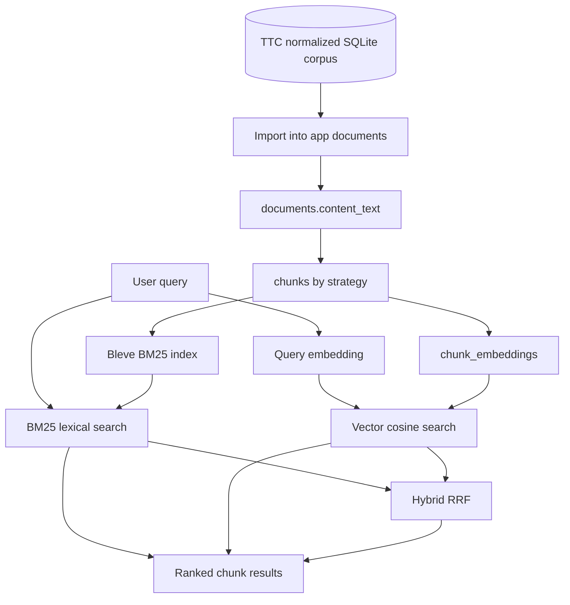

# Product-Aware Retrieval Quality Implementation Guide

## Executive summary

RAGEVAL-004 proved that the RAG Evaluation System can retrieve chunks end to end. It added BM25 lexical search, query-vector search over stored embeddings, hybrid BM25+vector retrieval, HTTP endpoints, CLI commands, and a lightweight smoke-query runner. That work answered the infrastructure question: can the system take a real query and return ranked chunks with source/document/chunk context?

RAGEVAL-005 answers the next question: can the system retrieve the right chunks for product-aware questions over the The Tree Center corpus?

The current answer is only partially. Exact article queries such as `crape myrtle varieties` work well against the sampled BM25 index. Privacy-screen queries show useful complementarity between BM25 guide chunks and vector product chunks. But product-selection and product-fact questions are still constrained by upstream data quality. The normalized corpus stores product metadata such as botanical name, hardiness zone, mature size, sunlight, soil conditions, drought tolerance, categories, tags, SKU, price range, and stock status. The app import path currently copies `content_items.content_text` into `documents.content_text`, but that text is built primarily from title, excerpt, and HTML body. Important structured product facts may remain in metadata tables rather than in the text that BM25 indexes and embeddings encode.

This ticket is about making retrieval quality measurable and improvable. The correct order is:

1. compose product `content_text` from structured facts and prose;
2. re-import products into the app database;
3. inspect product text before chunking or embedding;
4. re-chunk broader, source-balanced samples;
5. rebuild source-specific and combined BM25 indexes;
6. strengthen smoke tests so weak generic matches do not pass as strong evidence;
7. expand embeddings in bounded source-balanced batches only after text quality is confirmed;
8. run retrieval inspections for 15–25 real queries;
9. promote manually reviewed queries into benchmark candidates.

Do not start by embedding the full corpus. Do not start by creating benchmark metrics. The system first needs better retrieval inputs and more reliable diagnostic checks.

## Intended reader

This document is for a new intern joining the RAG Evaluation System project. You should be able to read it and understand:

- what has already been built;
- why the current retrieval results are useful but not yet strong;
- how the The Tree Center corpus flows from MySQL dump to app DB;
- why product metadata must be composed into searchable text;
- which files to modify;
- how to validate each step;
- how to avoid expensive or misleading embedding/search runs;
- how this work prepares future benchmark design.

The tone is implementation-focused. Every major recommendation is tied to concrete files, commands, schemas, or validation checks.

## Current project context

The repository is:

```text
/home/manuel/workspaces/2026-05-27/rag-evaluation-system/2026-05-27--rag-evaluation-system
```

The app database is:

```text
data/rag-eval.db
```

The normalized TTC corpus database is:

```text
data/corpus/ttc-dump/ttc-corpus.sqlite
```

The original TTC source dump is:

```text
/home/manuel/code/ttc/ttc/ttc_dev_dump.sql.bz2
```

The most relevant tickets are:

| Ticket | Purpose |
|---|---|
| `RAGEVAL-002` | Extract The Tree Center MySQL dump into normalized SQLite and import into the app DB. |
| `RAGEVAL-003` | Build the Corpus Explorer for inspecting sources, documents, chunks, and embedding coverage. |
| `RAGEVAL-004` | Build BM25, vector, hybrid retrieval, and smoke checks. |
| `RAGEVAL-005` | Improve product-aware retrieval quality enough to support benchmarks. |

## Current retrieval capabilities

The system currently has these search commands:

```bash
rag-eval search index
rag-eval search query
rag-eval search vector
rag-eval search hybrid
rag-eval search smoke
```

And these search APIs:

```http
POST /api/v1/search/indexes
POST /api/v1/search/query
POST /api/v1/search/vector
POST /api/v1/search/hybrid
```

The current retrieval architecture is:



RAGEVAL-004 validated these retrieval paths with real TTC data. The important measured facts are:

- `bm25-ttc-guides-articles-fixed-1200-150` indexed 204 chunks across 6 documents.
- `crape myrtle varieties` returned `Crape Myrtle Varieties and Guide`, which is a strong exact-match result.
- `how to plant arborvitae` returned generic planting results such as Japanese maples and privacy screens, which is partially useful but too weak.
- `hydrangea pruning` warned because focused hydrangea evidence was not found in the bounded indexed sample.
- vector search for `which trees make a good privacy screen` returned `Leyland Cypress` product chunks, which showed useful semantic product retrieval over the embedded sample.
- hybrid search for the same privacy-screen query returned both product chunks and guide chunks, which showed why BM25 and vector retrieval should be compared rather than treated as replacements for each other.

These results are useful diagnostics. They are not benchmark scores.

## Why product-aware retrieval is the next bottleneck

The Tree Center corpus includes articles, guides, and products. Articles and guides are mostly prose. Products are mixed records: they contain prose plus structured facts. Product-selection queries often ask for structured facts:

```text
zone 5 flowering trees
compact evergreen shrubs
full sun privacy trees
drought tolerant evergreen trees
emerald green arborvitae mature height
evergreen shrubs under 4 feet
```

A retrieval system cannot answer these queries well unless the indexed and embedded text contains the relevant facts. If hardiness zone or mature height exists only in a side table and not in `documents.content_text`, then:

- BM25 cannot match it;
- vector embeddings cannot encode it;
- hybrid retrieval cannot recover it;
- benchmarks will misdiagnose retrieval as poor when the real failure is text composition.

The current normalized corpus already extracts product metadata in `product_meta` and terms in `item_terms`. The next job is to compose those facts into app document text before chunking, indexing, and embedding.

## Corpus pipeline overview

The TTC corpus pipeline currently has two stages.

### Stage A: MySQL dump to normalized SQLite corpus

Script:

```text
ttmp/2026/05/28/RAGEVAL-002--extract-the-tree-center-content-dump-into-ordered-sqlite-corpus/scripts/03-export-mysql-to-sqlite.py
```

This script reads the loaded MySQL dump through Docker Compose and writes:

```text
data/corpus/ttc-dump/ttc-corpus.sqlite
```

Important output tables:

```sql
content_items (
  id TEXT PRIMARY KEY,
  wp_id INTEGER NOT NULL UNIQUE,
  kind TEXT NOT NULL,
  post_type TEXT NOT NULL,
  status TEXT NOT NULL,
  slug TEXT NOT NULL,
  title TEXT NOT NULL,
  url_path TEXT NOT NULL,
  published_at TEXT,
  modified_at TEXT,
  excerpt TEXT NOT NULL DEFAULT '',
  content_html TEXT NOT NULL DEFAULT '',
  content_text TEXT NOT NULL DEFAULT '',
  word_count INTEGER NOT NULL DEFAULT 0,
  parent_wp_id INTEGER NOT NULL DEFAULT 0,
  metadata_json TEXT NOT NULL DEFAULT '{}'
)

item_terms (
  item_id TEXT NOT NULL,
  taxonomy TEXT NOT NULL,
  term_id INTEGER NOT NULL,
  term_slug TEXT NOT NULL,
  term_name TEXT NOT NULL
)

product_meta (
  item_id TEXT PRIMARY KEY,
  sku TEXT,
  min_price REAL,
  max_price REAL,
  stock_status TEXT,
  botanical_name TEXT,
  hardiness_zone TEXT,
  mature_height TEXT,
  mature_width TEXT,
  sunlight TEXT,
  soil_conditions TEXT,
  drought_tolerance TEXT
)
```

The exporter currently builds `content_text` with:

```python
text_parts = [row.get("title") or "", row.get("excerpt") or "", html_to_text(content_html)]
content_text = "\n\n".join(part.strip() for part in text_parts if part and part.strip())
```

That is sufficient for prose documents. It is incomplete for products.

### Stage B: normalized SQLite corpus to app DB

Script:

```text
ttmp/2026/05/28/RAGEVAL-002--extract-the-tree-center-content-dump-into-ordered-sqlite-corpus/scripts/04-import-corpus-into-rageval.py
```

This script imports rows into app tables:

```text
sources
documents
```

For each corpus item, it inserts or updates a document. The important part is:

```python
row["content_text"] or ""
```

That value becomes `documents.content_text`, which later becomes chunks, BM25 index text, and embedding input.

This means product-aware retrieval can be improved either in the exporter or importer. The recommended first implementation is to improve the importer, because it is closer to the app DB and can join `content_items`, `product_meta`, and `item_terms` without rerunning the MySQL export.

## Target product text composition

The goal is deterministic, readable, fact-rich product text. The text should be suitable for both BM25 and embeddings.

A composed product document should look like:

```text
Title: Leyland Cypress
Content kind: product
Botanical name: Cupressus × leylandii
Categories: Evergreen Trees; Privacy Trees; Fast Growing Trees
Tags: privacy; evergreen; screening
Hardiness zones: 6-10
Mature height: 40-60 feet
Mature width: 15-25 feet
Sunlight: Full sun to partial shade
Soil conditions: Well-drained soil
Drought tolerance: Moderate
SKU: ...
Stock status: instock
Price range: 19.50-89.50

Summary:
...

Description:
...
```

Rules:

- Omit empty fields.
- Use stable field labels.
- Keep taxonomy terms readable by name, not only slug.
- Do not overemphasize price if retrieval is about plant selection; include it only as a low-priority fact.
- Preserve body/excerpt prose after structured facts.
- Avoid raw HTML in `content_text`.
- Keep `content_html` unchanged for debugging/display.
- Update `word_count` from the composed text.
- Preserve original metadata in `metadata_json`.

## Implementation plan: product text composition

### Recommended file to modify first

```text
ttmp/2026/05/28/RAGEVAL-002--extract-the-tree-center-content-dump-into-ordered-sqlite-corpus/scripts/04-import-corpus-into-rageval.py
```

This script should read product metadata and terms from the normalized corpus DB when importing products.

### Add helper: load product metadata

Pseudocode:

```python
def load_product_meta(corpus: sqlite3.Connection, item_id: str) -> dict[str, object]:
    row = corpus.execute(
        """
        SELECT sku, min_price, max_price, stock_status, botanical_name,
               hardiness_zone, mature_height, mature_width, sunlight,
               soil_conditions, drought_tolerance
        FROM product_meta
        WHERE item_id = ?
        """,
        (item_id,),
    ).fetchone()
    if not row:
        return {}
    return {key: row[key] for key in row.keys() if row[key] not in (None, "")}
```

### Add helper: load taxonomy terms

Pseudocode:

```python
def load_terms(corpus: sqlite3.Connection, item_id: str) -> dict[str, list[str]]:
    rows = corpus.execute(
        """
        SELECT taxonomy, term_name
        FROM item_terms
        WHERE item_id = ?
        ORDER BY taxonomy, term_name
        """,
        (item_id,),
    )
    terms: dict[str, list[str]] = {}
    for row in rows:
        terms.setdefault(row["taxonomy"], []).append(row["term_name"])
    return terms
```

### Add helper: compose product text

Pseudocode:

```python
def add_labeled_line(lines: list[str], label: str, value: object) -> None:
    if value is None:
        return
    text = str(value).strip()
    if not text:
        return
    lines.append(f"{label}: {text}")


def compose_product_text(row: sqlite3.Row, product_meta: dict[str, object], terms: dict[str, list[str]]) -> str:
    lines: list[str] = []

    add_labeled_line(lines, "Title", row["title"] or row["slug"])
    add_labeled_line(lines, "Content kind", "product")
    add_labeled_line(lines, "Botanical name", product_meta.get("botanical_name"))
    add_labeled_line(lines, "Hardiness zones", product_meta.get("hardiness_zone"))
    add_labeled_line(lines, "Mature height", product_meta.get("mature_height"))
    add_labeled_line(lines, "Mature width", product_meta.get("mature_width"))
    add_labeled_line(lines, "Sunlight", product_meta.get("sunlight"))
    add_labeled_line(lines, "Soil conditions", product_meta.get("soil_conditions"))
    add_labeled_line(lines, "Drought tolerance", product_meta.get("drought_tolerance"))

    product_categories = terms.get("product_cat", [])
    product_tags = terms.get("product_tag", [])
    if product_categories:
        add_labeled_line(lines, "Product categories", "; ".join(product_categories))
    if product_tags:
        add_labeled_line(lines, "Product tags", "; ".join(product_tags))

    # Operational facts: useful, but keep below botanical/growing facts.
    add_labeled_line(lines, "SKU", product_meta.get("sku"))
    add_labeled_line(lines, "Stock status", product_meta.get("stock_status"))
    price = price_range(product_meta.get("min_price"), product_meta.get("max_price"))
    add_labeled_line(lines, "Price range", price)

    body_parts: list[str] = []
    if row["excerpt"]:
        body_parts.append("Summary:\n" + clean_text(row["excerpt"]))
    if row["content_text"]:
        body_parts.append("Description:\n" + clean_text(row["content_text"]))

    return "\n".join(lines + [""] + body_parts).strip()
```

### Use composition during import

Pseudocode inside `import_items`:

```python
for row in corpus.execute(query, params):
    kind = row["kind"]
    if kind == "product":
        product_meta = load_product_meta(corpus, row["id"])
        terms = load_terms(corpus, row["id"])
        content_text = compose_product_text(row, product_meta, terms)
    else:
        content_text = row["content_text"] or ""

    word_count = len(content_text.split())

    app.execute(
        """INSERT INTO documents (...) VALUES (...) ON CONFLICT(id) DO UPDATE ...""",
        (..., content_text, ..., word_count, ...),
    )
```

### Extend metadata

`metadata_for(row)` should keep current fields and can include retrieval-related hints:

```python
metadata.update({
    "retrieval_text_version": "product-v1",
    "product_fact_fields": sorted(product_meta.keys()),
    "term_taxonomies": sorted(terms.keys()),
})
```

Keep this deterministic so re-imports are diffable.

## Validation plan for product composition

Do not chunk or embed until text quality is inspected.

### Validate by SQL

```bash
sqlite3 data/rag-eval.db '
SELECT id, title, substr(content_text, 1, 1600)
FROM documents
WHERE source_id = "ttc-dump-products"
ORDER BY id
LIMIT 5;
'
```

Look for:

- field labels at the top;
- product categories/tags;
- hardiness zone if available;
- mature size if available;
- body prose after facts;
- no obvious raw HTML in `content_text`.

### Validate field coverage

Add an optional inspection query or script that counts how many products have key strings in `content_text`:

```sql
SELECT
  SUM(content_text LIKE '%Hardiness zones:%') AS hardiness_docs,
  SUM(content_text LIKE '%Mature height:%') AS height_docs,
  SUM(content_text LIKE '%Product categories:%') AS category_docs,
  COUNT(*) AS product_docs
FROM documents
WHERE source_id='ttc-dump-products';
```

### Validate through Corpus Explorer

Open several products and inspect:

- Overview tab metadata;
- Text tab readability;
- Chunks tab after re-chunking;
- Coverage tab before embeddings.

## Re-import plan

Run a product-only import first:

```bash
python ttmp/2026/05/28/RAGEVAL-002--extract-the-tree-center-content-dump-into-ordered-sqlite-corpus/scripts/04-import-corpus-into-rageval.py \
  --corpus data/corpus/ttc-dump/ttc-corpus.sqlite \
  --app-db data/rag-eval.db \
  --kinds product
```

Then inspect counts:

```bash
sqlite3 data/rag-eval.db '
SELECT source_id, COUNT(*), SUM(word_count)
FROM documents
GROUP BY source_id
ORDER BY source_id;
'
```

Expected behavior:

- `ttc-dump-products` remains 2,594 documents;
- product word count should increase if structured facts are newly included;
- article/guide rows are untouched unless imported intentionally.

## Re-chunking plan

After product text quality is validated, re-chunk a bounded product sample. Avoid chunking every product in the first pass unless memory/time is reviewed.

Suggested first target:

```text
100 products
all 19 dump guides
50 articles
all 19 Defuddle guides if useful for comparison
```

The current chunk command works document-by-document/source-by-source through existing services. If the current CLI does not support a source-level limit exactly as needed, write a ticket script under:

```text
ttmp/2026/05/29/RAGEVAL-005--product-aware-retrieval-quality-improvements/scripts/
```

Name it:

```text
01-rechunk-retrieval-quality-sample.sh
```

Rules for the script:

- use `GOMAXPROCS=2 GOMEMLIMIT=1024MiB` for Go commands;
- emit summaries, not full chunks;
- take source IDs and limits as variables;
- print document and chunk counts;
- be rerun-safe.

Validation query after chunking:

```sql
SELECT d.source_id, COUNT(DISTINCT d.id) AS docs, COUNT(c.id) AS chunks
FROM documents d
JOIN chunks c ON c.document_id = d.id
WHERE c.strategy_id = 'fixed-1200-150'
GROUP BY d.source_id
ORDER BY d.source_id;
```

## BM25 index plan

Build source-specific indexes first. This isolates source quality.

```bash
GOMAXPROCS=2 GOMEMLIMIT=1024MiB ./rag-eval search index \
  --strategy-id fixed-1200-150 \
  --source-ids ttc-dump-products \
  --index-id bm25-ttc-products-fixed-1200-150 \
  --force \
  --output table
```

Also build:

```text
bm25-ttc-guides-fixed-1200-150
bm25-ttc-articles-fixed-1200-150
bm25-ttc-sampled-all-fixed-1200-150
```

For each index, record:

- source IDs;
- document count;
- chunk count;
- index ID;
- commands used;
- smoke results.

If RAGEVAL-005 needs a script, store it as:

```text
scripts/02-build-retrieval-quality-indexes.sh
```

## Retrieval inspection query set

Use 15–25 queries grouped by intent. Do not call this a benchmark yet.

### Care and how-to questions

```text
how to plant arborvitae
when to prune hydrangeas
how much water do newly planted trees need
how to make a privacy screen
how to care for japanese maples
```

### Article and discovery questions

```text
crape myrtle varieties
fast growing shade trees
best trees for privacy
flowering trees for small yards
best evergreen trees for screening
```

### Product-selection questions

```text
zone 5 flowering trees
compact evergreen shrubs
full sun privacy trees
drought tolerant evergreen trees
evergreen shrubs under 4 feet
emerald green arborvitae mature height
leyland cypress growth rate
```

### Inspection table format

For each query, record:

| Field | Meaning |
|---|---|
| Query | The user query. |
| Intent | care, article-discovery, product-selection, product-fact. |
| Retriever | BM25, vector, or hybrid. |
| Top documents | Titles and IDs. |
| Useful chunks | Chunk IDs judged useful. |
| Failure class | Missing content, missing index coverage, sparse embeddings, bad chunking, ranking issue, hybrid merge issue. |
| Action | What to fix next. |

Store inspection notes in a new RAGEVAL-005 source or analysis doc after running them.

## Strengthen smoke tests

Current file:

```text
eval/ttc-smoke.yaml
```

Current runner:

```text
cmd/rag-eval/cmds/search/smoke.go
```

Problem: a query can pass because a generic term appears. Example: `how to plant arborvitae` can pass because `plant` appears even if `arborvitae` does not.

### Proposed schema extension

```yaml
queries:
  - id: arborvitae-planting
    text: how to plant arborvitae
    intent: care-guide
    expected_terms: [plant, arborvitae]
    required_terms_any_result: [arborvitae]
    required_terms_same_result: [plant, arborvitae]
    weak_terms: [plant, tree, care]
    expected_source_ids: [ttc-dump-guides, ttc-dump-articles, ttc-dump-products]
    notes: Should not pass only because generic planting content appears.
```

### Status rules

```text
fail:
  no results
  required_terms_any_result absent
  known relevant document/chunk absent when required

warn:
  only weak terms matched
  expected source missing
  required terms appear but not in same result

pass:
  required evidence terms appear in a top-K result
  or known relevant document/chunk appears
```

### Pseudocode

```go
func evaluateSmoke(query SmokeQuery, results []RetrievalResult) SmokeStatus {
    if len(results) == 0 {
        return Fail("no results")
    }

    topTexts := collectTitleAndPreview(results)

    if len(query.RequiredTermsAnyResult) > 0 && !allTermsAnywhere(query.RequiredTermsAnyResult, topTexts) {
        return Fail("required terms missing from top results")
    }

    if len(query.RequiredTermsSameResult) > 0 && !allTermsInOneResult(query.RequiredTermsSameResult, results) {
        return Warn("required terms did not co-occur in one result")
    }

    if onlyWeakTermsMatched(query.WeakTerms, results) {
        return Warn("only weak generic terms matched")
    }

    if len(query.ExpectedSourceIDs) > 0 && !anyExpectedSource(query.ExpectedSourceIDs, results) {
        return Warn("no expected source in top results")
    }

    return Pass()
}
```

Keep smoke tests lightweight. They should detect broken or weak retrieval, not replace relevance labels.

## Embedding expansion plan

Do not expand embeddings until product text composition is validated and chunks are inspected.

### Coverage check

```bash
./rag-eval embedding coverage \
  --strategy-id fixed-1200-150 \
  --provider-type openai \
  --model text-embedding-3-small \
  --dimensions 1536 \
  --output table
```

### Bounded source-balanced batches

```bash
GOMAXPROCS=2 GOMEMLIMIT=1024MiB ./rag-eval embedding compute \
  --strategy-id fixed-1200-150 \
  --source-ids ttc-dump-products \
  --profile openai-embedding-small \
  --profile-registries ~/.config/pinocchio/profiles.yaml \
  --batch-size 5 \
  --limit 50 \
  --output table
```

Repeat for:

```text
ttc-dump-guides
ttc-dump-articles
thetreecenter-guides
```

After each batch:

- run coverage;
- run vector query smoke;
- inspect top results;
- stop if text quality problems appear.

## Benchmark candidate preparation

Benchmarks require labels. Smoke tests do not have labels.

A benchmark candidate should look like:

```yaml
queries:
  - id: privacy-screen-trees
    query: fast growing trees for privacy screen
    intent: product-discovery
    relevant_documents:
      - ttc-guide-405509
      - ttc-product-3701
    relevant_chunks:
      - chk-6cb63747847a4ae7
      - chk-18620b039f4bbd83
    notes: Should retrieve guide advice and product recommendation evidence.
```

Create a new file only after manual inspection:

```text
eval/ttc-retrieval-dev.yaml
```

Initial metrics to implement later:

- recall@5;
- recall@10;
- MRR;
- NDCG only after graded relevance exists.

Do not compute benchmark metrics from `expected_terms` alone.

## Result grouping and context selection

Raw ranked chunks are useful for debugging. RAG context assembly needs additional controls.

Future search flags:

```text
--max-chunks-per-document 2
--group-by-document
--include-neighbors 1
--source-quota ttc-dump-guides=3,ttc-dump-products=5
```

Keep two modes:

| Mode | Purpose |
|---|---|
| raw retrieval | inspect ranking behavior exactly as retriever produced it |
| context retrieval | select diverse, context-ready evidence for RAG prompts |

This distinction matters. Debugging needs raw ranked lists. Answer generation needs curated context.

## UX coordination points

The UX colleague is working on the webpage. Backend work should make these UI features possible:

1. Search Workbench;
2. Result Inspector;
3. coverage-aware vector/hybrid warnings;
4. Corpus Explorer search overlays;
5. Index Manager;
6. Smoke Test Dashboard;
7. Benchmark Builder later.

Backend additions that will help UX:

```http
GET /api/v1/search/indexes
GET /api/v1/search/indexes/{id}
POST /api/v1/search/smoke
```

The current `search_indexes` schema does not record source IDs explicitly. Add a config JSON field or another metadata mechanism before building a serious Index Manager.

## Implementation phases

## Phase 1: product text composition

Deliverables:

- update `scripts/04-import-corpus-into-rageval.py`;
- compose product text from `product_meta` and `item_terms`;
- product-only re-import;
- SQL inspection output saved under RAGEVAL-005;
- diary entry with before/after examples.

Acceptance:

- product `content_text` contains structured facts;
- product word counts increase plausibly;
- sample product text is readable;
- no embedding computation has happened yet.

## Phase 2: bounded re-chunking

Deliverables:

- RAGEVAL-005 script for source-balanced chunking;
- chunk counts by source;
- sample chunk inspection notes.

Acceptance:

- broader product sample is chunked;
- chunks contain product facts and prose;
- no runaway output;
- chunk counts are recorded.

## Phase 3: BM25 source indexes

Deliverables:

- product-only BM25 index;
- guide-only BM25 index;
- article-only BM25 index;
- combined sampled BM25 index;
- index counts recorded.

Acceptance:

- product queries return product chunks when facts exist;
- guide queries return guide chunks;
- article queries return article chunks;
- weak queries are documented rather than hidden.

## Phase 4: stronger smoke tests

Deliverables:

- extended `eval/ttc-smoke.yaml` schema;
- updated `rag-eval search smoke` status logic;
- smoke output recorded for source-specific and combined indexes.

Acceptance:

- generic matches produce warnings;
- required-term misses fail;
- smoke output is suitable as a diagnostic summary.

## Phase 5: source-balanced embeddings

Deliverables:

- coverage before/after each batch;
- bounded embedding compute runs;
- vector/hybrid comparison outputs.

Acceptance:

- product vectors encode improved product text;
- vector retrieval improves on product-selection queries;
- costs remain bounded and explicit.

## Phase 6: benchmark candidate file

Deliverables:

- `eval/ttc-retrieval-dev.yaml` with manually reviewed relevant documents/chunks;
- notes explaining why each label is relevant.

Acceptance:

- at least 10 labeled query candidates;
- labels are document/chunk IDs, not only terms;
- benchmark metric implementation can start in a later ticket.

## Validation commands

Run these throughout the work:

```bash
GOMAXPROCS=2 GOMEMLIMIT=1024MiB go test ./internal/db ./internal/ingest ./internal/chunking ./internal/services/source ./internal/services/chunking ./internal/services/document ./internal/services/embedding ./internal/services/corpus ./internal/services/search ./internal/api -count=1 -timeout 60s

GOMAXPROCS=2 GOMEMLIMIT=1024MiB go build ./cmd/rag-eval

docmgr doctor --ticket RAGEVAL-005 --stale-after 30
```

Use these after text composition:

```bash
sqlite3 data/rag-eval.db '
SELECT id, title, substr(content_text, 1, 1600)
FROM documents
WHERE source_id="ttc-dump-products"
LIMIT 5;
'
```

Use these after BM25 indexing:

```bash
./rag-eval search smoke \
  --file eval/ttc-smoke.yaml \
  --index-id bm25-ttc-sampled-all-fixed-1200-150 \
  --limit 10 \
  --output table
```

Use these after embeddings:

```bash
GOMAXPROCS=2 GOMEMLIMIT=1024MiB ./rag-eval search vector \
  --query "zone 5 flowering trees" \
  --strategy-id fixed-1200-150 \
  --source-ids ttc-dump-products \
  --profile openai-embedding-small \
  --profile-registries ~/.config/pinocchio/profiles.yaml \
  --limit 10 \
  --candidate-limit 200 \
  --output table
```

## Risks and safeguards

### Risk: embedding incomplete product text

If product metadata is not composed first, embeddings will encode incomplete evidence.

Safeguard: inspect product `content_text` before any product embedding run.

### Risk: confusing smoke tests with benchmarks

Smoke tests can pass weak results. They are diagnostic checks, not evaluation metrics.

Safeguard: benchmark files require relevant document/chunk IDs.

### Risk: source coverage hiding failures

A query can fail because the relevant document was not chunked or indexed.

Safeguard: record document/chunk/index counts for every run.

### Risk: one document dominates top results

Raw chunk retrieval can return many neighboring chunks from one document.

Safeguard: add grouping/deduplication later, but keep raw mode for debugging.

### Risk: long-running or expensive provider calls

Embedding expansion can consume API quota and time.

Safeguard: use source IDs, batch size, limit, coverage checks, and memory limits.

## Definition of done

RAGEVAL-005 is done when:

1. product `content_text` includes structured product facts;
2. product re-import is rerun-safe and inspected;
3. a broader source-balanced chunk sample exists;
4. product, guide, article, and combined BM25 indexes exist with recorded counts;
5. smoke tests distinguish weak generic matches from strong evidence;
6. embeddings are expanded in bounded source-balanced batches after text validation;
7. real product-aware queries return inspectable and mostly plausible chunks;
8. at least 10 manually reviewed benchmark candidates are ready for a later metrics ticket;
9. diary, changelog, and file relations are current.

## Final guidance

This ticket should improve retrieval inputs before retrieval scoring. Product-aware retrieval quality depends on text composition, chunk coverage, and embedding coverage before it depends on ranking tweaks. The work should proceed in small validated steps: compose text, inspect text, chunk text, index chunks, run smoke queries, embed bounded batches, compare retrievers, then label benchmark candidates.
