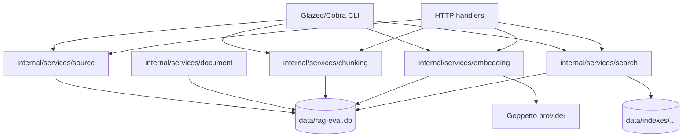
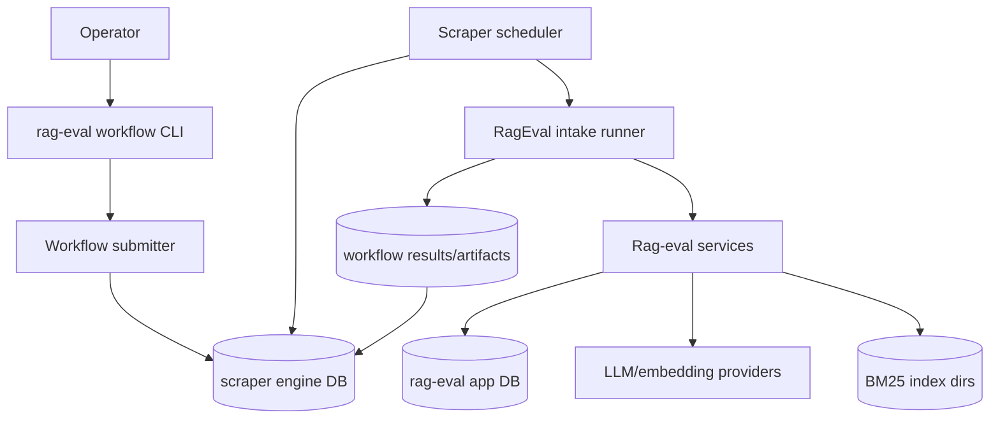
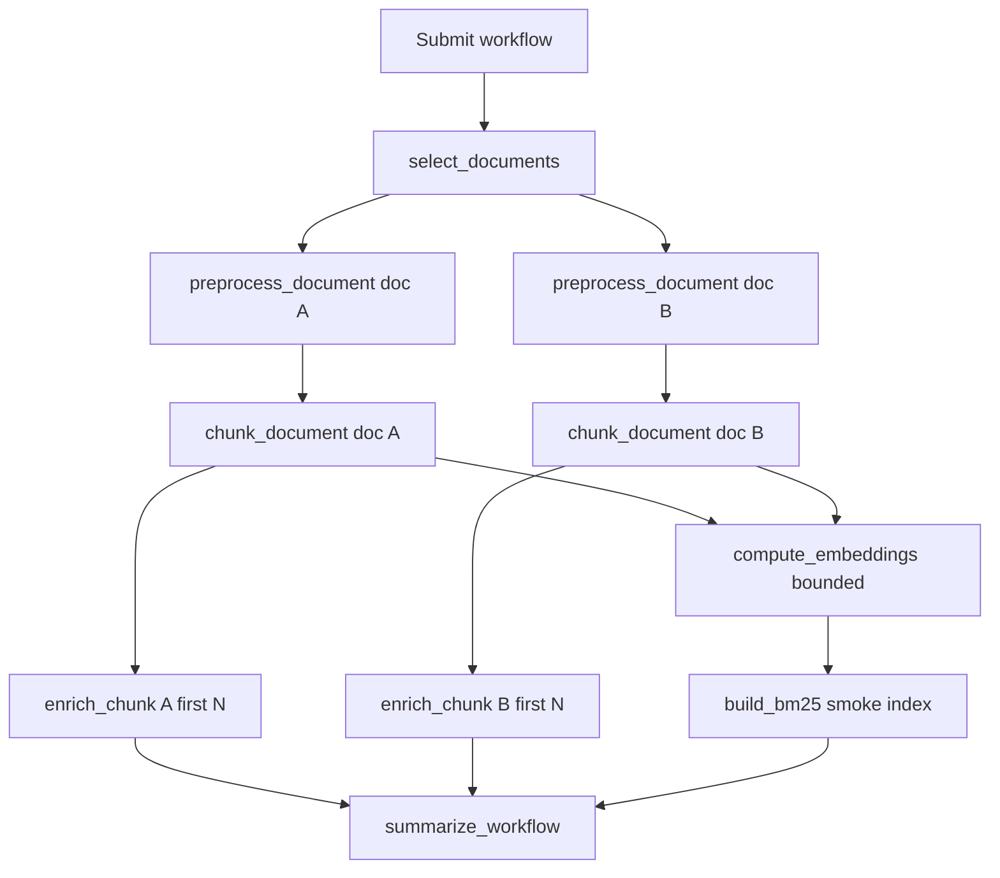

# Workflow Scraper Intake Integration Design and Implementation Guide

## Executive summary

The RAG Evaluation System currently has a working intake foundation: sources can be created, documents can be scanned or imported, documents can be chunked with strategy-aware identities, embeddings can be computed with Geppetto/Pinocchio provider configuration, embedding coverage can be inspected, and BM25 indexes can be built from canonical chunks. The current orchestration model is direct: CLI and HTTP handlers call shared Go services.

This ticket should add scraper workflow integration as an orchestration layer above those services. It should not replace the existing CLI/service path in the first implementation. The correct first milestone is a bounded prototype that proves scraper workflows improve modularity, retryability, and observability for intake, especially once LLM document preprocessing and chunk postprocessing are introduced.

The recommended direction is:

1. Preserve the existing service layer as the canonical implementation of source scanning, chunking, embeddings, and BM25 index building.
2. Add rag-eval-specific scraper runners or op adapters that call those services from durable workflow operations.
3. Add document-level and chunk-level LLM artifact tables before overwriting canonical `documents.content_text`.
4. Prototype one small workflow over a bounded TTC corpus slice.
5. Compare the workflow debugging experience against direct CLI commands before expanding to full corpus intake.

The main decision is to use scraper for orchestration and retry, not for domain logic. Workflow ops should describe durable units of work. Domain services should continue to implement work.

## Problem statement

The current intake pipeline is functional but manually orchestrated. Operators run commands in sequence:

```text
source create
source scan or corpus import
chunk apply
embedding compute
embedding coverage
search index
```

This is workable for simple experiments. It becomes fragile when intake adds LLM pre/post-processing. LLM steps introduce provider failures, partial results, prompt versions, cost controls, and slow per-document or per-chunk operations. Without a durable workflow layer, the operator must track which documents succeeded, which failed, which should be retried, and which prompt version produced each artifact.

The project already anticipated a workflow-driven intake system in RAGEVAL-001, but the implementation deliberately stabilized the lower-level services first. That stabilization now makes workflow integration safer: the workflow layer can wrap idempotent services rather than duplicate their logic.

The goal of RAGEVAL-006 is not to migrate everything into scraper immediately. The goal is to design and prototype a workflow integration path that answers these questions:

- Can existing rag-eval services be represented as durable scraper operations?
- Can LLM preprocessing and chunk enrichment be retried independently?
- Can workflow results be traced back to source/document/chunk/embedding rows?
- Can developers debug a failed workflow op by rerunning the equivalent direct CLI command?
- Does the workflow layer make intake more structured without making it opaque?

## Scope

### In scope

- Architecture for integrating the scraper workflow engine into rag-eval.
- Mapping current intake service operations to workflow ops.
- Designing a minimal rag-eval workflow runner or adapter layer.
- Designing document preprocessing and chunk enrichment artifact persistence.
- Designing a bounded prototype workflow over a small TTC corpus slice.
- Defining CLI/API surfaces for submitting and inspecting workflow intake runs.
- Defining tests and validation commands.
- Documenting tradeoffs, risks, and open questions.

### Out of scope for the first prototype

- Replacing all existing intake CLI commands.
- Running the full TTC corpus through LLM preprocessing.
- Building a new workflow UI before the backend prototype works.
- Changing search ranking or benchmark logic.
- Moving all rag-eval data into scraper site databases.
- Making scraper JavaScript site scripts the only way to define intake behavior.

## Current rag-eval intake state

The current rag-eval intake stack is service-oriented. CLI commands and HTTP handlers are adapters over shared services.



### Evidence-backed observations

The source service already states the intended future boundary: it owns source creation and ingestion behavior shared by CLI, HTTP, and future workflow operations. In `/home/manuel/workspaces/2026-05-27/rag-evaluation-system/2026-05-27--rag-evaluation-system/internal/services/source/service.go`, lines 12-19 define the service, and lines 36-57 implement `Create` as a validated source upsert. Lines 71-90 implement `Scan` by delegating to `internal/ingest.Scanner`.

The chunking service has the same explicit boundary. In `internal/services/chunking/service.go`, lines 12-19 define the shared service, lines 38-84 validate and run chunking, and lines 86-90 delete existing chunks for exactly one document/strategy pair before reinserting. This makes chunking rerun-safe for workflow retries.

The embedding service already supports workflow-friendly cost controls. In `internal/services/embedding/service.go`, lines 21-29 define `ComputeRequest` with `StrategyID`, `SourceIDs`, `BatchSize`, `Limit`, and `Force`. Lines 83-118 list chunks, hash text, and skip fresh embeddings. Lines 120-156 batch provider calls and upsert vectors. Lines 161-197 implement read-only coverage.

The database schema already contains artifact-like storage for chunk enrichment. In `internal/db/db.go`, lines 140-157 define `chunk_enrichments` with `prompt_version`, provider/model identity, summaries, topics, entities, hypothetical questions, quality score, and `text_hash`. This table is not yet wired into an LLM service, but it is the correct direction for chunk postprocessing.

BM25 indexing is already a derived operation over canonical chunks. In `internal/services/search/bm25.go`, lines 27-143 implement `BuildBM25`: it validates strategy ID, reads chunks with document context, writes a temporary Bleve index, renames it into place, and records `search_indexes` metadata. This is a workflow candidate, but only after chunking is complete.

HTTP handlers already route to the service layer. In `internal/api/handlers.go`, lines 17-57 register source, document, chunking, embedding, search, and corpus routes. Source handlers call `sourceservice.NewService`; chunk handlers call `chunkservice.NewService`; embedding handlers call `embeddingservice.NewService`.

The current gap is orchestration, not low-level behavior.

## Current scraper workflow architecture

The scraper repository already provides a durable workflow engine. It is located at:

```text
/home/manuel/workspaces/2026-05-27/rag-evaluation-system/scraper
```

Its documentation describes a split between a generic durable engine and site-specific behavior. Go owns persistence, scheduling, HTTP execution, leases, retries, queue policy, and CLI ergonomics. JavaScript usually owns site-specific behavior.

The core runtime model is:

```text
submit verb
  -> create workflow
  -> emit initial op(s)
worker
  -> lease ready op
  -> run op through registered runner
  -> persist result, artifacts, emitted child ops, or error
  -> refresh dependencies and workflow status
```

### Scraper primitives

`../scraper/pkg/engine/model/types.go` defines the main primitives:

- `WorkflowRun` at lines 44-53;
- `Dependency` at lines 55-58;
- `RetryPolicy` at lines 60-66;
- `QueuePolicy` and token-bucket rate limit policy at lines 78-115;
- `OpSpec` at lines 124-140;
- `OpError` and `OpResult` at lines 180-197.

`../scraper/pkg/engine/store/store.go` defines the store interface. Lines 10-13 define `CreateWorkflowParams`, lines 57-63 define op lease/complete/fail methods, and lines 70-77 define the combined `Store` interface with dependency refresh, queue candidates, and workflow stats.

`../scraper/pkg/engine/runner/runner.go` defines the runner seam. Lines 17-25 define `RunContext`, and lines 27-30 define the `Runner` interface:

```go
type Runner interface {
    Kind() string
    Run(ctx context.Context, runCtx RunContext) (*model.OpResult, error)
}
```

`../scraper/pkg/engine/scheduler/scheduler.go` runs the durable execution loop. Lines 197-294 refresh runnable ops, list queue candidates, lease ready ops, and execute them. Lines 303-383 execute one leased op through the runner registry and complete it. Lines 386-420 fail an op and schedule retry state when appropriate.

These pieces are directly relevant to rag-eval because they provide the retry, dependency, and queue-control behavior we need for LLM-heavy intake.

### Scraper JavaScript site model

Scraper's existing site model uses:

- `site.yaml` manifests;
- `verbs/` JavaScript files for submission-time CLI commands;
- `scripts/` JavaScript files for durable execution-time ops;
- optional site DB migrations;
- built-in `js` and `http/fetch` runners.

The JavaScript API supports `ctx.emit`, dependencies, artifacts, result records, `site-db`, and `scraper-db`. This model is useful and proven for scraping sites, but rag-eval intake has substantial Go domain services already. We should not force all rag-eval domain behavior into JavaScript just to use the engine.

## Design goal

Use scraper's durable workflow engine without losing rag-eval's direct, testable service layer.

The target architecture is:



The workflow engine should know about work units and dependencies. The rag-eval services should know about documents, chunks, embeddings, and indexes.

## Recommended architecture

### Add a rag-eval workflow package

Create a new package:

```text
internal/workflow/
  submit.go          # create workflows and initial ops
  runner.go          # runner implementation for rag-eval op kinds
  ops.go             # op input/output structs and op kind constants
  errors.go          # retryable/non-retryable op error helpers
  engine.go          # scraper store/scheduler wiring helpers
  service_registry.go# dependencies injected into runner
  tests/...          # temporary SQLite and fake provider tests
```

The package should depend on scraper engine packages, not on scraper site JavaScript infrastructure for the first prototype.

Why Go-native first:

- Current rag-eval behavior is in Go services.
- Go-native runner tests can use fake providers and temporary SQLite DBs.
- It avoids adding JavaScript/goja debugging to the first integration step.
- JavaScript site definitions can be considered later if dynamic workflow authoring becomes important.

### Register one custom runner kind

Use a single runner kind for typed rag-eval operations:

```text
kind: rag-eval/intake
```

Inside the op input, use an `operation` field:

```json
{
  "operation": "chunk_document",
  "db_path": "data/rag-eval.db",
  "document_id": "ttc-guide-398454",
  "strategy": "fixed",
  "chunk_size": 1200,
  "overlap": 150
}
```

Alternative: use many runner kinds such as `rag-eval/chunk-document`, `rag-eval/compute-embeddings`, and `rag-eval/build-bm25`. The single-runner approach is simpler for the prototype because all operations share dependency injection and database setup.

### Keep op inputs explicit and serializable

Every op input should be JSON-serializable and copy/pasteable. Avoid hidden process state.

Recommended operation inputs:

```go
type IntakeOpInput struct {
    Operation string `json:"operation"`
    DBPath    string `json:"db_path"`

    SourceID string `json:"source_id,omitempty"`
    Dir      string `json:"dir,omitempty"`

    DocumentID string `json:"document_id,omitempty"`
    DocumentIDs []string `json:"document_ids,omitempty"`

    Strategy string `json:"strategy,omitempty"`
    StrategyID string `json:"strategy_id,omitempty"`
    ChunkSize int `json:"chunk_size,omitempty"`
    Overlap int `json:"overlap,omitempty"`

    ProviderProfile string `json:"provider_profile,omitempty"`
    ProfileRegistries []string `json:"profile_registries,omitempty"`
    ProviderType string `json:"provider_type,omitempty"`
    Model string `json:"model,omitempty"`
    Dimensions int `json:"dimensions,omitempty"`
    BatchSize int `json:"batch_size,omitempty"`
    Limit int `json:"limit,omitempty"`
    Force bool `json:"force,omitempty"`

    PromptVersion string `json:"prompt_version,omitempty"`
    ArtifactType string `json:"artifact_type,omitempty"`

    IndexID string `json:"index_id,omitempty"`
    SourceIDs []string `json:"source_ids,omitempty"`
}
```

The first implementation can split this into per-op structs internally, but the serialized op shape should remain clear in workflow inspection tools.

### Operation set for the prototype

Start with these operations:

| Operation | Purpose | Existing service or new service |
|---|---|---|
| `scan_source` | scan filesystem source into documents | existing `source.Service.Scan` |
| `select_documents` | choose bounded document IDs for the workflow | new small query helper |
| `preprocess_document` | LLM clean/normalize one document into an artifact table | new document preprocessing service |
| `chunk_document` | apply chunking strategy to one document or artifact text | existing `chunking.Service`, later extended for artifact input |
| `enrich_chunk` | LLM summarize/extract topics/entities/questions for one chunk | new chunk enrichment service using `chunk_enrichments` |
| `compute_embeddings` | compute embeddings for strategy/source subset | existing `embedding.Service.Compute` |
| `build_bm25` | build BM25 index from chunks | existing `search.Service.BuildBM25` |
| `summarize_workflow` | write final counts and links | new lightweight op |

The prototype should not attempt full dynamic fan-out over thousands of documents. It should run over two or three documents first.

## LLM document preprocessing design

LLM preprocessing should not overwrite `documents.content_text` in the first implementation. It should write a derived artifact. This preserves raw intake and makes comparison possible.

Add a table:

```sql
CREATE TABLE IF NOT EXISTS document_processing_artifacts (
    document_id TEXT NOT NULL REFERENCES documents(id) ON DELETE CASCADE,
    artifact_type TEXT NOT NULL,
    prompt_version TEXT NOT NULL,
    provider TEXT NOT NULL,
    model TEXT NOT NULL,
    input_text_hash TEXT NOT NULL,
    output_text TEXT,
    output_json TEXT DEFAULT '{}',
    quality_score REAL,
    status TEXT NOT NULL DEFAULT 'succeeded',
    error_json TEXT DEFAULT '{}',
    created_at TEXT NOT NULL DEFAULT (datetime('now')),
    updated_at TEXT NOT NULL DEFAULT (datetime('now')),
    PRIMARY KEY (document_id, artifact_type, prompt_version, provider, model)
);
```

Candidate artifact types:

- `cleaned_text`;
- `product_composed_text`;
- `metadata_extraction`;
- `readability_rewrite`;
- `deduplicated_text`.

The document preprocessing op should:

1. load the document by ID;
2. compute `input_text_hash` from `documents.content_text`;
3. check for an existing artifact with the same identity and hash;
4. skip if fresh and `force=false`;
5. call the LLM provider;
6. validate output shape;
7. upsert the artifact;
8. return a small summary in `OpResult.Data`.

Pseudocode:

```text
runPreprocessDocument(input):
    doc = queries.GetDocumentWithContent(input.document_id)
    input_hash = sha256(doc.content_text)

    existing = artifacts.Get(document_id, artifact_type, prompt_version, provider, model)
    if existing.hash == input_hash and !input.force:
        return { skipped_fresh: true, artifact_id: existing.identity }

    prompt = renderPrompt(prompt_version, doc)
    response = llm.Generate(prompt)
    output = parseAndValidate(response)

    artifacts.Upsert(..., input_hash, output.text, output.json)
    return { artifact_type, prompt_version, chars: len(output.text) }
```

The first implementation can use Geppetto inference settings similarly to the embedding provider resolver. It should use fake providers in unit tests and explicit live smoke commands for real provider calls.

## Chunk enrichment design

The existing schema already has `chunk_enrichments`. Use it for chunk-level LLM postprocessing.

Current table fields include:

- `chunk_id`;
- `strategy_id`;
- `prompt_version`;
- `provider`;
- `model`;
- `short_summary`;
- `long_summary`;
- `key_topics_json`;
- `entities_json`;
- `hypothetical_questions_json`;
- `quality_score`;
- `text_hash`.

The enrichment op should:

1. load a chunk by exact `(chunk_id, strategy_id)`;
2. compute `text_hash`;
3. skip if a row exists for `(chunk_id, strategy_id, prompt_version)` with the same hash unless forced;
4. call LLM with a strict JSON schema prompt;
5. validate JSON fields;
6. upsert `chunk_enrichments`;
7. return a summary.

Pseudocode:

```text
runEnrichChunk(input):
    chunk = queries.GetChunk(input.chunk_id, input.strategy_id)
    hash = sha256(chunk.text)
    existing = enrichments.Get(chunk_id, strategy_id, prompt_version)
    if existing.hash == hash and !input.force:
        return { skipped_fresh: true }

    prompt = renderChunkPrompt(prompt_version, chunk.text)
    json = llm.GenerateJSON(prompt)
    validate keys: short_summary, long_summary, key_topics, entities, hypothetical_questions, quality_score
    enrichments.Upsert(chunk_id, strategy_id, prompt_version, provider, model, json, hash)
    return { enriched: true, topic_count: len(key_topics) }
```

This step is a strong workflow candidate because it may run once per chunk, uses an external provider, and should be retryable independently.

## Workflow graph for the first prototype

The first prototype should be intentionally small. A recommended graph:



For the first workflow run, choose:

```yaml
source_ids:
  - ttc-dump-guides
document_limit: 2
chunk_strategy: fixed
chunk_size: 1200
overlap: 150
enrichment_chunk_limit_per_document: 2
embedding_limit: 10
bm25_index_id: bm25-workflow-smoke-fixed-1200-150
```

The prototype should prove observability and retry behavior, not throughput.

## Workflow submission API and CLI

Add a new CLI group:

```text
rag-eval workflow submit-intake
rag-eval workflow run-worker
rag-eval workflow status
rag-eval workflow ops
rag-eval workflow retry-op
```

Minimal first command:

```bash
./rag-eval workflow submit-intake \
  --engine-db state/rag-eval-workflows.db \
  --db data/rag-eval.db \
  --workflow-id ttc-guides-llm-smoke-001 \
  --source-ids ttc-dump-guides \
  --document-limit 2 \
  --preprocess-prompt-version doc-cleanup-v1 \
  --enrich-prompt-version chunk-enrich-v1 \
  --strategy fixed \
  --chunk-size 1200 \
  --overlap 150 \
  --embedding-profile openai-embedding-small \
  --profile-registries ~/.config/pinocchio/profiles.yaml \
  --embedding-limit 10 \
  --bm25-index-id bm25-workflow-smoke-fixed-1200-150
```

Worker command:

```bash
./rag-eval workflow run-worker \
  --engine-db state/rag-eval-workflows.db \
  --max-cycles 100 \
  --poll-interval 100ms
```

HTTP can follow later. If added, use endpoints similar to:

```http
POST /api/v1/workflows/intake
GET  /api/v1/workflows
GET  /api/v1/workflows/{workflow_id}
GET  /api/v1/workflows/{workflow_id}/ops
POST /api/v1/workflows/{workflow_id}/ops/{op_id}/retry
```

Do not block the first prototype on HTTP. CLI plus engine DB inspection is enough.

## Runner design

The runner should open the rag-eval app DB per op or reuse a safe DB provider injected into the runner. The simplest version opens `db_path` from op input, runs migrations, constructs `db.Queries`, executes the service operation, then closes the connection.

Pseudocode:

```go
type IntakeRunner struct {
    ProviderResolver ProviderResolver
    LLMResolver      LLMResolver
    IndexRoot        string
}

func (r *IntakeRunner) Kind() string { return "rag-eval/intake" }

func (r *IntakeRunner) Run(ctx context.Context, runCtx runner.RunContext) (*model.OpResult, error) {
    var input IntakeOpInput
    json.Unmarshal(runCtx.Op.Input, &input)

    queries := OpenDBAtPath(input.DBPath)
    defer queries.Close()

    switch input.Operation {
    case "scan_source":
        result := source.NewService(queries).Scan(ctx, ...)
        return dataResult(result), nil
    case "chunk_document":
        result := chunking.NewService(queries).Apply(ctx, ...)
        return dataResult(compactChunkResult(result)), nil
    case "compute_embeddings":
        provider := r.ProviderResolver.Resolve(ctx, input)
        result := embedding.NewService(queries).Compute(ctx, ...)
        return dataResult(result), nil
    case "build_bm25":
        result := search.NewService(queries, r.IndexRoot).BuildBM25(ctx, ...)
        return dataResult(result), nil
    case "preprocess_document":
        result := documentprocessing.NewService(queries, r.LLMResolver).Preprocess(ctx, ...)
        return dataResult(result), nil
    case "enrich_chunk":
        result := enrichment.NewService(queries, r.LLMResolver).Enrich(ctx, ...)
        return dataResult(result), nil
    default:
        return nil, nonRetryable("unknown_operation", ...)
    }
}
```

### Error classification

External provider failures should be retryable when the failure is transient:

- rate limits;
- temporary network errors;
- 5xx provider errors;
- timeout.

Input/configuration failures should be non-retryable:

- missing document ID;
- unknown strategy;
- invalid prompt version;
- missing API key;
- invalid JSON response after maximum parse repair attempts.

Expose this through scraper's `OpError`:

```go
model.OpError{
    Code: "provider_rate_limited",
    Message: err.Error(),
    Retryable: true,
    Details: json.RawMessage(...),
}
```

Scraper's scheduler uses `RetryPolicy` and retryable errors to schedule retries, as seen in `scheduler.go` lines 386-420 and `nextRetryState` after line 481.

## Retry and idempotency rules

Each operation needs an idempotency key and a freshness condition.

| Operation | Idempotency/freshness rule |
|---|---|
| `scan_source` | document IDs are stable by source/path; insert is upsert. |
| `select_documents` | deterministic order and limit; result is workflow data. |
| `preprocess_document` | primary key includes document, artifact type, prompt version, provider, model; skip same input hash. |
| `chunk_document` | rebuild exact document/strategy pair; strategy ID records config. |
| `enrich_chunk` | primary key includes chunk, strategy, prompt version; skip same text hash. |
| `compute_embeddings` | primary key includes chunk, strategy, provider, model, dimensions; skip same text hash. |
| `build_bm25` | index ID identifies derived index; use `force` for rebuild. |
| `summarize_workflow` | read-only aggregation or overwrite same summary artifact. |

Workflow retry should never duplicate durable domain artifacts. If retry can create duplicates, fix the service before adding it to the workflow.

## Queue policy recommendations

Use queue names to separate resource classes:

```text
rag-eval:cpu          # scanning, chunking, SQLite-only operations
rag-eval:llm          # document preprocessing and chunk enrichment
rag-eval:embedding    # embedding provider calls
rag-eval:index        # BM25 index builds
```

Initial policies:

```yaml
queuePolicies:
  - queue: rag-eval:cpu
    maxInFlight: 2
  - queue: rag-eval:llm
    maxInFlight: 1
    rateLimit:
      kind: token_bucket
      ratePerSecond: 0.2
      burst: 1
  - queue: rag-eval:embedding
    maxInFlight: 1
    rateLimit:
      kind: token_bucket
      ratePerSecond: 0.5
      burst: 1
  - queue: rag-eval:index
    maxInFlight: 1
```

The exact configuration depends on how we embed scraper. The principle is more important than the syntax: CPU work and provider work should not share one queue.

## Artifacts and observability

The workflow engine already persists op results and artifacts. Use them for operational summaries, not for canonical data that belongs in rag-eval tables.

Recommended split:

| Data | Store in rag-eval DB | Store in workflow result/artifact |
|---|---:|---:|
| documents | yes | summary only |
| chunks | yes | summary only |
| embeddings | yes | counts only |
| BM25 index path | yes, in `search_indexes` | summary only |
| document preprocessing output | yes, in new artifact table | preview and identity |
| chunk enrichment output | yes, in `chunk_enrichments` | preview and identity |
| provider raw response | optional, if useful and safe | artifact if not secret/heavy |
| errors and retry details | maybe status/error table | yes |

The Corpus Explorer can later display workflow-produced artifact identities. The first implementation can rely on CLI inspection and SQLite queries.

## Alternatives considered

### Alternative 1: Keep using only CLI scripts

This is the simplest short-term path. It is good for direct debugging and one-off experiments. It becomes weak for LLM preprocessing because provider calls are slow, costly, and partially failing. Manual scripts do not provide durable dependency tracking or per-op retry state.

Decision: keep CLI scripts as debugging escape hatches, but add workflow orchestration for multi-step LLM intake.

### Alternative 2: Move all intake into scraper JavaScript sites

This would reuse scraper's existing site abstraction directly. It would make workflows declarative and dynamic, but it would force Go domain services through JavaScript wrappers too early. It would also make debugging new LLM artifacts depend on goja runtime behavior.

Decision: do not start here. Consider JavaScript workflow authoring after Go-native ops prove useful.

### Alternative 3: Import scraper as a library and add Go-native rag-eval runner

This is the recommended prototype path. It uses scraper's engine, store, scheduler, retry, and queue policy while keeping rag-eval service logic in Go.

Decision: proceed with this design first.

### Alternative 4: Use an external workflow system

Temporal, Dagger, Argo, or a job queue could provide durable workflows. That would add more infrastructure and move away from the locally available scraper engine that was already part of the original design.

Decision: not appropriate for this local RAG evaluation system at this stage.

## Implementation plan

### Phase 0: Dependency and boundary check

1. Add scraper module dependency to rag-eval, preferably with a local `replace` during development if needed.
2. Verify version compatibility for Go, Glazed, sqlite3, and go-go-goja dependencies.
3. Add `internal/workflow` package skeleton.
4. Add temporary tests proving a minimal scraper store and scheduler can be created from rag-eval tests.

Exit criteria:

- `go test ./internal/workflow -count=1` can create a workflow and run a no-op custom runner.

### Phase 1: Go-native intake runner

1. Implement `rag-eval/intake` runner.
2. Implement op input decoding and error classification.
3. Implement operations for `chunk_document`, `compute_embeddings` with fake provider, and `build_bm25`.
4. Add tests with temporary rag-eval DB and scraper engine DB.

Exit criteria:

- A test creates a workflow with a chunk op and embedding op dependency.
- Scheduler runs both ops.
- Chunks and fake embeddings are written to rag-eval DB.

### Phase 2: Workflow submission CLI

1. Add `cmd/rag-eval/cmds/workflow` group.
2. Add `submit-intake` for bounded prototype workflow.
3. Add `run-worker` or `run-once` for local execution.
4. Add `status` and `ops` commands, possibly wrapping scraper engineview services.

Exit criteria:

- Operator can submit a workflow and run worker cycles from `rag-eval` CLI.

### Phase 3: Document preprocessing artifacts

1. Add `document_processing_artifacts` migration.
2. Add query helpers and service.
3. Add fake LLM provider tests.
4. Add workflow op `preprocess_document`.
5. Keep direct CLI command or test helper for debugging preprocessing outside workflow.

Exit criteria:

- A workflow can preprocess two documents and store artifacts without modifying `documents.content_text`.

### Phase 4: Chunk enrichment workflow

1. Add query helpers for `chunk_enrichments`.
2. Add enrichment service over fake LLM provider.
3. Add workflow op `enrich_chunk`.
4. Add bounded fan-out over first N chunks per document.

Exit criteria:

- A workflow can enrich a bounded set of chunks and skip fresh enrichments on retry.

### Phase 5: Live provider smoke

1. Use Pinocchio/Geppetto profile resolution for document preprocessing and chunk enrichment.
2. Run a two-document, two-chunk live smoke with strict cost limits.
3. Record provider, model, prompt version, hashes, and output counts.

Exit criteria:

- Live smoke succeeds or fails with retryable/non-retryable errors visible in workflow state.

### Phase 6: Corpus Explorer integration

1. Add read-only workflow summaries to API.
2. Link documents/chunks to workflow artifacts where relevant.
3. Show preprocessing/enrichment coverage per source/strategy/prompt version.

Exit criteria:

- UI can answer which documents/chunks have workflow-produced LLM artifacts.

## Testing strategy

### Unit tests

- op input decode validation;
- error classification;
- document artifact freshness checks;
- chunk enrichment freshness checks;
- fake provider behavior;
- workflow runner operation dispatch.

### Integration tests

Use temporary SQLite databases:

1. create rag-eval app DB;
2. seed a source, document, and chunking strategy;
3. create scraper engine DB;
4. register custom runner;
5. create workflow with dependent ops;
6. run scheduler cycles;
7. assert rag-eval DB rows and scraper workflow status.

### Live smoke tests

Live provider tests should be explicit and bounded:

```bash
GOMAXPROCS=2 GOMEMLIMIT=1024MiB \
./rag-eval workflow submit-intake \
  --workflow-id live-llm-smoke-001 \
  --source-ids ttc-dump-guides \
  --document-limit 1 \
  --enrichment-chunk-limit 1 \
  --profile openai-embedding-small
```

Do not run live provider calls in unit tests.

## Risks and mitigations

| Risk | Why it matters | Mitigation |
|---|---|---|
| Workflow layer hides simple bugs | Developers may debug engine state instead of service behavior. | Keep direct CLI/service commands and make every op reproducible outside workflow. |
| Non-idempotent ops duplicate artifacts | Retry can create incorrect rows. | Define primary keys and freshness checks before enabling retries. |
| LLM output is hard to validate | Bad JSON or vague summaries can poison retrieval. | Use strict prompt versions, JSON validation, fake-provider tests, and bounded live smoke. |
| Provider costs grow unexpectedly | Workflows can fan out. | Source/document/chunk limits, queue policy, dry-run planning, and explicit live flags. |
| Importing scraper creates dependency conflicts | Scraper and rag-eval use related dependencies at different versions. | Phase 0 dependency test before implementation. |
| BM25 or embedding state becomes stale | Workflow may rebuild one artifact but not another. | Add summary op and coverage checks; document required rebuild order. |

## Open questions

1. Should rag-eval embed scraper's engine store directly or call a scraper binary as a subprocess for the first prototype?
2. Should workflow state use a separate engine DB (`state/rag-eval-workflows.db`) or live inside `data/rag-eval.db`?
3. Should document preprocessing artifacts become a new table immediately, or should the first prototype use workflow artifacts only?
4. Which Geppetto LLM generation interface should document preprocessing use, separate from embeddings?
5. Should workflow ops operate on original `documents.content_text` or allow selecting a document artifact as chunk input in Phase 1?
6. How should prompt templates be stored and versioned: files, embedded Go constants, DB rows, or Pinocchio profiles?

Recommended initial answers:

- use a separate engine DB;
- add `document_processing_artifacts` before live preprocessing;
- keep original direct service paths;
- implement Go-native runner before JS site scripts;
- keep prompt versions file-backed at first.

## File reference

### rag-eval files

| File | Why to read it |
|---|---|
| `internal/db/db.go` | Intake schema, chunk enrichment table, search index metadata. |
| `internal/db/queries.go` | Source/document/chunk/embedding persistence helpers. |
| `internal/services/source/service.go` | Source creation and scan service boundary. |
| `internal/services/chunking/service.go` | Strategy-aware, rerun-safe chunk application. |
| `internal/services/embedding/service.go` | Batch compute, text-hash freshness, coverage. |
| `internal/services/embedding/provider.go` | Geppetto/Pinocchio embedding provider resolution. |
| `internal/services/search/bm25.go` | Derived BM25 index build operation. |
| `internal/api/handlers.go` | Current service-backed HTTP route pattern. |
| `cmd/rag-eval/cmds/embedding/compute.go` | CLI adapter pattern with profile flags. |
| `ttmp/2026/05/29/RAGEVAL-005--product-aware-retrieval-quality-improvements/design-doc/01-product-aware-retrieval-quality-implementation-guide.md` | Product text composition context for future preprocessing. |

### scraper files

| File | Why to read it |
|---|---|
| `../scraper/pkg/engine/model/types.go` | Workflow, op, dependency, retry, queue, result primitives. |
| `../scraper/pkg/engine/store/store.go` | Store interface for workflow creation, leasing, completion, results, stats. |
| `../scraper/pkg/engine/scheduler/scheduler.go` | Scheduler loop, lease execution, retry behavior, workflow status update. |
| `../scraper/pkg/engine/runner/runner.go` | Custom runner interface. |
| `../scraper/pkg/doc/topics/scraper-runtime-model.md` | Human-readable explanation of submit vs execution time. |
| `../scraper/pkg/doc/topics/scraper-queue-policies-and-rate-limiting.md` | Queue policy and token-bucket behavior. |
| `../scraper/sites/slashdot/verbs/seed.js` | Example submit verb. |
| `../scraper/sites/slashdot/scripts/seed.js` | Example durable op that emits dependent child ops. |

## Final recommendation

Create the workflow integration, but keep it as an additive prototype. The project is ready because the lower-level intake services are idempotent enough to wrap. The project is not ready for a full migration because LLM preprocessing, document artifact storage, and workflow debugging conventions are not proven yet.

The best next implementation is a Go-native scraper runner that executes existing rag-eval services, followed by a small LLM preprocessing/enrichment prototype over one or two TTC guide documents. If that prototype is easy to inspect and retry, expand it. If it makes debugging harder, keep the workflow layer optional and continue improving direct services first.
