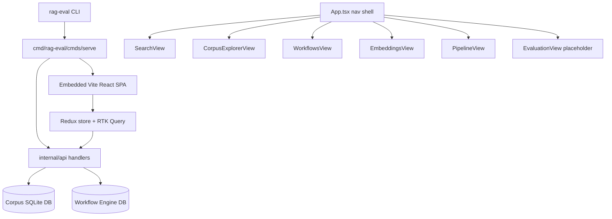
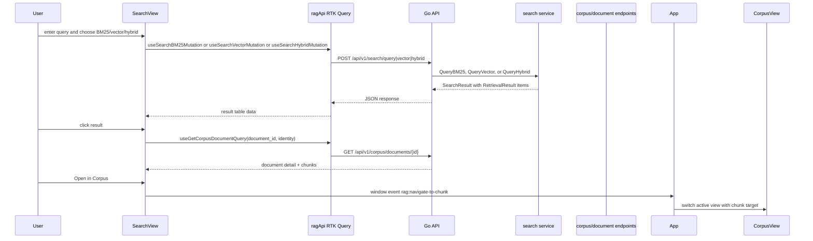
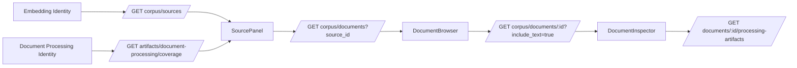
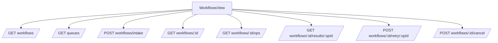

# RAG Evaluation Web Architecture and Design System Review

## Executive Summary

The RAG Evaluation System already has the raw material for a strong RAG dashboard. The backend exposes a meaningful set of APIs for sources, documents, chunks, embeddings, search, corpus exploration, workflow orchestration, and derived artifacts. The React app exposes most of those workflows through six top-level views: Search, Corpus, Workflows, Pipeline, Embeddings, and Evaluation. The UI is useful today because it lets a developer run searches, inspect chunks, browse corpus coverage, submit intake workflows, watch workflow progress, inspect operation results, compute embeddings, and compare stored vectors.

The web architecture is also at the point where it needs a design-system and DMETA pass before it grows further. The app has a coherent retro monochrome visual language in `web/src/index.css`, but that CSS file currently acts as tokens, foundation primitives, layout system, atoms, molecules, organisms, and utility library all at once. Components repeatedly use inline layout styles, global class strings, local subcomponents, and view-local state. There is no Storybook, no CSS Modules, no component metadata, no generated/promoted boundary, and no `dmeta-ir` catalog in this repository. That is acceptable for the prototype phase, but it will not scale cleanly to a complex RAG dashboard.

The right next step is not a wholesale rewrite. The right next step is a disciplined vertical slice. Choose the query-to-evidence workflow, extract the shared tokens/foundation/layout primitives it needs, author the first RAG DMETA IR objects, lower them into Web MDS templates, generate scaffolds, and promote React components bottom-up. The current UI should be treated as evidence, not as the architecture to preserve exactly.

The recommended first slice is:

```text
RetrievalQuery + Corpus + EvidenceChunk + SourceDocument
  -> query_composer + retrieval_evidence_set + source_document_summary
  -> submit_query + inspect_evidence + open_source_document
  -> SearchWorkbenchPage + SearchControlsPanel + RetrievalResultsPanel + ResultInspectorPanel
  -> promoted React built from PageShell, DashboardGrid, Panel, Stack, Text, Heading, CodeText, StatusBadge, Button, DataTable
```

This report is written for a new intern. It explains what the web system is, which files matter, how data flows from Go APIs to RTK Query to React views, where the current design system is implicit, what should become DMETA IR, and how to implement the next architecture pass safely.

## How to Read This Report

Read the first half to understand the current system. Read the second half when you are ready to change it.

- **Current system sections** explain the app shell, API layer, major views, CSS, and backend routes.
- **Review sections** evaluate the current implementation against the design-system + DMETA playbook.
- **Proposed architecture sections** define the target layers, suggested DMETA IR, Web MDS templates, design-system primitives, validators, and phased implementation plan.

The central rule is repeated throughout because it prevents most mistakes:

> Existing React/CSS is evidence, not architecture. Core IR describes domain meaning. Interaction IR describes user-visible obligations and actions. Web MDS describes Web component choices. React implements the final design system.

## Current System in One Diagram



The production server opens the app database, runs migrations, registers API handlers, and serves the embedded SPA. Evidence: `cmd/rag-eval/cmds/serve/server.go` opens the database at lines 25-29, registers API handlers at line 37, and mounts the embedded SPA at line 38. Vite builds the frontend into `../internal/web/dist` (`web/vite.config.ts`, line 19), and `internal/web/spa.go` embeds that directory and falls back to `index.html` for SPA routes.

## Repository and Web File Map

The web application is small enough to map directly, but large enough that responsibilities are starting to blur.

| File | Lines | Current responsibility |
| --- | ---: | --- |
| `web/src/App.tsx` | 92 | Top-level navigation shell, active view state, custom cross-view events. |
| `web/src/main.tsx` | 14 | React root and Redux provider. |
| `web/src/store/index.ts` | 19 | RTK Query store setup. |
| `web/src/services/api.ts` | 742 | API DTOs, RTK Query endpoints, generated hooks. |
| `web/src/index.css` | 622 | Global tokens, retro theme, reusable classes, layout classes, form/table/button styles, widget styles. |
| `web/src/components/search/SearchView.tsx` | 761 | Search workbench, query form, source filters, result table, coverage panel, result inspector. |
| `web/src/components/corpus/CorpusExplorerView.tsx` | 201 | Corpus source/document/detail explorer and preprocessing coverage selection. |
| `web/src/components/corpus/DocumentInspector.tsx` | 346 | Document overview, text, chunks, embedding coverage, processing artifacts. |
| `web/src/components/workflows/WorkflowsView.tsx` | 719 | Workflow list, queue health, submit modal, workflow detail, op graph, op result inspector. |
| `web/src/components/embeddings/EmbeddingsView.tsx` | 284 | Embedding compute controls and similarity comparison. |
| `web/src/components/pipeline/PipelineView.tsx` | 71 | Simple source/document overview. |
| `web/src/components/evaluation/EvaluationView.tsx` | 18 | Placeholder for future evaluation dashboard. |
| `web/src/components/retro/*` | 76 total | Older Mac-style components that appear stale or partially disconnected from the current global CSS. |

The highest-risk files are `SearchView.tsx`, `WorkflowsView.tsx`, `api.ts`, and `index.css`. They are not bad files. They are doing too many jobs because the project has not yet introduced a design-system and IR layer.

## Current Frontend Runtime

The app shell is a simple in-memory tab system, not React Router. `App.tsx` defines the visible views at line 9, stores `activeView` in component state, and switches views in `renderView` at line 54. It also defines `ChunkNavigationTarget` at line 18 and listens for two custom browser events at lines 41-42:

```text
rag:navigate-to-chunk
rag:navigate-to-workflows
```

Those events let the Search view jump to the Corpus view and let the Corpus inspector jump to Workflows. This works for a prototype, but it is a routing smell for a larger dashboard. The event payload is not typed at the app boundary, cannot be bookmarked, and can drift between emitters and listeners. It should eventually become route state or an explicit dashboard navigation store.

The data layer is RTK Query. `web/src/services/api.ts` creates `ragApi` at line 294, uses `/api/v1` as its base URL at line 296, and exports generated hooks at line 709. The Redux store only contains the RTK Query reducer and middleware (`web/src/store/index.ts`, lines 4-11). That is a good sign: the app does not yet have a complicated global state model. Most view state is local, and server cache state belongs to RTK Query.

## Backend API Surface Used by the Web App

The Go backend registers a broad REST surface in `internal/api/handlers.go`. The route registry begins in `RegisterHandlersWithOptions` at line 30. Important groups:

```http
GET  /api/v1/sources
POST /api/v1/sources
GET  /api/v1/documents
GET  /api/v1/documents/{id}
GET  /api/v1/documents/{id}/chunks
GET  /api/v1/chunking-strategies
POST /api/v1/embeddings/compute
POST /api/v1/embeddings/coverage
POST /api/v1/embeddings/similarity
POST /api/v1/search/query
POST /api/v1/search/vector
POST /api/v1/search/hybrid
GET  /api/v1/corpus/sources
GET  /api/v1/corpus/documents
GET  /api/v1/corpus/documents/{id}
GET  /api/v1/workflows
GET  /api/v1/workflows/{id}
GET  /api/v1/workflows/{id}/ops
GET  /api/v1/workflows/{id}/results/{opId}
POST /api/v1/workflows/{id}/retry/{opId}
POST /api/v1/workflows/{id}/cancel
POST /api/v1/workflows/intake
GET  /api/v1/queues
GET  /api/v1/artifacts/document-processing/identities
GET  /api/v1/artifacts/document-processing/coverage
GET  /api/v1/artifacts/chunk-enrichment/identities
GET  /api/v1/artifacts/chunk-enrichment/coverage
GET  /api/v1/chunks/{id}/enrichments
```

The API is product-rich. It already encodes many concepts a DMETA core model should know about: sources, documents, chunks, embeddings, search results, workflows, queues, document processing artifacts, chunk enrichments, evaluation queries, and evaluation runs.

The database schema confirms this domain. `internal/db/db.go` defines sources at lines 67-74, documents at lines 78-95, chunks at lines 99-113, chunking strategies at lines 116-124, chunk embeddings at lines 127-139, chunk enrichments at lines 142-158, document processing artifacts at lines 162-176, search indexes at lines 184-198, and evaluation tables at lines 203-237.

## Data Flow: Search Workbench

The Search view is the best first vertical slice because it already ties together query composition, retrieval, evidence inspection, source filtering, embedding coverage, and cross-navigation to the corpus.



The code evidence is clear:

- Search defaults live in `SearchView.tsx` lines 17-22.
- `SearchView` starts at line 39.
- Coverage is fetched when vector or hybrid is active (`SearchView.tsx`, line 82).
- `runSearch` chooses BM25/vector/hybrid mutations (`SearchView.tsx`, line 95).
- `ResultInspector` starts at line 500.
- `handleOpenInCorpus` dispatches `rag:navigate-to-chunk` at line 527.

The current design-system issue is that this one file owns a whole page, panels, forms, tables, state transitions, coverage warnings, quick queries, result inspector, tab bar, and document/chunk text rendering. In the target architecture, these should become separate organisms and molecules.

## Data Flow: Corpus Explorer

The Corpus view is the system's explanatory browser. It turns the RAG pipeline from abstract storage into inspectable artifacts: source summaries, document lists, document text, chunk boundaries, embedding coverage, and document processing artifacts.



Important evidence:

- `CorpusExplorerView` defines the default embedding identity at line 30.
- It defines a default preprocessing artifact identity at line 39.
- The main component starts at line 46.
- It loads document-processing identities at line 76.
- It derives preprocessing coverage into a source-keyed map at lines 93-100.
- It renders `IdentityBar`, `SourcePanel`, `DocumentBrowser`, and `DocumentInspector` at lines 136, 154, 162, and 192.
- `DocumentInspector` has tabs for overview, text, chunks, coverage, and artifacts. The active-tab sections begin at lines 105, 164, 238, and 298.

This is a strong product workflow. It already expresses the right semantic concepts. The weakness is structural: components use global classes and inline styles rather than design-system primitives, and the product concepts have not been captured in DMETA IR.

## Data Flow: Workflow Dashboard

The Workflows view exposes the durable intake pipeline. It is important because it connects the corpus artifacts back to the operations that created them.



The backend groups workflow operations by operation and status in `internal/api/workflow_artifact_handlers.go`. `handleWorkflowOps` starts at line 44, defines the response grouping structure at line 55, and returns grouped counts plus a sample op. The frontend mirrors this: `STATUS_ICON` is defined at line 20 of `WorkflowsView.tsx`, `QueueHealthWidget` starts at line 46, `SubmitIntakeModal` at line 106, `OpGraph` at line 301, `OpResultSection` at line 349, `WorkflowDetail` at line 456, `WorkflowsList` at line 617, and `WorkflowsView` at line 679.

This view is valuable, but it is a classic sign that the prototype is outgrowing a single file. `WorkflowsView.tsx` contains an entire dashboard application: queue metrics, modal form, graph, result inspector, workflow list, polling, retry/cancel controls, navigation, and formatting helpers. The target architecture should split this into organisms/molecules and define the workflow concepts in Interaction IR.

## Current Visual System and CSS

`web/src/index.css` contains the current design language. It starts with tokens at line 4, sets global body styling at line 27, defines the navigation strip at line 39, defines panels at line 78, tables at line 127, statuses at line 181, buttons at line 197, inputs at line 230, coverage strips at line 254, text helpers at line 328, progress bars at line 491, modal overlay at line 560, and form rows at line 580.

The visual language is coherent: monochrome, classic Mac-inspired, dense, inspection-oriented, with monospace labels and compact panels. That is a legitimate design direction for an engineering RAG dashboard. The issue is not taste. The issue is ownership.

Today, `index.css` owns all of these concerns at once:

| Concern | Current examples | Target owner |
| --- | --- | --- |
| Tokens | `--mac-bg`, `--mac-border`, `--font-mono` | `tokens.css` |
| Foundation typography | `.text-mono`, `.text-dim`, `.text-small`, `.text-bold` | `Text`, `CodeText`, `Caption`, `Heading` |
| Layout primitives | panel padding, form rows, grid gaps, scroll regions | `Panel`, `Stack`, `Inline`, `DashboardGrid`, `ScrollRegion` |
| Atoms | `.btn`, `.input`, `.select`, `.copy-btn` | `Button`, `TextInput`, `Select`, `IconButton` |
| Molecule/organism anatomy | `.coverage-strip`, `.chunk-bar`, `.op-graph`, `.progress-bar` | component-specific CSS Modules |
| Page chrome | `.nav-strip`, `.nav-brand`, `.nav-item` | `AppShell` or `DashboardNav` |

A static scan found 622 CSS lines and heavy repeated class usage. The most frequent class names in React are `text-dim`, `text-mono`, `meta-key`, `mono`, `meta-value`, `stat-value`, `panel`, `panel-header`, `input`, `num`, `section-title`, `stat-label`, and `panel-body-condensed`. That is exactly the pattern the design-system playbook warns about: repeated foundation and layout roles are global utility classes rather than owned primitives.

The scan also found heavy inline styling pressure: `SearchView.tsx` has 61 `style={{...}}` occurrences, `WorkflowsView.tsx` has 52, `EmbeddingsView.tsx` has 42, and `DocumentInspector.tsx` has 17. Inline styles are not automatically wrong, but at this scale they show that layout primitives do not exist yet.

## Current Strengths

The current web app has several strengths worth preserving.

### 1. The product workflows are real

The UI is not a static mock. Search, corpus browsing, workflows, embeddings, and artifact inspection all connect to backend endpoints. That makes the app a good source of design-system evidence.

### 2. The backend API is already organized by product capability

The route groups line up well with future DMETA concepts: sources/documents/chunks, embeddings, search, corpus explorer, workflows, queues, and artifacts. This will make IR authoring easier because the domain boundaries already exist in services and endpoints.

### 3. RTK Query is a good boundary

`api.ts` centralizes DTOs and hooks. Even though the file is too large, the pattern is sound. The future should split API modules by domain, not abandon RTK Query.

### 4. The retro dashboard language is coherent

The monochrome Mac-inspired design is internally consistent and supports dense operator workflows. It should be formalized as tokens and primitives rather than discarded.

### 5. The system already has explanatory UI concepts

Coverage strips, chunk timelines, op graphs, status badges, data tables, inspectors, and tab bars are exactly the kinds of patterns a RAG dashboard needs. They need names, ownership, and stories.

## Current Problems

### Problem 1: No DMETA IR exists for the web/dashboard concepts

There is no `dmeta-ir` directory in the RAG repository. That means the important design decisions only exist in React and Go code. A new engineer cannot ask, “What is the target-neutral representation for retrieval evidence?” or “Which Web organism renders workflow queue health?” because those concepts have not been named outside implementation.

This is the main gap against the playbook. The app already has domain concepts and visible obligations, but they are implicit.

### Problem 2: The design system is a global CSS file, not layered primitives

The current CSS is useful, but too centralized. It combines tokens, foundation typography, layout, atoms, molecules, organisms, and page chrome. This makes local changes risky because a class like `.panel` or `.text-mono` can affect every view.

### Problem 3: Component files are too coarse

`SearchView.tsx` and `WorkflowsView.tsx` are page-scale components with many local subcomponents. This hides reusable boundaries. For example, `CoveragePanel`, `QuickQueries`, `ResultInspector`, `QueueHealthWidget`, `OpGraph`, and `OpResultSection` are valuable reusable organisms/molecules but live inside page files.

### Problem 4: Layout is mostly inline

The app has repeated split panes, panel stacks, grids, forms, and scroll regions. These should be layout primitives. Inline styles make those choices hard to audit and hard to validate.

### Problem 5: Navigation uses custom browser events

Custom events work, but they are fragile as the app grows. The payloads are not centralized. One event carries `{documentId, chunkId, sourceId}` from search, while workflow navigation dispatches a similar event with `{sourceId, strategyId}`. The `ChunkNavigationTarget` interface in `App.tsx` expects `documentId`, `chunkId`, and `sourceId`. This mismatch should be cleaned up before building more cross-view workflows.

### Problem 6: Evaluation is the product name, but the Evaluation view is a placeholder

The database already has evaluation tables (`eval_queries`, `eval_runs`, `eval_results`), and the product is called RAG Evaluation System. The web app does not yet expose evaluation workflows beyond a placeholder. That is fine for now, but the design-system/DMETA pass should include evaluation as a first-class future domain, not as an afterthought.

### Problem 7: Stale retro components appear disconnected

`web/src/components/retro/MacButton.tsx`, `MacMenuBar.tsx`, and `MacWindow.tsx` reference classes such as `mac-btn`, `mac-menu-bar`, and `mac-window`. The current CSS scan did not show corresponding definitions in `index.css`. These components may be stale from an earlier iteration. They should be either removed, revived as real primitives, or replaced by the new design-system layer.

## Design-System Target Architecture

The target design system should be extracted bottom-up. Do not start by rewriting pages. Start by making repeated roles explicit.

```text
tokens
  -> foundation primitives
  -> layout primitives
  -> atoms
  -> molecules
  -> organisms
  -> pages
```

### Tokens

Create `web/src/styles/tokens.css` and move the stable visual language there. Keep the retro monochrome identity, but rename tokens from `--mac-*` to product-neutral names or preserve `--rag-*` aliases.

Example:

```css
:root {
  --rag-color-bg: #ffffff;
  --rag-color-text: #000000;
  --rag-color-text-muted: #666666;
  --rag-color-surface-panel: #ffffff;
  --rag-color-surface-muted: #eeeeee;
  --rag-color-border: #000000;
  --rag-color-action: #0000cc;
  --rag-color-danger: #cc0000;
  --rag-color-success: #007722;
  --rag-color-warning: #aa7700;

  --rag-font-body: 'Geneva', 'Helvetica Neue', 'Arial', sans-serif;
  --rag-font-mono: 'Monaco', 'Courier New', monospace;
  --rag-font-role-body: 400 12px/1.45 var(--rag-font-body);
  --rag-font-role-code: 400 11px/1.45 var(--rag-font-mono);
  --rag-font-role-label: 700 11px/1.2 var(--rag-font-mono);
}
```

### Foundation primitives

Create `web/src/components/foundation` with:

| Primitive | Why |
| --- | --- |
| `Text` | Replaces `.text-dim`, `.text-small`, `.text-bold`, body text roles. |
| `CodeText` | Replaces `.text-mono`, `.mono`, IDs, model names, strategy IDs. |
| `Heading` | Replaces panel/section title typography where semantic headings are needed. |
| `Caption` | Replaces compact helper text and metadata hints. |
| `StatusText` | Centralizes status tone mapping for succeeded/failed/running/pending. |
| `Divider` | Replaces `.divider` and ad hoc borders. |
| `VisuallyHidden` | Prevents future page-local hidden label classes. |

Example API:

```tsx
<Text size="compact" tone="muted">No workflows yet.</Text>
<CodeText copyable>{workflowId}</CodeText>
<StatusText status="failed">✘ failed</StatusText>
```

### Layout primitives

Create `web/src/components/layout` with:

| Primitive | Replaces |
| --- | --- |
| `AppShell` | `App.tsx` root + nav strip + content padding. |
| `DashboardGrid` | repeated flex/grid split layouts. |
| `Panel` | `.panel`, `.panel-header`, `.panel-body`, `.panel-body-condensed`. |
| `Stack` | vertical flex layouts with `gap`. |
| `Inline` | horizontal flex rows and toolbar patterns. |
| `ScrollRegion` | repeated max-height/overflow blocks. |
| `TabList` | `.tab-bar` + `.tab-item`. |
| `FormRow` | `.form-row` label/control alignment. |

Example:

```tsx
<DashboardGrid columns="controls-results-inspector">
  <Stack gap="sm">
    <SearchControlsPanel />
    <CoveragePanel />
  </Stack>
  <RetrievalResultsPanel />
  <ResultInspectorPanel />
</DashboardGrid>
```

### Atoms and molecules

Initial atoms:

- `Button`
- `IconButton`
- `TextInput`
- `Select`
- `CheckboxRow`
- `StatusBadge`
- `CopyButton`

Initial molecules:

- `MetadataGrid`
- `StatGrid`
- `DataTable`
- `CoverageStrip`
- `ProgressBar`
- `ChunkTimelineBar`
- `QueryPresetList`
- `IdentitySelector`

These should not be invented abstractly. Extract them from the current views where repetition is visible.

## Proposed DMETA IR Architecture

The repository should add a `dmeta-ir` directory. The first goal is not to model everything. The first goal is to model the first vertical slice with natural-language YAML fields so a human can navigate it.

Suggested directory:

```text
dmeta-ir/
  core-model/
    archetypes/10-rag-dashboard.yaml
    capabilities/10-rag-dashboard.yaml
  interactions/
    representations/10-rag-dashboard.yaml
    actions/10-rag-dashboard.yaml
    elaboration-rules/10-rag-dashboard.yaml
  meta-design-systems/
    web/
      component-system.yaml
      lowering-rules.yaml
      widgets/search.yaml
      widgets/corpus.yaml
      widgets/workflows.yaml
      style/tokens.yaml
      style/recipes.yaml
      targets/react.yaml
  instantiations/
    rag-evaluation-dashboard.yaml
```

Every major object must include human-readable fields. The minimum should be:

```yaml
summary: One sentence for scans and generated indexes.
description: >
  A short paragraph explaining what this object means.
why: >
  Why this belongs in this layer and not another layer.
human_notes: >
  Optional maintainer notes for caveats, defaults, or naming traps.
examples:
  - Concrete product example.
non_goals:
  - What this object deliberately does not model.
```

Comments should help navigation, but comments must not be the only explanation.

### Core model candidates

```yaml
# -----------------------------------------------------------------------------
# RAG corpus and retrieval domain objects
# These are target-neutral concepts. They do not name React panels, CSS classes,
# browser routes, or Web layout.
# -----------------------------------------------------------------------------

archetypes:
  RetrievalQuery:
    summary: A query submitted against a corpus or retrieval configuration.
    description: >
      RetrievalQuery represents the semantic request that drives BM25, vector, or
      hybrid retrieval. It includes query text, corpus/index selection, filters,
      retriever configuration, and execution context.
    why: >
      Query meaning exists outside Web rendering. The same query can be submitted
      from the web dashboard, CLI, notebook, smoke test, or evaluation run.
    examples:
      - "fast growing trees for privacy screen"
      - "hydrangea pruning"
    non_goals:
      - Does not model the Web search input field.
      - Does not model button placement or form layout.

  SourceDocument:
    summary: A document stored in the RAG corpus.
    description: >
      SourceDocument is the durable source item loaded from a source. It has a
      title, URL, content text, optional raw/HTML content, metadata, word count,
      language, and processing status.
    why: >
      Document identity is shared by corpus browsing, retrieval results,
      citations, workflows, preprocessing artifacts, and evaluation labels.
    examples:
      - TTC guide page imported from the Tree Center corpus.
      - Product detail document generated from a dump row.

  EvidenceChunk:
    summary: A chunk of document text used for retrieval and inspection.
    description: >
      EvidenceChunk represents a bounded text span produced by a chunking strategy.
      It carries chunk index, offsets, token count, text, embedding state, and
      optional enrichment state.
    why: >
      Chunks are central to retrieval explainability and evaluation. They are not
      Web table rows; Web can render them as rows, cards, timelines, or reports.

  EmbeddingIdentity:
    summary: The strategy/provider/model/dimensions tuple used to interpret vectors.
    description: >
      EmbeddingIdentity identifies which chunking strategy and embedding model are
      being inspected. Changing this identity changes coverage, vector search, and
      similarity results.
    why: >
      The current UI already exposes this as a first-class control. It should be
      modeled explicitly because many dashboard views depend on it.

  IntakeWorkflow:
    summary: A durable workflow that transforms documents into chunks, embeddings, and indexes.
    description: >
      IntakeWorkflow represents the orchestration run stored in the workflow engine
      database. It contains op groups, statuses, retry/cancel behavior, and queue
      health implications.
    why: >
      Workflows explain how corpus artifacts were produced. They belong in the
      domain model before Web renders them as progress bars or op graphs.

  EvaluationRun:
    summary: A retrieval-quality evaluation run over queries and expected evidence.
    description: >
      EvaluationRun captures the configuration, status, query set, retrieved
      results, scores, latency, and comparison context for measuring retrieval.
    why: >
      Evaluation is the product's destination. The web view is currently a
      placeholder, but the DB schema already includes eval run concepts.
```

### Interaction representations

```yaml
representations:
  query_composer:
    summary: Visible controls for composing and submitting a retrieval query.
    description: >
      Represents the user-visible obligation to enter query text, choose retriever
      mode, select index/strategy/provider identity, apply source filters, and run
      a search.
    why: >
      Query composition is target-neutral. Web MDS decides whether it becomes a
      side panel, command bar, modal, or notebook cell.
    supports_actions:
      - submit_query
      - reset_query

  retrieval_results:
    summary: Ranked retrieval results returned from BM25, vector, or hybrid search.
    description: >
      Represents the visible ranked evidence list with title, score, chunk index,
      retriever components, and preview text.
    why: >
      Retrieval results can render as a table, cards, CLI output, or evaluation
      report. The representation is not a Web table.
    supports_actions:
      - select_result
      - inspect_result
      - open_in_corpus

  result_inspector:
    summary: Detailed inspection of one retrieval result and its source context.
    description: >
      Represents the obligation to show score breakdown, IDs, chunk text,
      neighboring chunks, document metadata, and coverage for a selected result.
    why: >
      Result inspection is central to evaluating retrieval quality and should be
      modeled separately from the search results list.

  corpus_browser:
    summary: Source-to-document-to-chunk exploration of the indexed corpus.
    description: >
      Represents the visible hierarchy of source summaries, document rows,
      document details, chunks, coverage, and artifacts.
    why: >
      Corpus exploration explains the data pipeline and supports debugging search.

  workflow_monitor:
    summary: Live workflow status, op groups, queue health, and op results.
    description: >
      Represents the user-visible state of the intake workflow engine, including
      workflow list, progress, op graph, retry/cancel actions, queue health, and
      result/error inspection.
    why: >
      Workflow monitoring is an operator obligation independent of Web rendering.
```

### Interaction actions

```yaml
actions:
  submit_query:
    summary: Execute the current retrieval query.
    description: >
      Runs BM25, vector, or hybrid retrieval using the selected configuration and
      returns ranked evidence chunks.
    why: >
      Query submission is product behavior. Web later binds it to a button, Enter
      key handler, or command palette action.

  inspect_result:
    summary: Inspect one ranked retrieval result.
    description: >
      Opens details for a selected result, including score components, chunk text,
      neighboring chunks, and document metadata.

  open_in_corpus:
    summary: Navigate from a retrieval result to its document and chunk in the corpus browser.
    description: >
      Carries source, document, and chunk identity so the corpus browser can focus
      the relevant artifact.
    human_notes: >
      The current implementation uses browser custom events. The target should use
      typed route state or an explicit dashboard navigation store.

  submit_intake_workflow:
    summary: Start a durable intake workflow.
    description: >
      Creates workflow operations for chunking, embedding, and BM25 indexing based
      on selected sources/documents and processing options.

  retry_workflow_op:
    summary: Retry a failed workflow operation.
    description: >
      Requeues a failed op through the workflow engine mutation API.
```

### Web MDS template examples

The Web MDS should lower representations into dashboard organisms and pages. It should not encode exact CSS.

```yaml
templates:
  - id: rag.search_workbench_page
    name: SearchWorkbenchPage
    summary: Page-level dashboard for composing retrieval queries and inspecting evidence.
    description: >
      Composes query controls, coverage state, quick query presets, retrieval
      results, and the selected result inspector.
    why: >
      This is the Web page that satisfies the Search view's top-level user intent.
      It belongs in Web MDS because it chooses a dashboard grid composition.
    component:
      level: page
      role: search_workbench_page
      generation_policy: scaffold_then_promote
      layout:
        primitive: dashboard_grid
        recipe: controls_results_inspector
    consumes:
      representations:
        - query_composer
        - retrieval_results
        - result_inspector
      actions:
        - submit_query
        - inspect_result
        - open_in_corpus
    composition:
      uses:
        - template: rag.search_controls_panel
          role: query_controls
          required: true
        - template: rag.retrieval_results_panel
          role: result_list
          required: true
        - template: rag.result_inspector_panel
          role: result_inspector
          required: true
    design:
      css_ownership: none
      foundation:
        typography: required
        visually_hidden: use_primitive
    stories:
      - empty
      - bm25_results
      - hybrid_results_with_inspector
      - sparse_vector_coverage

  - id: rag.retrieval_results_panel
    name: RetrievalResultsPanel
    summary: Panel showing ranked retrieval results.
    description: >
      Renders result rows with rank, title, chunk index, score, optional BM25/vector
      components, and preview text.
    why: >
      The current SearchView table is a reusable organism. It should become an
      explicit Web template so retrieval result presentation can be validated.
    component:
      level: organism
      role: retrieval_results_panel
      generation_policy: scaffold_then_promote
      layout:
        primitive: panel
    consumes:
      representations:
        - retrieval_results
      actions:
        - select_result
        - inspect_result
    design:
      css_ownership: anatomy_only
      foundation:
        typography: required
    stories:
      - empty
      - loading
      - bm25
      - vector
      - hybrid
```

## Recommended Refactor Plan

### Phase 1: Stabilize the current web app documentation and build checks

Before changing code, make the web app easy to validate.

- Add a root or web `README.md` section explaining the six views and backend assumptions.
- Ensure `pnpm install` is documented because `pnpm build` currently fails without local `node_modules`.
- Add explicit scripts for `typecheck`, `build`, and later `storybook`.
- Decide whether stale `components/retro/*` should be removed or revived.

Validation:

```bash
cd 2026-05-27--rag-evaluation-system/web
pnpm install
pnpm build
```

Observed in this review: `pnpm build` failed because `tsc` was not found and `node_modules` was missing. The exact output was:

```text
sh: 1: tsc: not found
ELIFECYCLE Command failed.
WARN Local package.json exists, but node_modules missing, did you mean to install?
```

### Phase 2: Extract tokens, foundation, and layout primitives

Create:

```text
web/src/styles/tokens.css
web/src/components/foundation/
web/src/components/layout/
```

Start with primitives that remove the most repetition:

- `Text`, `CodeText`, `StatusText`, `Caption`, `Divider`, `VisuallyHidden`;
- `AppShell`, `Panel`, `Stack`, `Inline`, `DashboardGrid`, `ScrollRegion`, `TabList`, `FormRow`.

Refactor only one vertical slice first: Search view. Do not rewrite every view at once.

### Phase 3: Split SearchView into reusable pieces

Target file structure:

```text
web/src/components/pages/SearchWorkbenchPage/
web/src/components/organisms/SearchControlsPanel/
web/src/components/organisms/RetrievalResultsPanel/
web/src/components/organisms/ResultInspectorPanel/
web/src/components/molecules/CoveragePanel/
web/src/components/molecules/QueryPresetList/
web/src/components/molecules/MetadataGrid/
web/src/components/molecules/DataTable/
```

Keep behavior the same while changing structure. The first refactor should be a move/extract refactor, not a redesign.

### Phase 4: Add Storybook or equivalent component review surface

The project currently has no Storybook. Add it before large design-system expansion. Stories should cover:

- foundation primitives;
- layout primitives;
- Search controls empty/loading/error states;
- retrieval results for BM25/vector/hybrid;
- sparse vector coverage warning;
- result inspector detail/chunk/document tabs;
- corpus document inspector tabs;
- workflow list and op graph states.

### Phase 5: Author the first DMETA IR vertical slice

Add `dmeta-ir` and model the search/corpus result path first. Require `summary`, `description`, and `why` fields in every major YAML object.

Do not model evaluation first. The Evaluation view is still a placeholder. Model what exists and what is actively used: query composer, retrieval results, result inspector, corpus browser, and workflow monitor.

### Phase 6: Add generated scaffolds and metadata

Once the first Web MDS templates exist, generate React scaffolds into a separate generated directory. Preserve metadata:

```json
{
  "templateId": "rag.retrieval_results_panel",
  "componentLevel": "organism",
  "layout": { "primitive": "panel" },
  "design": { "cssOwnership": "anatomy_only" },
  "composition": { "uses": ["rag.data_table", "rag.status_text"] }
}
```

### Phase 7: Add validators

Minimum validators:

- no duplicate template IDs;
- all templates have `summary`, `description`, and `why`;
- all lowering rules reference known representations/actions/templates;
- all promoted components preserve `data-dmeta-template`;
- `css_ownership: none` components do not import local CSS;
- foundation typography is used instead of repeated local/global text classes;
- no new page-local hidden-text classes;
- generated files are not hand-edited.

## Pseudocode: First Validator

```js
function validateDmetaCatalog(catalog) {
  const ids = new Set();

  for (const object of catalog.allMajorObjects()) {
    assert(object.summary, `${object.id}: missing summary`);
    assert(object.description, `${object.id}: missing description`);
    assert(object.why, `${object.id}: missing why`);
  }

  for (const template of catalog.webTemplates) {
    assert(!ids.has(template.id), `duplicate template id ${template.id}`);
    ids.add(template.id);
    assertKnownLevel(template.component.level);
    assertKnownCssOwnership(template.design.css_ownership);

    for (const edge of template.composition?.uses ?? []) {
      assertKnownTemplate(edge.template);
    }
  }

  for (const rule of catalog.loweringRules) {
    for (const rep of rule.when.representations ?? []) assertKnownRepresentation(rep);
    for (const action of rule.when.actions ?? []) assertKnownAction(action);
    for (const template of rule.emits.widget_templates ?? []) assertKnownTemplate(template);
  }
}
```

## Pseudocode: Target Search Page Composition

```tsx
export function SearchWorkbenchPage() {
  const queryState = useSearchWorkbenchState();
  const results = useRetrievalSearch(queryState.request);

  return (
    <AppShell activeView="search">
      <DashboardGrid recipe="controls-results-inspector">
        <Stack gap="sm">
          <SearchControlsPanel {...queryState.controls} />
          <EmbeddingCoveragePanel identity={queryState.embeddingIdentity} />
          <QueryPresetList onSelect={queryState.setQuery} />
        </Stack>

        <RetrievalResultsPanel
          result={results.data}
          loading={results.loading}
          error={results.error}
          selectedId={queryState.selectedResultId}
          onSelect={queryState.selectResult}
        />

        <ResultInspectorPanel
          result={queryState.selectedResult}
          identity={queryState.embeddingIdentity}
          onOpenInCorpus={queryState.openInCorpus}
        />
      </DashboardGrid>
    </AppShell>
  );
}
```

This is not meant to be copied exactly. It shows the ownership split: the page owns orchestration; panels own product sections; foundation/layout primitives own repeated presentation.

## Intern Onboarding Guide: What to Read First

Read these files in order:

1. `cmd/rag-eval/cmds/serve/server.go` — how the backend and embedded SPA are served.
2. `internal/api/handlers.go` — route registry and core API groups.
3. `web/src/services/api.ts` — frontend DTOs and RTK Query hooks.
4. `web/src/App.tsx` — top-level navigation and cross-view events.
5. `web/src/components/search/SearchView.tsx` — most important current vertical slice.
6. `web/src/components/corpus/CorpusExplorerView.tsx` — source/document/chunk exploration.
7. `web/src/components/corpus/DocumentInspector.tsx` — detailed artifact inspection.
8. `web/src/components/workflows/WorkflowsView.tsx` — workflow operations and queue monitoring.
9. `web/src/index.css` — current implicit design system.
10. This report's proposed DMETA IR examples — target architecture for the next pass.

## Review-Critical Risks

- **Navigation drift**: custom events should be replaced or centralized before more cross-view workflows are added.
- **CSS drift**: every new view will likely add more global classes and inline styles unless primitives are extracted first.
- **API type drift**: `api.ts` is large and hand-written. It should eventually be split by domain or generated from OpenAPI/protobuf/DMETA contracts.
- **Evaluation gap**: the product is named RAG Evaluation, but the web evaluation view is not implemented.
- **Validator gap**: without validators, the future DMETA/design-system contract will be documentation only.
- **Build reproducibility**: `pnpm build` requires dependencies; the current environment did not have `node_modules` installed.

## Exit Criteria for the First Implementation Slice

The first slice is done when:

1. `SearchView` is split into named page/organism/molecule components without behavior regression.
2. Tokens, foundation, and layout primitives exist and are used in the search slice.
3. A `dmeta-ir` catalog exists for query composition, retrieval results, result inspection, and corpus navigation.
4. Every major YAML object has `summary`, `description`, and `why` fields.
5. Web MDS templates declare component level, composition, coarse layout, CSS ownership, and stories.
6. Storybook or equivalent stories exist for the new primitives and search slice states.
7. Validators enforce duplicate IDs, human-readable YAML fields, provenance, and basic CSS ownership.
8. `pnpm build` passes after dependencies are installed.

## References

- `cmd/rag-eval/cmds/serve/server.go`
- `cmd/rag-eval/cmds/serve/root.go`
- `internal/web/spa.go`
- `internal/api/handlers.go`
- `internal/api/workflow_artifact_handlers.go`
- `internal/db/db.go`
- `internal/services/corpus/service.go`
- `internal/services/search/service.go`
- `internal/services/search/hybrid.go`
- `internal/workflow/submit.go`
- `internal/workflow/ops.go`
- `web/package.json`
- `web/vite.config.ts`
- `web/src/main.tsx`
- `web/src/App.tsx`
- `web/src/store/index.ts`
- `web/src/services/api.ts`
- `web/src/index.css`
- `web/src/components/search/SearchView.tsx`
- `web/src/components/corpus/CorpusExplorerView.tsx`
- `web/src/components/corpus/DocumentInspector.tsx`
- `web/src/components/corpus/SourcePanel.tsx`
- `web/src/components/corpus/DocumentBrowser.tsx`
- `web/src/components/corpus/ChunkTimelineBar.tsx`
- `web/src/components/workflows/WorkflowsView.tsx`
- `web/src/components/embeddings/EmbeddingsView.tsx`
- `web/src/components/pipeline/PipelineView.tsx`
- `web/src/components/evaluation/EvaluationView.tsx`
