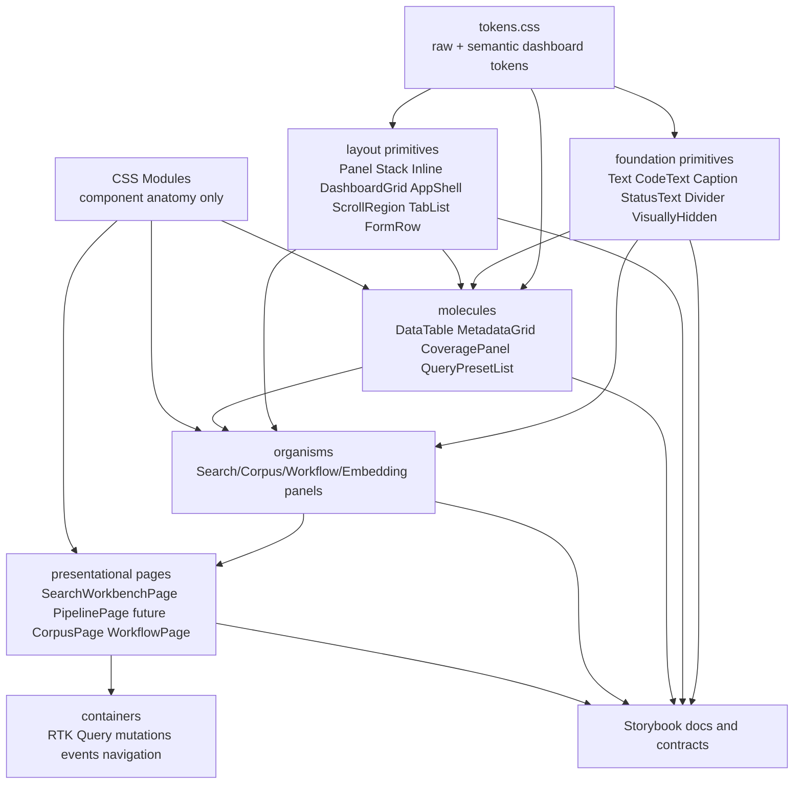

# RAG React Design System Guidelines

## Executive Summary

The RAG Evaluation dashboard now has the beginnings of a real React design system: tokens, foundation primitives, layout primitives, reusable molecules, extracted organisms, page boundaries, and Storybook coverage for many components. It is still not close enough to the TTC Garden Assistant standard. The project continues to carry too much ad-hoc CSS in `web/src/index.css`, feature views, and local widgets; several components still mix API behavior, layout, typography, tables, status display, and feature anatomy in the same JSX block.

This guideline defines the target React/design-system architecture for the RAG project. It is modeled after the TTC foundation-system guide, but adapted to the RAG dashboard's retro monochrome visual language and API-heavy workflows.

The intended stack is:

```text
raw tokens
  -> semantic dashboard tokens
  -> foundation primitives
  -> layout primitives
  -> reusable data/display molecules
  -> feature organisms
  -> page presentation boundaries
  -> RTK Query containers
  -> generated/promoted React metadata later, only if requested
```

The goal is not to remove CSS Modules. The goal is to make CSS ownership explicit:

- tokens own values;
- foundation primitives own typography, code text, captions, status text, accessibility, and separators;
- layout primitives own structure and spacing recipes;
- molecules own reusable data-display patterns;
- organisms own feature panels with DTO-shaped props;
- pages own composition of organisms and page-level state;
- containers own RTK Query, mutations, navigation events, and side effects;
- component CSS Modules own only local anatomy that is not reusable.

A component or page is not done until it has Storybook coverage. That rule applies to primitives, molecules, organisms, and presentational page boundaries.

## Problem Statement

The dashboard has improved significantly, but the current codebase still shows prototype-era styling patterns:

1. `web/src/index.css` still acts as a catch-all for tokens, primitives, widgets, utility classes, forms, tables, status colors, progress bars, chunk timelines, and workflow graph styles.
2. Some older views and Corpus widgets still use global classes such as `panel`, `data-table`, `text-dim`, `text-mono`, `meta-grid`, `stat-grid`, `form-row`, `chunk-bar`, and `coverage-dot` directly.
3. Several components have inline layout styles for flex/grid/gaps that should be either layout primitives or local CSS Module anatomy.
4. Page-level components are not consistently split between storyable presentation and API-aware containers.
5. The RAG design system has primitives, but it does not yet have a full foundation documentation surface like TTC's intended foundation Storybook docs.
6. File layout is not yet fully consistent across feature areas. Corpus widgets are now moving toward per-widget folders, but this should become a rule for all public reusable widgets.

The target is not a generic component library divorced from the app. The target is a RAG dashboard design system that makes the existing retro Mac-inspired identity durable, inspectable, and reusable.

## Current-State Evidence

### Tokens exist but are too small for a full foundation surface

`web/src/styles/tokens.css` currently defines the monochrome palette and a small set of role aliases:

```css
--mac-bg
--mac-text
--mac-text-dim
--mac-border
--mac-surface
--mac-surface-2
--mac-accent
--mac-accent-2
--mac-green
--mac-amber
--rag-font-role-body
--rag-font-role-compact
--rag-font-role-metadata
--rag-font-role-label
--rag-font-role-metric
--rag-font-role-code
```

This is a good start, but it is not a full token system yet. TTC's guide expects visible documentation for colors, typography, spacing, radii, elevation, and accessibility. RAG should add the equivalent foundation docs while preserving the retro visual language.

### Foundation primitives exist but need stricter adoption

Current foundation primitives:

```text
web/src/components/foundation/Text/
web/src/components/foundation/CodeText/
web/src/components/foundation/StatusText/
web/src/components/foundation/Caption/
web/src/components/foundation/Divider/
web/src/components/foundation/VisuallyHidden/
```

These are the right primitives for RAG. Unlike TTC, RAG does not currently need a full `Heading`/`Eyebrow` set because the dashboard has dense panels rather than editorial marketing sections. If repeated page or section headings emerge, add `Heading` deliberately; do not add it just to mirror TTC.

### Layout primitives exist and should replace raw panel/layout globals

Current layout primitives:

```text
web/src/components/layout/Panel/
web/src/components/layout/Stack/
web/src/components/layout/Inline/
web/src/components/layout/DashboardGrid/
web/src/components/layout/AppShell/
web/src/components/layout/ScrollRegion/
web/src/components/layout/TabList/
web/src/components/layout/FormRow/
```

These should be the only normal way to express panels, vertical stacks, inline grouping, dashboard two/three-column recipes, app shell structure, scrolling panel regions, tabs, and label/control rows.

### Reusable molecules exist but should absorb global table/metadata patterns

Current reusable molecules:

```text
web/src/components/molecules/DataTable/
web/src/components/molecules/MetadataGrid/
web/src/components/molecules/CoveragePanel/
web/src/components/molecules/QueryPresetList/
```

These should replace global `data-table`, `meta-grid`, and repeated coverage/query-preset structures. Any new table-like display should first try `DataTable`. Any key/value inspector should first try `MetadataGrid`.

### Storybook exists, but page coverage must be mandatory

Storybook is now configured and many components have stories. The rule going forward is stricter:

```text
new primitive       -> story required
new layout          -> story required
new molecule        -> story required
new organism        -> story required
new page boundary   -> story required
component move      -> preserve or add story
major state variant -> story required
```

If a runtime component is API-heavy, split a presentational component/page with DTO-shaped props and story that boundary.

## Target Architecture

### Layer diagram



### Ownership rules

| Layer | Owns | Must not own |
| --- | --- | --- |
| `tokens.css` | colors, fonts, spacing, radii, borders, shadows/elevation, semantic aliases | component selectors, feature-specific anatomy |
| foundation | text roles, code text, captions, status tones, hidden text, dividers | layout grids, API behavior, feature-specific rendering |
| layout | panel shells, stacks, inline grouping, form rows, tabs, scroll regions, dashboard grids | domain data formatting, API behavior, bespoke widget internals |
| molecules | reusable tables, metadata grids, coverage summaries, small repeated controls | RTK Query hooks, page navigation, workflow-specific orchestration |
| organisms | feature panels with DTO-shaped props and callbacks | API fetching unless intentionally a container-only organism |
| pages | page composition and page-local UI state | low-level typography/table/panel CSS |
| containers | RTK Query, mutations, side effects, navigation events | presentational styling logic |
| CSS Modules | component-specific anatomy and unusual visualizations | reusable typography, panels, table styling, status colors, generic spacing |

## File Layout Rules

### Public reusable component folders

Every public reusable component should be folder-based:

```text
ComponentName/
  ComponentName.tsx
  ComponentName.module.css        # if local anatomy is needed
  ComponentName.stories.tsx       # mandatory
  index.ts
```

This applies to:

```text
foundation/*
layout/*
molecules/*
organisms/*
pages/*
feature-local public widgets such as corpus/*
```

### Feature folders

Feature folders may contain API containers and private helpers, but any reusable widget inside them should still be folder-based:

```text
components/corpus/
  CorpusExplorerView.tsx          # RTK Query/container view is allowed here
  SourcePanel/
    SourcePanel.tsx
    SourcePanel.module.css
    SourcePanel.stories.tsx
    index.ts
  DocumentBrowser/
    DocumentBrowser.tsx
    DocumentBrowser.module.css
    DocumentBrowser.stories.tsx
    index.ts
```

### Page boundaries

Pages should live in `components/pages/<PageName>/`:

```text
components/pages/PipelinePage/
  PipelinePage.tsx
  PipelinePage.stories.tsx
  index.ts
```

If the runtime view needs RTK Query, keep a container nearby in the feature folder:

```text
components/pipeline/PipelineView.tsx      # RTK Query container
components/pages/PipelinePage/            # storyable page boundary
components/pipeline/PipelineOverview.tsx  # storyable presentational panel composition
```

### Barrels

Use `index.ts` barrels for public surfaces only. Avoid importing through a barrel from inside the same package if it creates circular dependencies. For example, `CoveragePanel` should import `DataTable` and `MetadataGrid` from their sibling folders, not through a barrel that re-exports itself.

## Storybook Requirements

### Required story organization

Use these Storybook title prefixes:

```text
Design System/Foundation/<Primitive>
Design System/Layout/<Primitive>
Component Library/Molecules/<Component>
Component Library/Corpus/<Component>
Component Library/Workflows/<Component>
Component Library/Pipeline/<Component>
Component Library/Embeddings/<Component>
Pages/<PageName>
```

### Required story states

At minimum:

- default/populated state;
- empty state if the component renders lists/tables;
- loading state if the component has loading props;
- error state if the component displays errors;
- selected/active state for selectors, tabs, lists, graphs;
- dense/overflow state for tables, panels, and inspectors.

### API-heavy pages

Do not force Storybook to hit live APIs. Instead:

1. Keep RTK Query hooks in a container.
2. Extract a DTO-shaped page or panel.
3. Story the DTO-shaped boundary.
4. Add a Redux provider only when a component genuinely still calls RTK Query and cannot yet be split.

The `DocumentInspector` story currently uses a Redux `Provider` because the component calls an RTK Query hook. Prefer splitting this pattern over time.

## CSS Guidelines

### Global CSS should shrink

`web/src/index.css` should eventually contain only:

- font imports/base document styles;
- app-level reset/defaults;
- global form control defaults if intentionally shared;
- temporary legacy classes with a deprecation plan.

It should not keep owning:

```text
.panel / .panel-header / .panel-body
.data-table
.meta-grid
.tab-bar / .tab-item
.text-* typography utilities
.status-* status colors
.form-row / .form-section
.stat-grid
.chunk-bar visualizations
.coverage-strip visualizations
.op-graph visualizations
```

Those should move into primitives, molecules, organisms, or local CSS Modules.

### CSS Modules are good when they describe anatomy

Keep local CSS for:

- component-specific item rows;
- selected/active visual states inside a widget;
- graph/timeline geometry;
- overflow and clamp behavior;
- feature-specific grid recipes that are not general layout primitives;
- warning boxes or callouts unique to one component;
- modal sizing and overlay anatomy.

Do not use local CSS for:

- generic panel borders/header/body;
- generic table layout;
- generic status color mapping;
- generic caption/code/metadata typography;
- generic label/control form rows;
- generic vertical/horizontal spacing that `Stack`/`Inline` can express.

### Inline style rule

Inline styles are allowed only for:

- truly dynamic geometry (for example timeline segment `left`/`width`);
- story-only swatch demos when a CSS Module would be noise;
- one-off third-party integration constraints.

Otherwise use primitives or CSS Modules.

## RAG Primitive Guidelines

### Foundation primitives

Keep the foundation layer deliberately small:

```text
Text          body/compact text and tone
CodeText      IDs, models, paths, compact code-like values
Caption       small metadata/help/warning copy
StatusText    status-to-tone mapping with optional icons
Divider       separators
VisuallyHidden accessibility-only text
```

Do not add a generic `Box`. Do not add arbitrary style props. If a primitive starts accepting `padding`, `display`, `gap`, `fontWeight`, and `color`, it has become a CSS-in-JSX system and should be rejected.

### Layout primitives

Use the existing layout primitives first:

```text
Panel         bordered Mac-style card/panel shell
Stack         vertical rhythm
Inline        horizontal grouping/wrapping
DashboardGrid known dashboard column recipes
AppShell      top-level app frame
ScrollRegion  bounded scrollable areas
TabList       controlled tabs
FormRow       label/control/hint rows
```

Add new layout primitives only when at least two feature areas need the same structure.

### Molecules

Molecules should be reusable across features and should have no RTK Query hooks.

Preferred molecules:

- `DataTable` for dense tabular rows;
- `MetadataGrid` for key/value facts;
- `CoveragePanel` for embedding coverage summaries;
- `QueryPresetList` for selectable query examples.

Candidate future molecules:

- `MetricGrid` or `MetricStrip` if `stat-grid` repeats after cleanup;
- `ProgressBar` if workflow and embedding/evaluation progress share behavior;
- `IdentitySelectorBar` if embedding/document-processing identity controls repeat;
- `CoverageStrip` if chunk/source coverage visualization repeats.

Do not add these until duplication is demonstrated in at least two places.

## Component and Page Guidelines

### Containers vs presentational components

RTK Query hooks, mutation calls, polling, event dispatch, and cross-view navigation belong in containers or runtime pages.

Presentational components should receive:

- DTO-shaped data;
- selected IDs or selected records;
- loading/error flags;
- callbacks such as `onSelect`, `onSubmit`, `onRetry`, `onOpenDocument`.

This makes Storybook straightforward and keeps visual contracts testable.

### Page boundaries

Every main dashboard view should eventually have a storyable page boundary:

```text
SearchWorkbenchPage      existing, needs storyable split/mocks
CorpusExplorerPage       future
WorkflowsPage            future
PipelinePage             existing
EmbeddingsPage           future
EvaluationPage           future
```

If a page currently cannot be storied because it owns API hooks, split it into:

```text
FeatureView.tsx          container with hooks
FeaturePage.tsx          storyable page composition
FeaturePanel.tsx         storyable organism/presentation if useful
```

### Feature organisms

Organisms should generally live under `components/organisms` when reusable across a dashboard area, or under the feature folder when they are feature-local by product decision.

Both are acceptable, but the folder must be explicit and story-covered.

## DMETA Boundary

These React guidelines are implementation/design-system guidance. They do not change the current RAG DMETA scope.

For the current ticket:

- `dmeta-ir/` remains documentation-only.
- Do not add validators or generated scaffolds unless explicitly requested.
- Core model should not know React component names, CSS classes, layout props, typography roles, or Storybook stories.
- Interaction IR should describe visible obligations and actions, not React implementation.
- Web MDS may later reference coarse widgets/pages such as `SearchWorkbenchPage`, `DataTable`, or `Panel`, but only when a tooling consumer exists.

Correct boundary:

```text
Core model: SourceDocument, EvidenceChunk, WorkflowRun, EvaluationQuery
Interaction IR: query input, result list, inspect evidence, retry op
Web MDS: dashboard page/panel/table choices
React design system: Panel, DataTable, MetadataGrid, StatusText
CSS Modules: local anatomy
```

## CSS Reduction Strategy

### Phase 0: Inventory before every cleanup batch

Run:

```bash
cd 2026-05-27--rag-evaluation-system/web
rg -n "className=\"(panel|panel-header|panel-body|data-table|meta-grid|tab-bar|text-|status-|form-row|stat-grid|chunk-|coverage-|op-)" src/components src/App.tsx
rg -n "^\.(panel|data-table|text-|status-|meta-grid|tab-|form-|stat-|chunk-|coverage-|op-)" src/index.css
```

Record which classes are still active and which are legacy.

### Phase 1: Foundation docs and token docs

Add:

```text
web/src/components/foundation/Foundation.stories.tsx
web/src/components/foundation/Foundation.stories.module.css
```

Stories:

```text
Design System/Foundation/Colors
Design System/Foundation/Typography
Design System/Foundation/Status
Design System/Foundation/Spacing
Design System/Foundation/RadiiAndBorders
Design System/Foundation/Accessibility
```

This is the missing TTC-like foundation overview for RAG.

### Phase 2: Replace remaining global panel/table/text usage

Priority targets:

1. `EvaluationView` placeholder: use `Panel`, `Text`, `Caption`; add page story if it becomes a page boundary.
2. `IdentityBar`: use `Panel`, `Inline`, `FormRow`, `Caption`, `MetadataGrid`; add story.
3. `ArtifactIdentityBar`: use `Panel`/`FormRow`/`Caption` or split into smaller identity selector components; add stories.
4. `ChunkTimelineBar`: move `chunk-bar-*` CSS into `ChunkTimelineBar.module.css`; add story.
5. Storybook layout demos: replace raw `.panel` demo snippets with `Panel` components.

### Phase 3: Page boundaries for remaining views

Add storyable page boundaries for:

- Corpus Explorer;
- Workflows;
- Embeddings;
- Evaluation once real content exists.

Do not require live API calls in stories. Split DTO-shaped pages first.

### Phase 4: Move visualization globals into CSS Modules

Move these from `index.css` into the owning widgets:

```text
coverage-strip / coverage-dot  -> CoverageStrip or owning panel module
chunk-bar-*                    -> ChunkTimelineBar.module.css
op-graph / op-node / op-arrow  -> WorkflowOpGraphPanel.module.css
progress-bar / progress-fill   -> WorkflowSummaryPanel or future ProgressBar
```

### Phase 5: Shrink `index.css`

Once consumers are gone, delete legacy global blocks from `index.css`. Do not delete first; prove no consumers remain with `rg`.

## Validation Requirements

Run after every code cleanup phase:

```bash
cd 2026-05-27--rag-evaluation-system/web
pnpm typecheck
pnpm build
pnpm build-storybook
```

Then revert generated embed artifacts before committing:

```bash
cd 2026-05-27--rag-evaluation-system
git checkout -- internal/web/dist/index.html
```

Run ticket hygiene:

```bash
cd 2026-05-27--rag-evaluation-system
docmgr --root ttmp doctor --ticket RAG-WEB-DESIGN-SYSTEM-REVIEW --stale-after 30
```

`go test ./...` is not currently a frontend validation gate because the repo's `go.mod` has a known sibling checkout requirement:

```text
replace github.com/go-go-golems/scraper => ../scraper
```

## Implementation Checklist for Every New Component

Before opening a PR or committing:

- [ ] Is it in the correct layer: foundation, layout, molecule, organism, page, or container?
- [ ] Does it have a folder if public/reusable?
- [ ] Does it have a Storybook story?
- [ ] Does the story cover empty/loading/error/selected states when relevant?
- [ ] Are RTK Query hooks kept out of presentational components where practical?
- [ ] Are panel/table/status/text concerns delegated to existing primitives?
- [ ] Is local CSS limited to anatomy?
- [ ] Are inline styles limited to dynamic geometry or story-only demos?
- [ ] Did `pnpm typecheck`, `pnpm build`, and `pnpm build-storybook` pass?
- [ ] Was generated `internal/web/dist/index.html` reverted before commit?
- [ ] Were diary, changelog, tasks, and related files updated?

## What Not To Build Yet

Do not build:

- a generic `Box` primitive;
- a Tailwind migration;
- CSS-in-JS style props;
- a giant polymorphic component API;
- DMETA validators for this RAG scope;
- generated React scaffolds from RAG IR;
- Storybook stories that hit live APIs by default.

Do build:

- narrow primitives;
- local CSS Modules for anatomy;
- DTO-shaped presentational components;
- page stories;
- token/foundation overview stories;
- evidence-backed cleanup phases.

## Recommended Next Work

1. Add RAG foundation overview Storybook docs.
2. Add stories for `IdentityBar`, `ArtifactIdentityBar`, and `ChunkTimelineBar`.
3. Refactor `IdentityBar` through `Panel`, `Inline`, `FormRow`, `Caption`, and `MetadataGrid`.
4. Refactor `ArtifactIdentityBar` into storyable identity selector widgets.
5. Move `ChunkTimelineBar` global CSS into a local CSS Module.
6. Replace raw `.panel` snippets in layout stories with `Panel`.
7. Add storyable page boundaries for Corpus, Workflows, and Embeddings.
8. Delete legacy global CSS blocks only after `rg` proves there are no consumers.

## References

Primary source model:

- `/home/manuel/workspaces/2026-05-27/ttc-design-system/2026-05-27--ttc-design-system/ttmp/2026/06/01/TTC-FOUNDATION-SYSTEM--ttc-react-foundation-primitives-and-token-documentation/design-doc/01-react-foundation-system-implementation-guide.md`

RAG files reviewed:

- `web/src/styles/tokens.css`
- `web/src/index.css`
- `web/src/components/foundation/*`
- `web/src/components/layout/*`
- `web/src/components/molecules/*`
- `web/src/components/organisms/*`
- `web/src/components/pages/*`
- `web/src/components/corpus/*`
- `web/src/components/pipeline/*`
- `web/src/components/embeddings/EmbeddingsView.tsx`
- `web/src/components/workflows/WorkflowsView.tsx`
- `web/src/services/api.ts`

Related ticket docs:

- `design-doc/01-rag-evaluation-web-architecture-and-design-system-review.md`
- `reference/01-investigation-diary.md`
