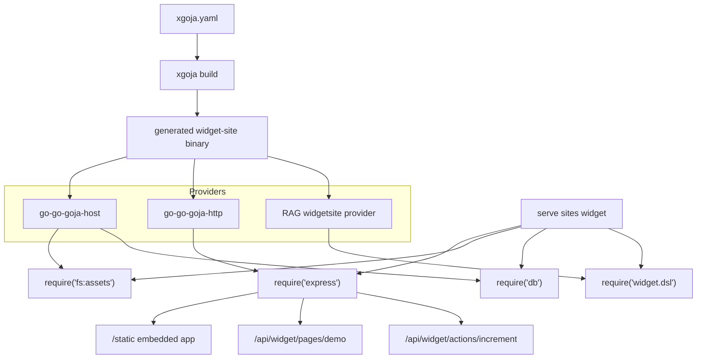

# xgoja Widget Site Binary Analysis and Implementation Guide

## Executive Summary

The target system is a generated `xgoja` binary that serves a small WidgetRenderer web application. The binary should include four capabilities in one generated artifact:

1. a `widget.dsl` JavaScript module that lets a JavaScript verb author Widget IR;
2. embedded frontend assets, ideally the built `@go-go-golems/rag-evaluation-site` default app;
3. Express-style HTTP route registration from a provider-backed JavaScript verb serve command;
4. a database module exposed as `require("db")` or `require("database")` so routes and actions can query or mutate state.

The current xgoja stack already supports most of this. The HTTP provider can expose a `serve` command provider that invokes a JavaScript verb once, keeps the runtime alive, and lets the verb register routes through `require("express")`. The host provider can expose embedded assets through `require("fs:assets")` and can expose a guarded database module through `require("db")`. The RAG repository now has a reusable `widget.dsl` implementation in `pkg/widgetdsl` and a React renderer package in `packages/rag-evaluation-site`.

The missing piece is a clean xgoja provider package for the RAG WidgetRenderer stack. That provider should live under a normal import path such as `pkg/xgoja/providers/widgetsite`. It should register `widget.dsl` and `rag.dsl`; it may also contribute provider-shipped JavaScript verbs and help pages. A later version may contribute a preconfigured database service, but the current host provider is already sufficient for an initial demo if JavaScript calls `db.configure("sqlite3", dsn)`.

The ticket-local experiment showed that a combined `xgoja.yaml` can pass `xgoja doctor` and `xgoja list-modules`, but a provider placed under `ttmp/.../scripts` is not a good generated-build target. Generated binaries compile in a temporary module and must resolve provider imports through normal Go module semantics. During local development, the provider should be inside the RAG module and the xgoja package entry should use `replace: <repo-root>`; `--xgoja-replace <go-go-goja-root>` is also required when using a source-built xgoja binary.

## Problem Statement

The RAG WidgetRenderer work produced a clean runtime boundary: Goja scripts emit Widget IR, Go validates and serves it, and React renders the actual component tree. A generated xgoja binary should be able to reuse that model without hand-writing a new Go server for every small widget site.

The implementation must answer these questions:

- How does xgoja select and register `widget.dsl` as a CommonJS module?
- How does a generated binary embed static web assets and serve them through Express?
- How does a JavaScript verb become a long-lived HTTP site setup command rather than a short-lived CLI command?
- How should `require("db")` be made available, and how should its configuration be controlled?
- Where should custom provider code live so generated builds can import it reliably?
- What parts of xgoja already work, and what parts may need extension?

This is a design guide rather than a final implementation. It includes a concrete implementation plan and a small ticket-local experiment that establishes current behavior and failure modes.

## Current Evidence

### The requested xgoja help pages

`xgoja help --all` lists the relevant tutorials:

- `tutorial-http-serve-jsverbs`
- `tutorial-generated-runtime-package`
- `tutorial-static-assets-http-server`
- `provider-runtime-config-and-host-services`
- `buildspec-reference`

The HTTP serve tutorial establishes the command shape:

```bash
./dist/http-serve-jsverbs serve sites demo --http-listen 127.0.0.1:8787
```

The selected JavaScript verb registers routes through `require("express")` and returns. The provider-backed `serve` command owns the blocking lifecycle.

The static assets tutorial establishes the embedded asset pattern:

```js
const express = require("express")
const assets = require("fs:assets")

const app = express.app()
app.staticFromAssetsModule("/static", assets, "/app/public")
```

The generated runtime-package tutorial establishes an alternate target mode, `target.kind: package`, where xgoja generates an importable Go package rather than a binary. The help page references `examples/xgoja/14-generated-runtime-package`, but that directory is absent in the inspected checkout. The generated-package mode still matters for a host-owned server, but this ticket's primary target is a generated xgoja binary.

### Upstream examples that passed smoke validation

The following upstream example smoke targets were run from the local `go-go-goja` checkout:

```bash
make -C examples/xgoja/10-embedded-assets-fs serve-smoke
make -C examples/xgoja/13-http-serve-jsverbs smoke
```

Both completed successfully. The first validates embedded assets served through an Express static handler. The second validates provider-backed JavaScript verb HTTP serving.

The `14-generated-runtime-package` example referenced by the help page was not present, so the help text is ahead of or out of sync with the checkout.

### Existing provider support

The xgoja host provider already registers guarded host-capability modules:

```go
func Register(registry *providerapi.ProviderRegistry) error {
    return registry.Package(PackageID,
        fsModule("fs"),
        fsModule("node:fs"),
        execModule(),
        databaseModule("database"),
        databaseModule("db"),
    )
}
```

The database provider module creates `modules/database.DBModule` with configurable `allowConfigure`. If `allowConfigure: true`, JavaScript may call:

```js
const db = require("db")
db.configure("sqlite3", ":memory:")
```

The HTTP provider registers the `express` module and a `serve` command provider. Its command provider scans configured JavaScript verbs, builds generated commands, invokes the selected verb in an xgoja runtime, and waits for shutdown. This is the right lifecycle for a webapp setup verb.

### RAG WidgetRenderer support

The RAG repository already contains the needed WidgetRenderer pieces:

- `pkg/widgetdsl`: public Goja module that exports `widget.dsl` and `rag.dsl` helpers for Widget IR construction.
- `pkg/widgetrunner`: reusable runner for page/action scripts outside xgoja.
- `pkg/widgetserver`: standalone HTTP API server for Widget IR pages/actions/schema.
- `pkg/defaultspa`: embedded default React app for the `widgetserver` route model.
- `pkg/widgetschema`: Widget IR schema/version metadata.
- `packages/rag-evaluation-site`: React package with renderer, hooks, CSS, and default app.

For an xgoja binary, the most direct integration point is not `pkg/widgetrunner` or `pkg/widgetserver`. The xgoja HTTP provider already owns the runtime and Express server. The xgoja path should expose `widget.dsl` as a provider module and let the JavaScript verb register routes itself.

## Target Architecture

The recommended architecture uses xgoja's existing provider composition model.



The generated binary should be built from an `xgoja.yaml` that selects:

- host provider `fs` as `fs:assets` for embedded read-only assets;
- host provider `db` as `db` for SQL access;
- HTTP provider `express` for route registration;
- RAG widget provider `widget.dsl` as `widget.dsl`;
- HTTP provider command set `serve` mounted as `serve`;
- embedded JavaScript verbs under `verbs/`;
- embedded frontend assets under `assets/`.

## Proposed xgoja.yaml

The first implementation should put the provider under a normal package path:

```text
pkg/xgoja/providers/widgetsite
```

Then the generated binary spec can look like this during local development:

```yaml
name: rag-widget-xgoja-site
appName: rag-widget-xgoja-site
envPrefix: RAG_WIDGET_SITE

target:
  kind: xgoja
  output: dist/rag-widget-xgoja-site

packages:
  - id: go-go-goja-host
    import: github.com/go-go-golems/go-go-goja/pkg/xgoja/providers/host
  - id: go-go-goja-http
    import: github.com/go-go-golems/go-go-goja/pkg/xgoja/providers/http
  - id: rag-widget-site
    import: github.com/go-go-golems/rag-evaluation-system/pkg/xgoja/providers/widgetsite
    replace: ../../..

assets:
  - id: webapp
    path: ./assets
    embed: true

modules:
  - package: go-go-goja-http
    name: express
    as: express
  - package: go-go-goja-host
    name: fs
    as: fs:assets
    config:
      embedded:
        allow: true
        mounts:
          - asset: webapp
            mount: /app
  - package: go-go-goja-host
    name: db
    as: db
    config:
      allowConfigure: true
  - package: rag-widget-site
    name: widget.dsl
    as: widget.dsl

commands:
  jsverbs:
    enabled: true
    name: verbs
  eval:
    enabled: false
  run:
    enabled: false
  repl:
    enabled: false

commandProviders:
  - id: http-serve
    package: go-go-goja-http
    name: serve
    mount: serve

jsverbs:
  - id: local-sites
    path: ./verbs
    embed: true
```

When building from a local go-go-goja checkout, the command also needs:

```bash
xgoja build -f xgoja.yaml \
  --xgoja-replace /home/manuel/workspaces/2026-05-27/rag-evaluation-system/go-go-goja \
  --keep-work
```

The `packages[].replace` field handles the local RAG provider module. The `--xgoja-replace` flag handles the local go-go-goja module. These are separate because the generated build workspace has its own temporary `go.mod`.

## Provider Package Design

The RAG provider should be small. The first version only needs to register modules that already exist.

```go
package widgetsite

import (
    "github.com/dop251/goja_nodejs/require"
    "github.com/go-go-golems/go-go-goja/pkg/xgoja/providerapi"
    "github.com/go-go-golems/rag-evaluation-system/pkg/widgetdsl"
)

const PackageID = "rag-widget-site"

func Register(registry *providerapi.ProviderRegistry) error {
    loader := func(providerapi.ModuleSetupContext) (require.ModuleLoader, error) {
        return widgetdsl.NewLoader(), nil
    }
    return registry.Package(PackageID,
        providerapi.Module{
            Name: "widget.dsl",
            DefaultAs: "widget.dsl",
            Description: "Widget IR authoring DSL for RAG WidgetRenderer pages.",
            NewModuleFactory: loader,
        },
        providerapi.Module{
            Name: "rag.dsl",
            DefaultAs: "rag.dsl",
            Description: "Alias for widget.dsl.",
            NewModuleFactory: loader,
        },
    )
}
```

This provider does not need to understand HTTP, assets, or database access. Those are separate provider responsibilities. Keeping this provider narrow makes it easy to validate and publish.

A later version may add:

- provider-shipped help pages for `widget.dsl`;
- provider-shipped jsverbs that provide a default widget site demo;
- a `widget.schema` module exposing `pkg/widgetschema.Summary()`;
- a configured `widget.server` helper for registering standard `/api/widget/...` routes with Express.

The last item should wait until the route shape is stable. For the first implementation, plain JavaScript route registration is clearer.

## JavaScript Verb Design

A JavaScript verb is the site setup function. It registers routes and then returns. The HTTP provider's serve command keeps the runtime and HTTP server alive.

```js
__package__({ name: "sites", short: "WidgetRenderer sites" })

__verb__("demo", {
  name: "demo",
  output: "text",
  short: "Serve a WidgetRenderer demo site",
  tags: ["http", "widget", "db"]
})
function demo() {
  const express = require("express")
  const assets = require("fs:assets")
  const db = require("db")
  const rag = require("widget.dsl")

  db.configure("sqlite3", ":memory:")
  db.exec("CREATE TABLE queries (id INTEGER PRIMARY KEY, name TEXT, status TEXT)")
  db.exec("INSERT INTO queries (name, status) VALUES (?, ?)", "demo query", "success")

  const app = express.app()
  app.staticFromAssetsModule("/static", assets, "/app/public")
  app.get("/", (_req, res) => res.redirect("/static/"))

  app.get("/api/widget/pages/demo", (_req, res) => {
    const rows = db.query("SELECT id, name, status FROM queries ORDER BY id")
    res.json({
      schemaVersion: "0.1.0",
      id: "demo",
      title: "xgoja widget demo",
      root: rag.panel({ title: "xgoja widget demo" },
        rag.statusText({ status: "success", icon: true }, "Rows: " + rows.length),
        rag.dataTable({
          rows,
          getRowKey: "id",
          columns: [
            { id: "id", header: "ID", cell: rag.cell.field("id") },
            { id: "name", header: "Name", cell: rag.cell.field("name") },
            { id: "status", header: "Status", cell: rag.cell.status("status") }
          ]
        })
      )
    })
  })
}
```

This script demonstrates all required runtime surfaces: Express, embedded assets, database, and `widget.dsl`.

## Frontend Asset Strategy

There are two viable frontend strategies.

### Strategy A: Tiny demonstration app

For the first xgoja smoke, embed a small HTML file that fetches `/api/widget/pages/demo` and prints the returned Widget IR. This proves the generated binary, embedded assets, Express routes, db module, and `widget.dsl` module without involving React bundling.

This is the best first test because failures are easy to localize. If the page JSON is wrong, the problem is in the route or DSL. If `/static/` fails, the problem is embedded assets. If `require("db")` fails, the problem is module config. If the generated binary does not build, the problem is provider import/replace.

### Strategy B: Built WidgetRenderer app

After Strategy A passes, embed the built `@go-go-golems/rag-evaluation-site` app. The app build output should be copied into the xgoja spec's `assets/public` directory before `xgoja build`.

The build sequence is:

```bash
cd packages/rag-evaluation-site
pnpm build:app
rm -rf ../../examples/xgoja/widget-site/assets/public
mkdir -p ../../examples/xgoja/widget-site/assets/public
cp -R app-dist/. ../../examples/xgoja/widget-site/assets/public/
cd ../../examples/xgoja/widget-site
xgoja build -f xgoja.yaml --xgoja-replace /path/to/go-go-goja --keep-work
```

The React app expects `/api/widget/pages/{id}` and `/api/widget/actions/{name}`. The JavaScript verb must therefore register compatible endpoints. A redirect from `/` to `/static/` is enough for a minimal setup, but an SPA fallback route is better for `/pages/demo`.

The current Express module supports `staticFromAssetsModule` but does not obviously expose a catch-all static fallback helper equivalent to `pkg/defaultspa.SPAHandler`. If the default React app needs client-side route fallback from Express, one of these changes is needed:

1. add explicit Express routes that return embedded `index.html` for known app paths;
2. add `res.send()` / content-type support sufficient to serve `assets.readFileSync("/app/public/index.html")` directly;
3. extend the Express/static asset module with `app.spaFromAssetsModule(prefix, assets, root, index)`.

The first option is enough for a small demo. The third option is the clean long-term xgoja enhancement.

## Database Strategy

The host provider's `db` module works today when configured with `allowConfigure: true`. This means the JavaScript verb can open an in-memory or file-backed SQLite database.

```yaml
modules:
  - package: go-go-goja-host
    name: db
    as: db
    config:
      allowConfigure: true
```

```js
const db = require("db")
db.configure("sqlite3", ":memory:")
```

This is sufficient for the first demo, but it puts the DSN in JavaScript. For a generated application, the better model is a provider capability that exposes a public Glazed config section:

```text
--db-path ./state/widget.sqlite
--db-readonly=false
--db-allow-writes=true
```

The provider would then contribute a preconfigured database handle as a host service, and the database module would read it from `ModuleSetupContext.Host`. The `modules/database` package already has `WithPreconfiguredDB(db)` and `WithCloseFn(closeFn)`, so the Go module supports this shape. The missing piece is xgoja host provider wiring that maps command flags into a preconfigured `DBModule`.

Recommended staged approach:

1. First demo: use `allowConfigure: true` and call `db.configure()` in the jsverb.
2. Production path: add an xgoja host provider capability for database config and preconfigured DB host service.
3. Safety path: default to read-only database connections unless `--allow-writes` is explicit.

## Generated Runtime Package Mode

The generated runtime package tutorial describes a different integration point:

```yaml
target:
  kind: package
  output: internal/xgojaruntime
  package: xgojaruntime
```

Use this mode when an existing Go application owns lifecycle and routing but wants xgoja to generate provider registration and runtime construction helpers. For the RAG WidgetRenderer system, this could be useful if the existing `pkg/widgetserver` should own the HTTP API while xgoja only generates the runtime bundle.

The package mode would let a Go host call:

```go
bundle, err := xgojaruntime.NewBundle(xgojaruntime.Options{})
rt, err := bundle.NewRuntime(context.Background())
```

Then the host could wire that runtime into `pkg/widgetrunner`-like behavior or a custom HTTP server.

This ticket should not choose package mode for the first demo. The requested task is an xgoja binary with Express and jsverbs. Package mode is the fallback if Express cannot provide the desired SPA fallback or if the host application must own database pooling, auth, or service lifecycle.

## Ticket Experiment Results

A ticket-local experiment was created under:

```text
ttmp/2026/06/04/XGOJA-WIDGETSITE--xgoja-widget-site-binary-design/scripts/01-current-xgoja-widgetsite-experiment
```

It contains:

- `xgoja.yaml`
- `widgetprovider/provider.go`
- `verbs/sites.js`
- `assets/public/index.html`

The experiment combines host fs assets, host db, HTTP express, and a `widget.dsl` provider. Validation passed:

```bash
xgoja doctor -f xgoja.yaml
xgoja list-modules -f xgoja.yaml
```

The module list showed:

```text
go-go-goja-http express    express
go-go-goja-host fs         fs:assets
go-go-goja-host db         db
rag-widget      widget.dsl widget.dsl
```

The first build failed because the local xgoja binary reported `go-go-goja v0.0.0`, which is expected when using a source-built xgoja without `--xgoja-replace`.

The second build used `--xgoja-replace` and then failed because the ticket-local provider import path was not resolvable as a normal module:

```text
cannot find module for package github.com/go-go-golems/rag-evaluation-system/ttmp/.../widgetprovider
```

This is an important result. It proves the design should not rely on provider packages living in ticket scratch directories. Provider packages for generated xgoja binaries should live under a stable import path and use `packages[].replace` for local development.

## Required Implementation Plan

### Phase 1: Add a real RAG xgoja provider

Create:

```text
pkg/xgoja/providers/widgetsite/provider.go
pkg/xgoja/providers/widgetsite/provider_test.go
```

The provider should register:

- `widget.dsl`
- `rag.dsl`

The test should call `Register`, resolve both modules, create a loader, and evaluate a small `require("widget.dsl").panel(...)` script through an xgoja runtime or engine runtime.

### Phase 2: Add an xgoja example directory

Create:

```text
examples/xgoja/widget-site/
  xgoja.yaml
  Makefile
  verbs/sites.js
  assets/public/index.html
```

The `xgoja.yaml` should use:

- host provider
- HTTP provider
- RAG widgetsite provider
- `assets` with `embed: true`
- `fs:assets`
- `db`
- `express`
- `widget.dsl`
- HTTP `serve` command provider
- embedded jsverbs

The Makefile should include:

```make
smoke: doctor build serve-smoke
```

The smoke should start:

```bash
./dist/rag-widget-xgoja-site serve sites demo --http-listen 127.0.0.1:18789
```

Then curl:

```bash
/api/widget/pages/demo
/healthz
/static/
```

### Phase 3: Add database configuration safety

For the first example, use `db.configure("sqlite3", ":memory:")` in JavaScript. That proves the data path.

For production, add a host provider database capability or a new provider that contributes a preconfigured `*sql.DB` to host services. The design should avoid leaving write-capable database configuration entirely inside arbitrary JavaScript.

Pseudocode for a preconfigured database contribution:

```go
const DBServiceKey = "go-go-goja-host.database.v1"

type DBService struct {
    DB *sql.DB
}

func (capability) ContributeHostServices(ctx context.Context, req providerapi.HostServiceContributionRequest, sink providerapi.HostServiceSink) error {
    settings := decodeDBSettings(req.Values)
    db, err := sql.Open("sqlite3", settings.DSN())
    if err != nil { return err }
    if err := sink.AddCloser(func(context.Context) error { return db.Close() }); err != nil {
        _ = db.Close()
        return err
    }
    return sink.AddHostService(DBServiceKey, DBService{DB: db})
}
```

Then `databaseModule("db")` should read that service when present and call `dbm.New(dbm.WithName(alias), dbm.WithPreconfiguredDB(db), dbm.WithCloseFn(...))`.

### Phase 4: Embed the real WidgetRenderer app

After the tiny webapp smoke passes, replace `assets/public` with the built React app:

```bash
cd packages/rag-evaluation-site
pnpm build:app
rm -rf ../../examples/xgoja/widget-site/assets/public
mkdir -p ../../examples/xgoja/widget-site/assets/public
cp -R app-dist/. ../../examples/xgoja/widget-site/assets/public/
```

Then update `verbs/sites.js` to serve:

- `/static` assets;
- `/api/widget/pages/{id}` page JSON;
- `/api/widget/actions/{name}` action JSON;
- optional `/api/widget/schema` schema summary.

If SPA fallback is required for `/pages/demo`, either add explicit fallback routes or extend Express with an assets-backed SPA helper.

### Phase 5: Add browser smoke

Use Playwright after the curl smoke passes. The browser smoke should verify:

- generated xgoja binary starts with `serve sites demo`;
- embedded frontend loads;
- frontend fetches `/api/widget/pages/demo`;
- Widget IR renders if the full React app is embedded;
- a server action writes or reads from db;
- browser console has no warnings/errors.

## xgoja Changes That May Be Needed

The current xgoja stack can probably build the first tiny demo once the provider is moved to a normal package path. The following enhancements are likely needed for a polished WidgetRenderer binary.

### 1. Better database host-service configuration

Current state: `db` can be configured from JavaScript if `allowConfigure: true`.

Desired state: generated commands expose stable DB flags/config such as `--db-path`, `--db-readonly`, and `--db-allow-writes`; the host provider opens the database and injects a preconfigured DB module.

Why this matters: database connection policy belongs at the generated CLI boundary. JavaScript should not have to know whether the app is running against in-memory SQLite, a file path, or a read-only DSN.

### 2. Assets-backed SPA fallback helper

Current state: `app.staticFromAssetsModule(prefix, assets, root)` serves static files under a prefix.

Desired state: Express can serve a single-page app from assets and fall back to `index.html` for unknown routes.

Possible API:

```js
app.spaFromAssetsModule("/", assets, "/app/public", "index.html")
```

Why this matters: the default React app uses client-side routes such as `/pages/demo`. A static prefix alone is enough for `/static/`, but not enough for a polished app that owns route paths.

### 3. Provider-shipped widget docs and verbs

Current state: local `jsverbs` and help sources can be embedded from a project directory.

Desired state: the RAG widget provider can ship a default demo verb and API docs, so a generated binary can include a working demo without copying boilerplate.

This is optional for the first implementation.

### 4. Runtime package example/doc cleanup

The help page `tutorial-generated-runtime-package` references an example directory that was absent in the inspected checkout. Either the example should be restored, or the help page should be updated to point to the current example location.

## Decision Records

### Decision 1: Use xgoja provider-backed `serve` for the first binary

Status: proposed.

Options considered:

- Use `run scripts/server.js --keep-alive`.
- Use provider-backed `serve sites demo`.
- Use generated runtime package mode and write a Go host server.

Decision: use provider-backed `serve sites demo` for the first binary.

Rationale: the user requested a webapp with a jsverb. The HTTP provider's serve command exists specifically to invoke JavaScript verbs as long-lived HTTP site setup functions.

Consequence: route setup code lives in a JavaScript verb and uses `require("express")`. If future requirements need Go-owned lifecycle, generated runtime package mode remains available.

### Decision 2: Add a normal RAG xgoja provider package

Status: proposed.

Options considered:

- Keep the provider in ticket scripts.
- Add provider code under `pkg/xgoja/providers/widgetsite`.
- Modify xgoja to import raw module registrars directly from xgoja.yaml.

Decision: add provider code under `pkg/xgoja/providers/widgetsite`.

Rationale: generated binaries build in temporary modules and must resolve provider imports through Go module rules. Ticket-local scratch providers are not stable import targets.

Consequence: the RAG repository gains a small provider package and example. Local generated builds use `packages[].replace` to point to the repository root.

### Decision 3: Start with JavaScript-configured db, then move to preconfigured db service

Status: proposed.

Options considered:

- Call `db.configure()` in JavaScript.
- Preconfigure the DB from provider host services immediately.
- Avoid DB in the first demo.

Decision: use `db.configure()` for the first demo and design a preconfigured DB service for production.

Rationale: the existing host provider supports `allowConfigure: true` today. This gets the first end-to-end binary working. A preconfigured DB service is safer and cleaner but requires provider changes.

Consequence: the first demo must be treated as trusted-script-only. Production hardening should move DB policy into Glazed command/config/env fields.

### Decision 4: Validate tiny static app before embedding full React app

Status: proposed.

Options considered:

- Embed full `@go-go-golems/rag-evaluation-site` app immediately.
- Start with a tiny HTML fetch demo.

Decision: start with a tiny static app, then replace it with the React build.

Rationale: the tiny app isolates xgoja-generated binary behavior from React packaging. The React app has already been validated under `pkg/defaultspa`; xgoja should first prove provider composition, assets, db, and Express.

Consequence: there are two smoke levels. The first is fast and structural. The second validates the real UI.

## Intern Implementation Checklist

1. Read these files first:
   - `pkg/widgetdsl/module.go`
   - `packages/rag-evaluation-site/src/widgets/ir.ts`
   - `packages/rag-evaluation-site/src/widgets/WidgetRenderer.tsx`
   - `go-go-goja/pkg/xgoja/providers/http/serve.go`
   - `go-go-goja/pkg/xgoja/providers/host/host.go`
   - `go-go-goja/modules/database/database.go`
   - `go-go-goja/modules/express/express.go`
2. Create `pkg/xgoja/providers/widgetsite` and register `widget.dsl` / `rag.dsl`.
3. Add provider unit tests.
4. Add `examples/xgoja/widget-site` with tiny static app, jsverb, and xgoja.yaml.
5. Run `xgoja doctor` and `xgoja list-modules`.
6. Build with both replacements:
   - `--xgoja-replace /path/to/go-go-goja`
   - `packages[].replace: <repo-root>` for the RAG provider.
7. Smoke with curl.
8. Replace tiny static app with `packages/rag-evaluation-site/app-dist`.
9. Add SPA fallback support if required.
10. Add Playwright browser smoke.
11. Decide whether DB configuration stays in JS for demo or moves into host-service contribution.

## Validation Commands

Expected first-demo commands:

```bash
cd examples/xgoja/widget-site
xgoja doctor -f xgoja.yaml
xgoja list-modules -f xgoja.yaml
xgoja build -f xgoja.yaml \
  --xgoja-replace /home/manuel/workspaces/2026-05-27/rag-evaluation-system/go-go-goja \
  --keep-work
./dist/rag-widget-xgoja-site serve sites demo --http-listen 127.0.0.1:18789
curl -fsS http://127.0.0.1:18789/healthz
curl -fsS http://127.0.0.1:18789/api/widget/pages/demo
curl -fsS http://127.0.0.1:18789/static/
```

Expected React-app commands:

```bash
cd packages/rag-evaluation-site
pnpm build:app
# sync app-dist into examples/xgoja/widget-site/assets/public
cd ../../examples/xgoja/widget-site
xgoja build -f xgoja.yaml --xgoja-replace /path/to/go-go-goja --keep-work
./dist/rag-widget-xgoja-site serve sites demo --http-listen 127.0.0.1:18789
# Run Playwright against http://127.0.0.1:18789/static/ or app route.
```

## Risks and Review Points

- Generated builds run in temporary modules. Provider imports must be resolvable without the developer's `go.work` file.
- Host database access is trusted-script functionality. Do not expose write-capable database access without explicit flags or config.
- Embedded assets currently do not support include/exclude filters. Build a clean asset directory before embedding.
- SPA route fallback may require Express API extension if the React app should be served outside `/static/`.
- The generated-runtime-package help page references an absent example. Do not rely on that example until the docs or checkout are reconciled.
- The `db` module is available from the host provider, but a preconfigured DB service path still needs design or implementation.

## References

- `xgoja help tutorial-http-serve-jsverbs`
- `xgoja help tutorial-static-assets-http-server`
- `xgoja help tutorial-generated-runtime-package`
- `xgoja help tutorial-providing-package-and-modules`
- `xgoja help provider-runtime-config-and-host-services`
- `go-go-goja/examples/xgoja/10-embedded-assets-fs`
- `go-go-goja/examples/xgoja/13-http-serve-jsverbs`
- `go-go-goja/pkg/xgoja/providers/http/serve.go`
- `go-go-goja/pkg/xgoja/providers/host/host.go`
- `go-go-goja/modules/express/express.go`
- `go-go-goja/modules/database/database.go`
- `pkg/widgetdsl/module.go`
- `packages/rag-evaluation-site`
