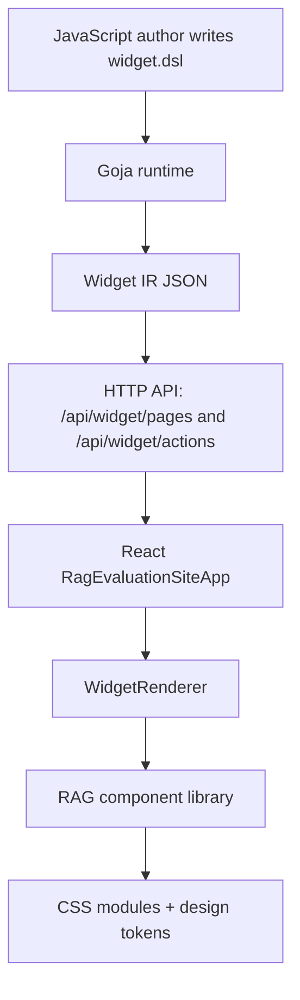
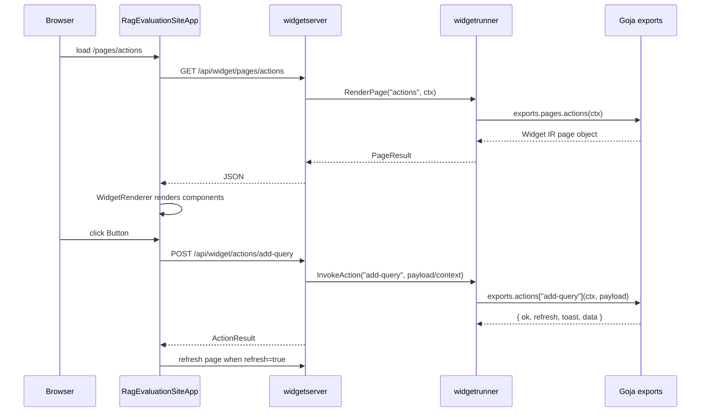
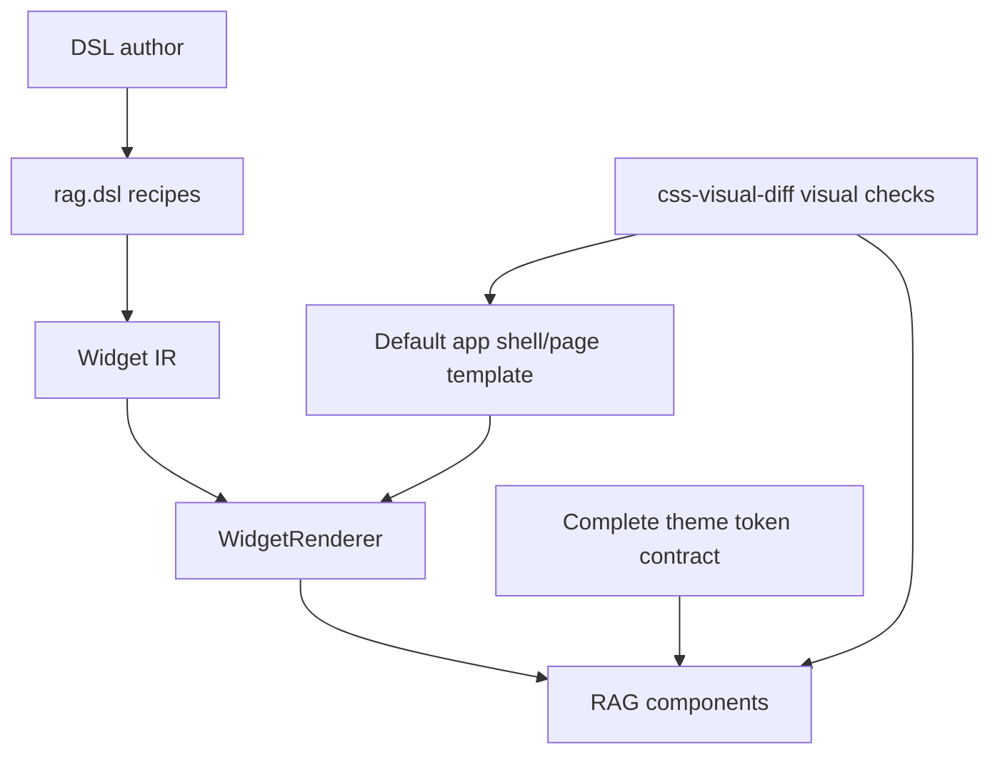

# Widget DSL Visual Quality Analysis and Implementation Guide

## Executive summary

The Widget DSL is intended to let authors create rich RAG evaluation websites without writing a large amount of React code. The current architecture is sound: JavaScript authors JSON-compatible Widget IR, Go/Goja serves page and action endpoints, and React renders real component-library widgets. The visual failure observed in the generated xgoja widget-site is not caused by the idea of Widget IR itself. It is caused by three implementation gaps at the boundary between the standalone package and the original RAG design system.

The primary root cause is a token contract mismatch. Components copied into `packages/rag-evaluation-site` still use the original RAG design-system tokens such as `--mac-surface`, `--mac-border`, `--mac-bg-dark`, `--font-mono`, and `--rag-font-role-metadata`. The standalone package theme currently defines only `--rag-*` color and font variables. When CSS declarations use undefined custom properties without fallbacks, the browser drops those declarations. The result is visible in css-visual-diff artifacts: generated buttons and panels compute to transparent backgrounds, no borders, and raw page padding of `0px`.

The second gap is that `RagEvaluationSiteApp` renders a bare `<div>` around `WidgetRenderer`. Unless the Widget IR itself emits an `AppShell`, page chrome, navigation, content padding, and layout rhythm are absent. This makes DSL pages look like component fragments dumped directly into a viewport rather than complete applications.

The third gap is authoring ergonomics. The current example manually composes many low-level widgets: `Stack`, `DashboardGrid`, `Panel`, `DataTable`, `MetadataGrid`, `Inline`, `Button`, and `Caption`. That is useful as a stress test, but it asks the DSL author to be a layout designer. If the goal is “rich web experiences that look and work great without writing a lot of code,” the DSL needs high-level page recipes, visual presets, and guardrails that produce good defaults.

This guide explains the system for a new intern, documents the evidence, and proposes an implementation path. The plan is:

1. Restore the package-level design-token contract.
2. Add an application shell/template layer for standalone Widget DSL sites.
3. Add semantic DSL recipes for common RAG pages.
4. Add stable visual-test selectors and css-visual-diff checks.
5. Improve the xgoja example so it demonstrates a polished rich site, not merely an action-capable site.

## Problem statement

The user asked for an investigation because the generated xgoja Widget DSL example “looks a bit like ass” compared to the original RAG site and Storybook components. That feedback is correct. The current generated page proves action plumbing, but it does not visually deliver the intended product promise.

The product promise is:

- A DSL author writes a small amount of JavaScript.
- That JavaScript returns serializable Widget IR.
- React renders real RAG UI components, not generic HTML mimicry.
- The resulting site looks and behaves like a polished RAG web app.
- Actions, tables, metadata panels, navigation, and dashboards should work with low ceremony.

The current generated page falls short because the “real component” rendering layer is missing the CSS token environment and page shell that made those components look correct in the original app.

## Scope

This document covers:

- The Widget DSL runtime architecture.
- The React renderer and package boundary.
- The xgoja generated site example.
- The visual evidence captured with css-visual-diff.
- The root causes of the visual gap.
- A phased implementation plan for improving visual quality.
- Testing and validation strategy.
- Intern-ready file references and pseudocode.

This document does not implement the visual fixes directly. It is the design and implementation guide for the next implementation pass.

## Glossary

- **Widget IR:** JSON-compatible intermediate representation describing UI nodes. It contains text nodes, element nodes, and component nodes.
- **Widget DSL:** JavaScript API exposed as `require("widget.dsl")` / `require("rag.dsl")`. It builds Widget IR objects.
- **WidgetRenderer:** React component that maps Widget IR component nodes to real RAG component-library components.
- **Standalone package:** `packages/rag-evaluation-site`, published as `@go-go-golems/rag-evaluation-site` and built as an embedded SPA.
- **xgoja widget-site example:** `examples/xgoja/widget-site`, a generated xgoja binary that serves the embedded React app and Widget IR API endpoints.
- **Design tokens:** CSS custom properties consumed by component CSS, such as `--mac-border`, `--font-mono`, and `--rag-font-role-body`.
- **Recipe:** A higher-level DSL helper that emits a known-good composition, such as a search workbench or action dashboard.

## Evidence collected

Visual evidence is stored in the ticket workspace:

```text
ttmp/2026/06/05/WIDGETDSL-VISUAL-QUALITY--widget-dsl-visual-quality-and-rich-website-design/sources/visual-evidence/run-02
```

The successful run includes:

- `widget-actions.overlay.png` — generated xgoja Widget DSL action page.
- `storybook-pipeline-page.overlay.png` — original RAG PipelinePage Storybook reference.
- `storybook-retrieval-results.overlay.png` — original RetrievalResultsPanel Storybook reference.
- `widget-renderer-storybook.overlay.png` — WidgetRenderer search workbench Storybook composition.
- `artifacts/**/computed-css.json` — computed CSS evidence for key selectors.
- `*.preflight.json` — selector existence, visibility, bounds, and text summaries.
- `01-visual-evidence-summary.md` — run summary.

The capture scripts live in:

```text
ttmp/2026/06/05/WIDGETDSL-VISUAL-QUALITY--widget-dsl-visual-quality-and-rich-website-design/scripts
```

Key scripts:

- `01-start-widget-and-storybook.sh`
- `02-stop-widget-and-storybook.sh`
- `03-capture-visual-evidence.js`
- `04-run-visual-evidence.sh`

### Important computed-style evidence

The generated widget app root computed to:

```json
{
  "background-color": "rgba(0, 0, 0, 0)",
  "color": "rgb(29, 35, 42)",
  "font-family": "Inter, ui-sans-serif, system-ui, -apple-system, BlinkMacSystemFont, \"Segoe UI\", sans-serif",
  "font-size": "16px",
  "max-width": "none",
  "padding": "0px"
}
```

The first generated button computed to:

```json
{
  "background-color": "rgba(0, 0, 0, 0)",
  "border-radius": "0px",
  "color": "rgb(29, 35, 42)",
  "font-weight": "400",
  "height": "24px",
  "padding": "2px 12px"
}
```

The first generated table computed to:

```json
{
  "background-color": "rgba(0, 0, 0, 0)",
  "border-collapse": "collapse",
  "border-spacing": "2px",
  "font-size": "11px"
}
```

These values are symptoms of missing token definitions and weak app-shell styling. A real component-library button should not lose its background and border because package theme variables are absent.

## Architecture overview

The system has five layers. Each layer has a clear ownership boundary.



A good mental model is: JavaScript describes structure and behavior intent; React owns rendering; CSS tokens own visual identity.

If any boundary leaks, visual quality suffers:

- If JavaScript emits raw HTML instead of semantic widgets, it bypasses the component library.
- If React renders widgets without a theme, CSS variables collapse.
- If the app shell is missing, components sit on an unstructured page.
- If the DSL has only low-level primitives, authors must hand-build layout polish.

## Layer 1: Widget IR

Widget IR is the serialized contract between server-side authors and the React renderer. The TypeScript type lives in `packages/rag-evaluation-site/src/widgets/ir.ts`.

Important file evidence:

- `WidgetNode` is a union of text, element, and component nodes (`ir.ts:9`).
- Component types include `AppShell`, `AppNav`, `Button`, `DashboardGrid`, `DataTable`, `MetadataGrid`, `Panel`, `Stack`, `StatusText`, and more (`ir.ts:23-39`).
- Actions are serializable specs: navigate, server, event, and copy (`ir.ts:50-78`).
- `DataTable` uses serializable `CellSpec` values instead of function-valued cells (`ir.ts:123-149`).

A simplified IR shape is:

```ts
type WidgetNode = TextNode | ElementNode | ComponentNode;

type ComponentNode = {
  kind: 'component';
  type: 'Panel' | 'DataTable' | 'Button' | string;
  props?: JsonObject;
  children?: WidgetNode[];
};

type ServerActionSpec = {
  kind: 'server';
  name: string;
  payload?: JsonObject;
};
```

The IR must stay JSON-compatible because it crosses a Go/HTTP/JavaScript/React boundary. Do not add functions, class instances, DOM references, or cyclic structures to Widget IR.

## Layer 2: `widget.dsl` in Goja

The Goja native module lives in `pkg/widgetdsl/module.go`. It exposes JavaScript helpers that produce Widget IR.

Important file evidence:

- The module name is `widget.dsl` (`module.go:13`).
- It also registers the alias `rag.dsl` (`module.go:62-69`).
- Supported helpers are declared in `componentNames` (`module.go:15-32`).
- Helper names map to React component types in `componentTypes` (`module.go:34-51`).
- The module documentation explicitly says it returns Widget IR for React `WidgetRenderer`, not Go-side HTML (`module.go:73-85`).
- The runtime installs helpers and `cell` helpers into `exports` (`module.go:102-145`).

A basic authoring example:

```js
const rag = require("widget.dsl")

exports.pages = {
  index: () => ({
    schemaVersion: "0.1.0",
    id: "index",
    title: "Example",
    root: rag.panel({ title: "Example" },
      rag.caption({ tone: "muted" }, "Rendered by React")
    )
  })
}
```

Current low-level helpers are useful, but they are not enough for low-code visual quality. An author can build a page, but they must know which combinations produce a polished result.

## Layer 3: Widget runner and server

`pkg/widgetrunner` loads JavaScript scripts into a Goja runtime and invokes page/action functions. `pkg/widgetserver` exposes those results over HTTP.

Important file evidence:

- `widgetrunner.Config` accepts script directories and extra Goja modules (`runner.go:28-32`).
- `PageResult` contains `schemaVersion`, `id`, `title`, `root`, and optional `meta` (`runner.go:52-58`).
- `ActionRequest` contains `payload` and `context` (`runner.go:60-63`).
- `ActionResult` contains `ok`, `refresh`, `toast`, `patch`, and `data` (`runner.go:65-71`).
- `RenderPage` looks up a page function and validates the normalized Widget IR (`runner.go:163-195`).
- `InvokeAction` calls `exports.actions[name]` (`runner.go:198-221`).
- `widgetserver` exposes `GET /api/widget/pages/{id}` and `POST /api/widget/actions/{name}` (`server.go:104-109`).
- The server defaults to embedded frontend mode (`server.go:68-70`).

The runtime flow is:



This action architecture is working. The browser smoke proved `POST /api/widget/actions/add-query => 200 OK` and a subsequent page refresh. The visual-quality work should preserve this contract.

## Layer 4: React app and renderer

The standalone React app entry point is `packages/rag-evaluation-site/src/app/App.tsx`.

Important file evidence:

- `RagEvaluationSiteApp` reads the page id from the URL and fetches `/api/widget/pages/{id}` (`App.tsx:15-18`).
- Server actions are POSTed to `/api/widget/actions/{name}` with `{ payload, context }` (`App.tsx:20-35`).
- The normal render path is a bare `div.rag-evaluation-site-root` containing `WidgetRenderer` (`App.tsx:49-52`).
- The CSS for that root only sets `min-height: 100vh` (`app.css:1-3`).

`WidgetRenderer` maps IR component names to actual React components.

Important file evidence:

- Component dispatch happens in `renderComponentNode` (`WidgetRenderer.tsx:61-97`).
- `Button` forwards `variant`, `size`, `selected`, `disabled`, and `action` (`WidgetRenderer.tsx:128-142`).
- `DataTable` maps serializable column specs to React cell renderers and binds row selection actions (`WidgetRenderer.tsx:155-174`).
- `Panel` forwards title, actions, density, and fill (`WidgetRenderer.tsx:209-220`).

This is the correct strategy. The renderer uses the real component library. The missing piece is that the standalone app does not provide the same theme and page shell environment as Storybook/original RAG app.

## Layer 5: Component CSS and design tokens

The original RAG app defines the design-system tokens in `web/src/styles/tokens.css`.

Important file evidence:

- `--mac-bg`, `--mac-bg-dark`, `--mac-text`, `--mac-border`, `--mac-surface`, and related palette tokens are defined in `tokens.css:4-16`.
- `--font-body` and `--font-mono` are defined in `tokens.css:18-19`.
- role font aliases such as `--rag-font-role-body` and `--rag-font-role-metadata` are defined in `tokens.css:23-28`.

The standalone package theme is much smaller:

- `packages/rag-evaluation-site/src/theme.css` defines `--rag-font-sans`, `--rag-font-mono`, and `--rag-color-*` (`theme.css:1-14`).
- `packages/rag-evaluation-site/src/styles.css` imports that theme and sets body background/color/font family (`styles.css:1-12`).

The copied components still consume the original tokens:

- Button uses `--mac-border`, `--mac-surface`, `--mac-text`, and `--rag-font-role-metadata` (`Button.module.css:1-9`).
- Button primary/selected states use `--mac-bg-dark` and `--mac-text-inv` (`Button.module.css:20-24`).
- Panel uses `--mac-border`, `--mac-surface`, `--mac-bg-dark`, `--mac-text-inv`, and `--font-mono` (`Panel.module.css:1-20`).
- DataTable uses `--font-mono`, `--mac-surface`, `--mac-text`, `--mac-border`, `--mac-surface-2`, `--mac-bg-dark`, and `--mac-text-inv` (`DataTable.module.css:1-10`).

This is the root visual bug.

### Why undefined CSS custom properties break the UI

A declaration like this:

```css
.root {
  background: var(--mac-surface);
}
```

is invalid at computed-value time if `--mac-surface` is undefined and no fallback is provided. The browser does not substitute `transparent` intentionally; it drops the declaration, and the property falls back to its initial or inherited value. That is why the computed CSS shows transparent backgrounds and missing component chrome.

## Current xgoja example

The current xgoja example lives in `examples/xgoja/widget-site/verbs/sites.js`.

Important file evidence:

- It requires `express`, embedded assets, `db`, and `widget.dsl` (`sites.js:9-13`).
- It configures an in-memory SQLite table and seed rows (`sites.js:15-19`).
- It serves the React SPA from embedded assets and excludes API/health/favicon paths (`sites.js:21-26`).
- It builds summary panels, toolbar actions, table, selected panel, and audit panel with low-level Widget DSL helpers (`sites.js:55-140`).
- It exposes page endpoints for `index`, `demo`, and `actions` (`sites.js:161-163`).
- It exposes server action endpoints for select, cycle, bump priority, archive, add, retry, and reset (`sites.js:165-220`).

This example is valuable because it proves a lot of runtime behavior. It is not yet a good visual-quality example because it lacks:

- a page shell,
- token-correct component chrome,
- high-level recipe semantics,
- visual spacing rules,
- content hierarchy beyond panels and grids.

## Root-cause analysis

### Root cause 1: missing standalone token bridge

The standalone app imports `packages/rag-evaluation-site/src/styles.css`, which imports `theme.css`. That theme does not define the `--mac-*` variables used by copied components.

Evidence:

- `theme.css:1-14` defines only `--rag-*` variables.
- `Button.module.css:3-7`, `Panel.module.css:2-20`, and `DataTable.module.css:1-6` consume `--mac-*` and `--font-*` variables.
- css-visual-diff computed generated button background as `rgba(0, 0, 0, 0)`.

Impact:

- panels lose visible surfaces and borders,
- buttons lose intended default/primary states,
- table headers and selected rows lose contrast,
- page hierarchy collapses.

### Root cause 2: bare app root

`RagEvaluationSiteApp` renders:

```tsx
<div className="rag-evaluation-site-root" data-rag-page="RagEvaluationSiteApp" data-page-id={page.id}>
  <WidgetRenderer node={page.root} ... />
</div>
```

Evidence:

- `App.tsx:49-52`
- `app.css:1-3`
- css-visual-diff root padding: `0px`
- css-visual-diff root max-width: `none`

Impact:

- no page padding,
- no app-level background or content inset,
- no nav/header unless author emits it manually,
- root `Stack` spans the full viewport edge-to-edge.

### Root cause 3: no high-level visual recipes

The example builds pages with low-level primitives. This produces a lot of code and no guardrails.

Evidence:

- `sites.js:55-140` manually composes panels, dashboard grids, data tables, metadata grids, buttons, captions, and stacks.
- `widget.dsl` exposes component factories but no semantic page recipes (`module.go:15-32`).

Impact:

- authors must know layout recipes and component details,
- repeated page patterns are verbose,
- small authoring mistakes produce visually awkward pages,
- DSL does not yet fulfill “rich site with little code.”

### Root cause 4: insufficient stable visual selectors

The visual evidence script had to use broad selectors like `table` and `button`. Storybook iframes sometimes matched hidden control elements.

Evidence:

- `storybook-pipeline-page.preflight.json` showed `table` and `button` existed but were invisible with zero bounds.
- Components expose some useful attributes, such as `data-rag-atom="Button"`, but visual scripts need a consistent strategy across layouts, molecules, organisms, and WidgetRenderer output.

Impact:

- visual tests are brittle,
- screenshot tools may capture the wrong DOM,
- interns spend time debugging selector failures instead of visual regressions.

## Proposed architecture

The improved system should explicitly separate four concerns:

1. **Theme contract:** all components can rely on a complete token set.
2. **Application shell:** standalone Widget DSL pages have a polished default frame.
3. **Semantic recipes:** DSL authors choose domain-level templates, not only low-level layout primitives.
4. **Visual quality tooling:** screenshots and computed-style checks are reproducible.



## Design decision records

### Decision: Define a complete package-local token bridge

- **Context:** The standalone package currently defines `--rag-*` tokens but components consume `--mac-*` and font role variables.
- **Options considered:**
  1. Copy `web/src/styles/tokens.css` exactly into the package.
  2. Change every component to consume only new `--rag-*` tokens.
  3. Define a package-local bridge that includes both original `--mac-*` tokens and aliases to modern `--rag-*` tokens.
- **Decision:** Define a package-local bridge first. Keep `--mac-*` available for existing components and add aliases/fallbacks for future `--rag-*` migration.
- **Rationale:** This is the smallest safe fix. It restores visual behavior without rewriting every component. It also creates a migration path toward cleaner token names.
- **Consequences:** The package carries legacy token names for now. Future cleanup can migrate components gradually.
- **Status:** proposed.

### Decision: Add a default app shell wrapper, but allow opt-out

- **Context:** Some Widget IR pages may already emit `AppShell`; others emit only a fragment/panel tree.
- **Options considered:**
  1. Always wrap every page in `AppShell`.
  2. Never wrap; require every page to emit its own shell.
  3. Default-wrap pages unless `page.meta.shell === false` or root is already an `AppShell`.
- **Decision:** Default-wrap pages unless explicitly disabled or already wrapped.
- **Rationale:** Low-code authors get a polished page by default, while advanced authors retain control.
- **Consequences:** The page result `meta` contract should document shell options. Existing pages may gain padding/navigation unless they opt out.
- **Status:** proposed.

### Decision: Implement semantic recipes in `rag.dsl` first

- **Context:** Authors need low-code rich pages. We can implement recipes in JS DSL, React renderer, or both.
- **Options considered:**
  1. Add only React renderer templates.
  2. Add only JavaScript helper recipes that expand to existing widgets.
  3. Add JS recipes now and later add React-native templates for complex organisms.
- **Decision:** Start with JS recipes that expand to stable Widget IR compositions.
- **Rationale:** JS recipes are faster to iterate, remain JSON-compatible, and avoid expanding renderer complexity before patterns settle.
- **Consequences:** Recipes can become verbose IR, but that is acceptable. Later hot paths or complex organisms can graduate to React components.
- **Status:** proposed.

### Decision: Add data attributes for visual tooling

- **Context:** Broad selectors caused false matches in Storybook.
- **Options considered:**
  1. Continue using CSS classes and semantic tags.
  2. Add `data-rag-component`, `data-rag-layout`, and `data-widget-type` attributes to component roots.
  3. Add test IDs only in Storybook.
- **Decision:** Add stable data attributes to runtime component roots.
- **Rationale:** Visual quality tooling should target production DOM, not Storybook-only wrappers.
- **Consequences:** DOM becomes slightly more annotated. Tests and visual scripts become much more reliable.
- **Status:** proposed.

## Implementation plan

### Phase 1: Restore the theme token contract

Files to change:

- `packages/rag-evaluation-site/src/theme.css`
- possibly `packages/rag-evaluation-site/src/styles.css`
- tests/stories under `packages/rag-evaluation-site` or `web/src/widgets`

Add a complete token bridge.

Pseudocode CSS:

```css
:root {
  /* Canonical package tokens */
  --rag-font-sans: Inter, ui-sans-serif, system-ui, ...;
  --rag-font-mono: "SFMono-Regular", Consolas, ...;
  --rag-color-bg: #f6f7f8;
  --rag-color-surface: #ffffff;
  --rag-color-text: #1d232a;
  --rag-color-border: #d8dde3;

  /* Legacy RAG component token bridge */
  --mac-bg: var(--rag-color-bg);
  --mac-bg-dark: #000000;
  --mac-text: var(--rag-color-text);
  --mac-text-dim: var(--rag-color-text-muted);
  --mac-text-inv: #ffffff;
  --mac-border: #000000;
  --mac-border-subtle: var(--rag-color-border);
  --mac-surface: var(--rag-color-surface);
  --mac-surface-2: var(--rag-color-surface-muted);
  --mac-accent: var(--rag-color-accent);
  --mac-accent-2: var(--rag-color-danger);
  --mac-green: var(--rag-color-success);
  --mac-amber: var(--rag-color-warning);

  --font-body: var(--rag-font-sans);
  --font-mono: var(--rag-font-mono);

  --rag-font-role-body: 400 12px/1.45 var(--font-body);
  --rag-font-role-compact: 400 11px/1.4 var(--font-body);
  --rag-font-role-metadata: 400 11px/1.35 var(--font-mono);
  --rag-font-role-label: 700 11px/1.2 var(--font-mono);
  --rag-font-role-metric: 700 12px/1.25 var(--font-mono);
  --rag-font-role-code: 400 11px/1.45 var(--font-mono);
}
```

Acceptance criteria:

- Button computed background is not transparent.
- Panel computed border is not `0px none`.
- DataTable header background is not transparent.
- Existing Storybook WidgetRenderer stories still render.
- `make -C examples/xgoja/widget-site smoke` still passes.
- css-visual-diff evidence run shows corrected CSS values.

### Phase 2: Add a standalone app shell and page chrome

Files to change:

- `packages/rag-evaluation-site/src/app/App.tsx`
- `packages/rag-evaluation-site/src/app/app.css`
- possibly `packages/rag-evaluation-site/src/widgets/ir.ts` for `PageMeta` type
- `pkg/widgetrunner/runner.go` if `meta.shell` needs documented normalization

Introduce page metadata:

```ts
type PageShellMode = 'auto' | 'none' | 'app';

type WidgetPageMeta = {
  shell?: PageShellMode;
  activeNavItemId?: string;
  navItems?: Array<{ id: string; label: RenderableValue; action?: ActionSpec }>;
  maxWidth?: 'none' | 'content' | 'wide';
};
```

Render logic pseudocode:

```tsx
function RagEvaluationSiteApp(...) {
  const page = useWidgetPage(...)
  const root = <WidgetRenderer node={page.root} onAction={...} />

  if (page.meta?.shell === 'none' || isAppShellNode(page.root)) {
    return <div className="rag-evaluation-site-root">{root}</div>
  }

  return (
    <div className="rag-evaluation-site-root rag-evaluation-site-root--shell">
      <AppShell
        header={<DefaultHeader title={page.title} />}
        sidebar={<DefaultNav items={page.meta?.navItems ?? defaultNavItems} />}
      >
        <main className={contentClass(page.meta?.maxWidth)}>{root}</main>
      </AppShell>
    </div>
  )
}
```

CSS pseudocode:

```css
.rag-evaluation-site-root {
  min-height: 100vh;
  background: var(--mac-bg);
  color: var(--mac-text);
  font: var(--rag-font-role-body);
}

.rag-evaluation-site-content {
  min-width: 0;
  padding: 8px;
}

.rag-evaluation-site-content--wide {
  max-width: 1440px;
  margin: 0 auto;
}
```

Acceptance criteria:

- A page whose root is a simple `Panel` still renders inside a polished app frame.
- A page whose root is `AppShell` is not double-wrapped.
- A page can set `meta.shell = 'none'` for raw/embed use.
- `/pages/actions` has padding and coherent chrome without requiring every script to author it manually.

### Phase 3: Add semantic DSL recipes

Files to change:

- `pkg/widgetdsl/module.go`
- `pkg/widgetdsl/module_test.go`
- provider help docs under `pkg/xgoja/providers/widgetsite/doc/`
- `examples/xgoja/widget-site/verbs/sites.js`

Start with recipes that expand to existing widgets.

Candidate API:

```js
const rag = require("widget.dsl")

rag.page({
  id: "actions",
  title: "Query Operations",
  nav: [
    { id: "actions", label: "Actions", action: rag.action.navigate("/pages/actions") }
  ],
  sections: [
    rag.recipes.metrics({
      items: [
        { label: "Total", value: total, status: "ready" },
        { label: "Running", value: running, status: "running" }
      ]
    }),
    rag.recipes.actionToolbar({
      title: "Queue controls",
      actions: [
        { label: "Add query", variant: "primary", action: "add-query" },
        { label: "Retry failed", action: "bulk-retry-failed" }
      ]
    }),
    rag.recipes.masterDetailTable({
      title: "Query queue",
      rows,
      columns,
      selectedKey,
      onRowSelect: "select-query",
      detail: selected => rag.metadataGrid(...)
    })
  ]
})
```

Under the hood, each recipe returns plain Widget IR. Example expansion:

```js
recipes.metrics = ({ items }) =>
  rag.dashboardGrid({ recipe: "four-up" },
    items.map(item => rag.panel({ title: item.label, density: "condensed" },
      rag.statusText({ status: item.status, icon: true }, String(item.value))
    ))
  )
```

Acceptance criteria:

- The example page can be shortened substantially without losing richness.
- Recipes return JSON-compatible Widget IR.
- Recipes are documented in provider help.
- Existing low-level helpers remain available.

### Phase 4: Add renderer data attributes and visual selectors

Files to change:

- Component roots in `packages/rag-evaluation-site/src/components/**`
- `WidgetRenderer.tsx` if adding wrapper-level attributes
- css-visual-diff script in this ticket, then possibly a repo-local visual test location

Suggested attributes:

```tsx
<Panel data-rag-component="Panel" data-rag-density={density} ... />
<Button data-rag-atom="Button" data-rag-variant={variant} ... />
<DataTable data-rag-component="DataTable" ... />
<div data-widget-type={node.type}>...</div> // optional renderer wrapper only if needed
```

Selectors should prefer:

```css
[data-rag-page="RagEvaluationSiteApp"]
[data-rag-component="Panel"]
[data-rag-component="DataTable"]
[data-rag-atom="Button"]
```

Avoid broad selectors like `table` and `button` in Storybook captures unless there is no stable alternative.

Acceptance criteria:

- css-visual-diff preflight does not match hidden Storybook controls.
- Visual evidence scripts can target app content reliably.
- Data attributes do not change styling or behavior.

### Phase 5: Improve the xgoja widget-site example

Files to change:

- `examples/xgoja/widget-site/verbs/sites.js`
- `examples/xgoja/widget-site/Makefile`
- `examples/xgoja/widget-site/README.devctl.md`
- possibly provider help docs

The example should demonstrate the intended author experience:

- use semantic recipes where possible,
- retain stateful actions,
- include a polished default shell,
- include an action dashboard page,
- include a search/results-style page,
- include a master/detail table page,
- keep code readable.

Before:

```js
root: rag.stack({ gap: "lg" },
  rag.panel(...),
  rag.dashboardGrid(...),
  rag.panel(...),
  rag.dashboardGrid(...),
  rag.panel(...)
)
```

After:

```js
return rag.page({
  id,
  title: "Query Operations",
  activeNavItemId: "actions",
  sections: [
    rag.recipes.metrics(summary),
    rag.recipes.actionToolbar(toolbar),
    rag.recipes.masterDetail({ rows, selected, actions })
  ]
})
```

The implementation should still prove actions. Keep existing endpoints:

- `select-query`
- `cycle-status`
- `bump-priority`
- `archive-query`
- `add-query`
- `bulk-retry-failed`
- `reset-demo`

## Testing strategy

### Unit tests

Add tests for:

- `widget.dsl` recipes return expected IR shapes.
- recipe output is JSON-serializable.
- page metadata normalizes correctly.
- `RagEvaluationSiteApp` shell detection avoids double-wrapping.

Example test cases:

```ts
it('wraps simple page roots in the default shell', () => {
  render(<RagEvaluationSiteApp page={panelPage} />)
  expect(screen.getByRole('navigation')).toBeInTheDocument()
})

it('does not wrap AppShell roots twice', () => {
  render(<RagEvaluationSiteApp page={appShellPage} />)
  expect(document.querySelectorAll('[data-rag-layout="AppShell"]')).toHaveLength(1)
})
```

### Browser smoke tests

Keep the existing generated-binary smoke:

```text
make -C examples/xgoja/widget-site smoke
```

Keep devctl workflow validation:

```text
cd examples/xgoja/widget-site
devctl plugins list --timeout 30s
devctl plan --timeout 30s
devctl build --timeout 10m
devctl up --force --timeout 10m
devctl status --tail-lines 5
devctl down
```

### Visual evidence tests

Run:

```text
ttmp/2026/06/05/WIDGETDSL-VISUAL-QUALITY--widget-dsl-visual-quality-and-rich-website-design/scripts/04-run-visual-evidence.sh \
  ttmp/2026/06/05/WIDGETDSL-VISUAL-QUALITY--widget-dsl-visual-quality-and-rich-website-design/sources/visual-evidence/run-after-fix
```

Check computed CSS invariants:

- generated button background is not transparent,
- generated panel border is not `0px none`,
- generated app root padding is not `0px` in shell mode,
- generated app root has a meaningful background,
- Storybook selectors remain visible.

Suggested assertion script pseudocode:

```python
import json
from pathlib import Path

base = Path('sources/visual-evidence/run-after-fix/artifacts/widget-actions')
button = json.load(open(base / 'first-button/computed-css.json'))['computed']
root = json.load(open(base / 'app-root/computed-css.json'))['computed']

assert button['background-color'] != 'rgba(0, 0, 0, 0)'
assert root['padding'] != '0px'
```

## Intern implementation checklist

### First day: reproduce and understand

1. Read this document.
2. Run the current example:

```text
cd examples/xgoja/widget-site
devctl up --force --timeout 10m
```

3. Open:

```text
http://127.0.0.1:18791/pages/actions
```

4. Run the visual evidence script and inspect `widget-actions.overlay.png`.
5. Read these files in order:
   - `packages/rag-evaluation-site/src/theme.css`
   - `web/src/styles/tokens.css`
   - `packages/rag-evaluation-site/src/components/atoms/Button/Button.module.css`
   - `packages/rag-evaluation-site/src/components/layout/Panel/Panel.module.css`
   - `packages/rag-evaluation-site/src/app/App.tsx`
   - `pkg/widgetdsl/module.go`
   - `examples/xgoja/widget-site/verbs/sites.js`

### First implementation slice: token bridge

1. Update `packages/rag-evaluation-site/src/theme.css` with the token bridge.
2. Rebuild package app assets.
3. Run `make -C examples/xgoja/widget-site sync-app`.
4. Run `make -C examples/xgoja/widget-site smoke`.
5. Run visual evidence capture again.
6. Compare computed CSS before/after.
7. Commit with a diary entry.

### Second implementation slice: shell

1. Add page metadata type.
2. Add default shell wrapper.
3. Add CSS for root/content areas.
4. Add tests/stories.
5. Re-run visual evidence.
6. Commit with a diary entry.

### Third implementation slice: recipes

1. Add recipes to `widget.dsl`.
2. Add Go tests for recipe output.
3. Update help docs.
4. Refactor `examples/xgoja/widget-site/verbs/sites.js` to use recipes.
5. Keep action smoke green.
6. Commit with a diary entry.

## Risks and open questions

### Risk: token bridge preserves legacy naming too long

Keeping `--mac-*` tokens is pragmatic, but it preserves the retro token vocabulary. This is acceptable for now because component CSS already depends on it. A future cleanup can migrate components to canonical `--rag-*` tokens with fallback aliases.

### Risk: default shell may surprise embedded consumers

If someone embeds `RagEvaluationSiteApp` inside another app, automatic shell wrapping may add unwanted chrome. Mitigate with `meta.shell = 'none'` and a documented prop override.

### Risk: recipes become a second component system

Recipes should expand to existing Widget IR and real components. They should not become a separate style language. If a recipe needs behavior that cannot be expressed cleanly in existing widgets, consider adding a real React component and renderer mapping.

### Open question: where should polished RAG page templates live?

Options:

- inside `widget.dsl` as recipe helpers,
- inside `rag.dsl` as RAG-specific helper namespace,
- inside React as first-class template components,
- split between JS recipes and React components.

Recommendation: start in `rag.dsl` recipes and graduate stable complex recipes to React components later.

### Open question: modern vs retro visual language

The original RAG design system has a Classic Mac style. The standalone package theme currently looks more modern but incomplete. Decide whether standalone sites should preserve the exact retro look or evolve toward a modern RAG look. Do not mix both accidentally.

## Appendix A: API reference summary

### Page result

```ts
type PageResult = {
  schemaVersion: string;
  id: string;
  title: string;
  root: WidgetNode;
  meta?: JsonObject;
};
```

Go source: `pkg/widgetrunner/runner.go:52-58`.

### Action request

```ts
type ActionRequest = {
  payload?: JsonObject;
  context?: JsonObject;
};
```

Go source: `pkg/widgetrunner/runner.go:60-63`.

### Action result

```ts
type ActionResult = {
  ok: boolean;
  refresh?: boolean;
  toast?: string;
  patch?: JsonObject;
  data?: JsonObject;
};
```

Go source: `pkg/widgetrunner/runner.go:65-71`.

### HTTP endpoints

```text
GET  /api/widget/health
GET  /api/widget/pages/{id}
POST /api/widget/actions/{name}
GET  /api/widget/schema
```

Go source: `pkg/widgetserver/server.go:104-109`.

### Widget DSL helpers

Current component helpers include:

```text
appShell, appNav, button, caption, dashboardGrid, dataTable,
formRow, inline, metadataGrid, panel, scrollRegion, selectInput,
stack, statusText, tabList, textInput
```

Go source: `pkg/widgetdsl/module.go:15-32`.

### Renderer mappings

Renderer dispatch source: `packages/rag-evaluation-site/src/widgets/WidgetRenderer.tsx:61-97`.

Key mappings:

- `Button` → `renderButton` (`WidgetRenderer.tsx:128-142`)
- `DataTable` → `renderDataTable` (`WidgetRenderer.tsx:155-174`)
- `Panel` → `renderPanel` (`WidgetRenderer.tsx:209-220`)

## Appendix B: Visual evidence command reference

Start and capture:

```text
ttmp/2026/06/05/WIDGETDSL-VISUAL-QUALITY--widget-dsl-visual-quality-and-rich-website-design/scripts/04-run-visual-evidence.sh \
  ttmp/2026/06/05/WIDGETDSL-VISUAL-QUALITY--widget-dsl-visual-quality-and-rich-website-design/sources/visual-evidence/run-after-fix
```

Manual server workflow:

```text
cd examples/xgoja/widget-site
devctl up --force --timeout 10m
# open http://127.0.0.1:18791/pages/actions
devctl down
```

## Appendix C: Recommended PR sequence

1. `Fix standalone widget-site theme token bridge`
2. `Add default shell for standalone Widget DSL pages`
3. `Add stable data attributes for WidgetRenderer visual testing`
4. `Add rag.dsl page recipes for rich Widget DSL sites`
5. `Refactor xgoja widget-site example to use visual recipes`
6. `Add css-visual-diff visual regression workflow`

Each PR should include:

- focused code changes,
- updated Storybook or example coverage,
- css-visual-diff before/after evidence,
- diary update,
- docmgr changelog update.
